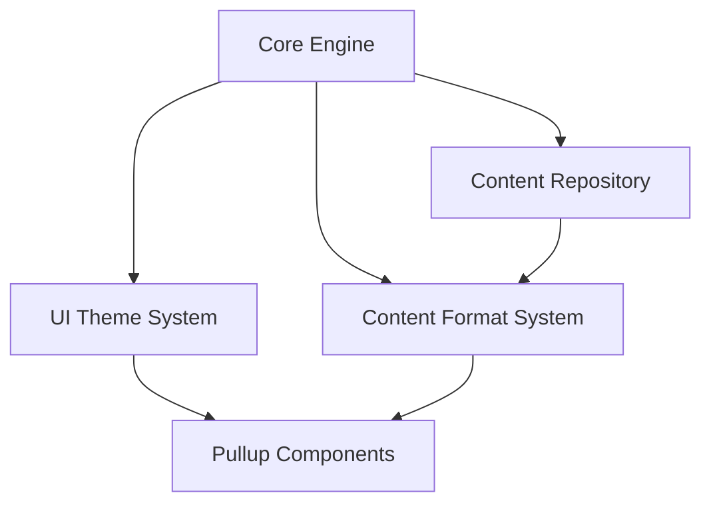
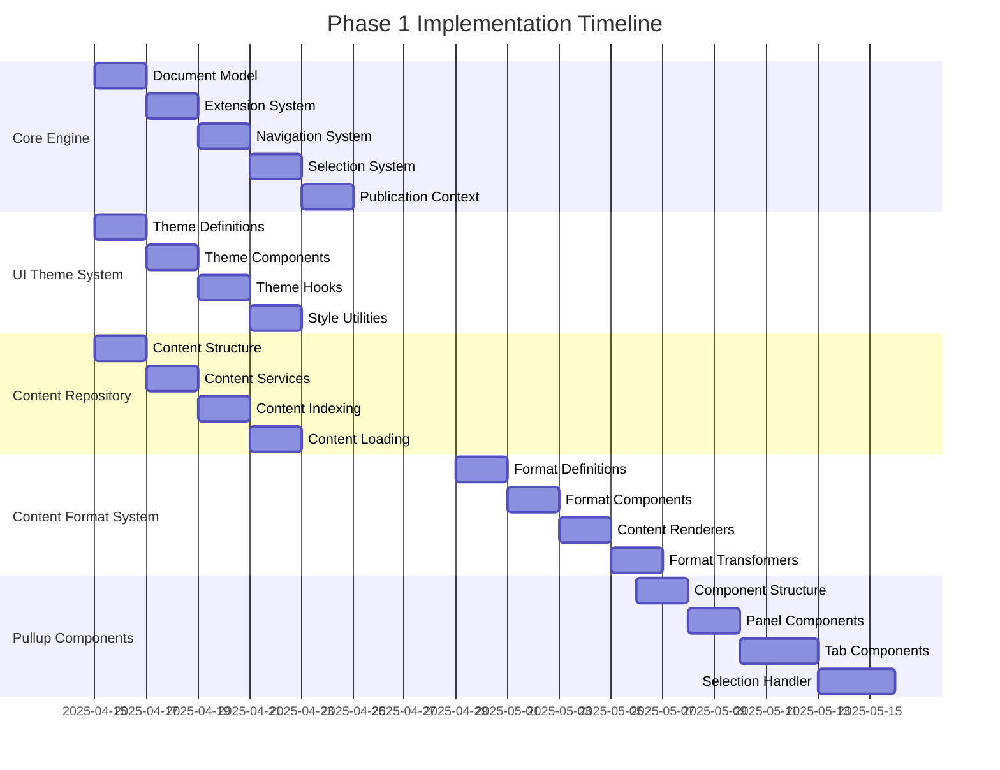

# 00-P1-Implementation-Roadmap: Phase 1 Foundation

**Status**: Draft  
**Created**: April 11, 2025  
**Phase**: 1 - Foundation  
**Component**: Overall Implementation Plan

## 1. Introduction

This document provides a comprehensive roadmap for implementing Phase 1 (Foundation) of the UB Ecosystem Architecture Plan. It serves as a guide for the development team, outlining the overall approach, dependencies between components, and a timeline for implementation.

Phase 1 focuses on establishing the core foundation of the UB Ecosystem, including:

1. Core Engine
2. UI Theme System
3. Content Format System
4. Pullup Components
5. Content Repository

These components provide the essential infrastructure upon which the entire ecosystem will be built.

## 2. Component Overview

### 2.1 Core Engine (01-P1-CoreEngine-Architecture.md)

The Core Engine provides the fundamental functionality that powers all publication readers (pubs). It implements:

- Document model
- Extension system
- Navigation capabilities
- Selection system
- Publication context

**Key Files**:

- `packages/core/document/` - Document model definitions
- `packages/core/extension/` - Extension system
- `packages/core/navigation/` - Navigation system
- `packages/core/selection/` - Text selection system
- `packages/core/publication/` - Publication context

### 2.2 UI Theme System (02-P1-UITheme-Specification.md)

The UI Theme System provides a consistent visual styling framework for the entire UB Ecosystem, managing:

- Theme preferences (light/dark mode)
- Color palettes
- Typography
- Spacing
- Other visual aspects

**Key Files**:

- `packages/ui-theme/themes/` - Theme definitions
- `packages/ui-theme/components/` - Theme components
- `packages/ui-theme/hooks/` - Theme hooks
- `packages/ui-theme/styles/` - Style utilities

### 2.3 Content Format System (03-P1-ContentFormat-Specification.md)

The Content Format System controls how UB content is displayed to users, providing:

- Traditional format
- Modern format
- Content renderers
- Format transformers

**Key Files**:

- `packages/content-format/formats/` - Format definitions
- `packages/content-format/components/` - Format components
- `packages/content-format/transformers/` - Content transformers
- `packages/content-format/hooks/` - Format hooks

### 2.4 Pullup Components (04-P1-Pullup-ComponentDesign.md)

The Pullup System provides a sliding panel for notes, quotes, and settings, including:

- Main pullup component
- Panel container
- Tab navigation
- Content area
- Tab implementations
- Text selection handler

**Key Files**:

- `packages/ui/components/pullup/` - Pullup components
- `packages/ui/components/pullup/Pullup/` - Main component
- `packages/ui/components/pullup/PullupPanel/` - Panel container
- `packages/ui/components/pullup/NotesTab/` - Notes tab
- `packages/ui/components/pullup/QuotesTab/` - Quotes tab
- `packages/ui/components/pullup/SettingsTab/` - Settings tab
- `packages/ui/components/pullup/TextSelectionHandler/` - Selection handler

### 2.5 Content Repository (05-P1-ContentRepository-Design.md)

The Content Repository organizes, stores, and provides access to all content, including:

- Content organization
- Content services
- Content indexing
- Content loading

**Key Files**:

- `content/` - Content directory
- `content/index/` - Content indexes
- `content/ub/` - UB content
- `packages/content-repository/` - Content services and utilities

## 3. Dependencies Between Components

Understanding the dependencies between components is crucial for planning the implementation sequence:

### 3.1 Primary Dependencies

1. **Core Engine**:

   - No dependencies on other components
   - Foundation for all other components

2. **UI Theme System**:

   - Depends on Core Engine for basic types and utilities

3. **Content Format System**:

   - Depends on Core Engine for document model
   - Optionally depends on Content Repository for content access

4. **Pullup Components**:

   - Depends on UI Theme System for styling
   - Depends on Content Format System for content rendering

5. **Content Repository**:
   - Depends on Core Engine for document model and types

### 3.2 Implementation Order

Based on these dependencies, the recommended implementation order is:

1. Core Engine
2. UI Theme System and Content Repository (can be implemented in parallel)
3. Content Format System
4. Pullup Components

## 4. Implementation Timeline

The following timeline provides a week-by-week breakdown of the Phase 1 implementation:

### 4.1 Week 1-2: Core Engine, UI Theme, Content Repository

**Days 1-2: Initial Setup**

- Create package structure
- Set up build system
- Configure TypeScript
- Set up testing framework

**Days 3-6: Core Engine**

- Implement document model
- Create extension system
- Develop navigation system
- Build selection system
- Create publication context

**Days 7-10: UI Theme System**

- Define theme interfaces
- Create light and dark themes
- Implement ThemeProvider
- Develop theme hooks and utilities

**Days 11-14: Content Repository**

- Define content structure
- Create content services
- Implement content indexing
- Develop content loading utilities

### 4.2 Week 3-4: Content Format System

**Days 15-16: Format Definitions**

- Define format interfaces
- Create traditional and modern formats

**Days 17-18: Format Components**

- Implement FormatProvider
- Create format toggle component

**Days 19-20: Content Renderers**

- Develop paragraph renderer
- Create list renderer
- Implement table renderer
- Build emphasis renderer

**Days 21-22: Format Transformers**

- Create list transformer
- Implement table transformer
- Develop emphasis transformer

### 4.3 Week 5-6: Pullup Components

**Days 23-24: Component Structure**

- Set up directory structure
- Define component interfaces
- Create type definitions

**Days 25-26: Panel Components**

- Implement PullupPanel
- Create PullupTabs
- Develop PullupContent

**Days 27-29: Tab Components**

- Implement NotesTab
- Create QuotesTab
- Develop SettingsTab

**Days 30-32: Selection Handler**

- Implement TextSelectionHandler
- Create selection menu
- Integrate with pullup system

## 5. Implementation Guidelines

### 5.1 Development Approach

1. **Component-First Development**: Focus on building individual components before integration
2. **Test-Driven Development**: Write tests before or alongside implementation
3. **Documentation-Driven Development**: Document components as they are developed
4. **Incremental Integration**: Integrate components incrementally to identify issues early

### 5.2 Coding Standards

1. **TypeScript**: Use TypeScript for all code with proper type definitions
2. **React Best Practices**: Follow React best practices for component development
3. **Functional Components**: Use functional components with hooks
4. **Separation of Concerns**: Keep presentation and logic separate
5. **Consistent Naming**: Use consistent naming conventions across the codebase

### 5.3 Testing Strategy

1. **Unit Tests**: Test individual components and functions
2. **Integration Tests**: Test interactions between components
3. **Visual Tests**: Use Storybook for visual testing
4. **Accessibility Tests**: Test for accessibility compliance
5. **Performance Tests**: Test for performance issues

### 5.4 Documentation

1. **Component Documentation**: Document each component with JSDoc comments
2. **API Documentation**: Document public APIs
3. **Usage Examples**: Provide usage examples for components
4. **Architecture Documentation**: Keep architecture documentation up to date

## 6. Risk Management

### 6.1 Potential Risks

1. **Integration Challenges**: Components may not integrate smoothly
2. **Performance Issues**: Components may have performance issues
3. **Accessibility Concerns**: Components may not be fully accessible
4. **Browser Compatibility**: Components may not work in all browsers
5. **Content Format Complexity**: Content formatting may be more complex than anticipated

### 6.2 Mitigation Strategies

1. **Early Integration Testing**: Test integration early and often
2. **Performance Monitoring**: Monitor performance throughout development
3. **Accessibility Reviews**: Conduct regular accessibility reviews
4. **Browser Testing**: Test in multiple browsers
5. **Incremental Approach**: Implement complex features incrementally

## 7. Next Steps

1. **Team Assignment**: Assign team members to components
2. **Development Environment**: Set up development environment
3. **Initial Implementation**: Begin implementing Core Engine
4. **Regular Reviews**: Conduct regular code and design reviews
5. **Progress Tracking**: Track progress against timeline

## 8. Conclusion

Phase 1 establishes the foundation for the entire UB Ecosystem. By following this roadmap, the development team can implement the foundation in a structured and efficient manner, ensuring a solid base for future phases.

The detailed specifications for each component provide the necessary guidance for implementation, while this roadmap provides the overall context and timeline. Together, they form a comprehensive plan for Phase 1 implementation.
