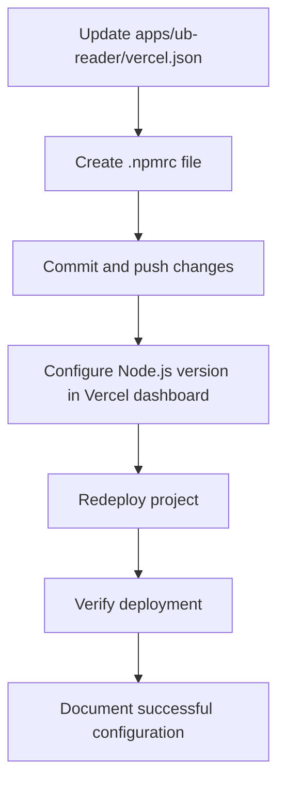

# 08-P1-Vercel-Deployment-Fix

**Status**: Draft  
**Created**: April 11, 2025  
**Phase**: 1 - Foundation  
**Component**: Deployment Fix

## 1. Overview

This document outlines the plan to fix the Vercel deployment issues related to npm workspace protocol in the UB Ecosystem monorepo. The current deployment is failing with the error `Unsupported URL Type "workspace:": workspace:*`, which indicates that Vercel's default npm version doesn't support the workspace protocol used in the project.

## 2. Implementation Plan



### 2.1 Update apps/ub-reader/vercel.json

Update the `apps/ub-reader/vercel.json` file to include a custom install command:

```json
{
  "version": 2,
  "buildCommand": "cd ../.. && npm run build --workspace=apps/ub-reader",
  "installCommand": "cd ../.. && npm install",
  "outputDirectory": ".next",
  "headers": [
    {
      "source": "/(.*)",
      "headers": [
        {
          "key": "Cache-Control",
          "value": "no-store, no-cache, must-revalidate, proxy-revalidate"
        }
      ]
    }
  ],
  "trailingSlash": false
}
```

The key change is adding the `"installCommand": "cd ../.. && npm install"` line, which ensures that npm installs dependencies from the root of the monorepo.

### 2.2 Create .npmrc file

Create a `.npmrc` file in the root directory with the following content:

```
node-linker=hoisted
legacy-peer-deps=true
```

This configuration helps npm handle workspace dependencies correctly:

- `node-linker=hoisted` ensures dependencies are hoisted to the root node_modules
- `legacy-peer-deps=true` helps avoid peer dependency issues

### 2.3 Commit and Push Changes

Commit the changes to the repository:

```bash
git add apps/ub-reader/vercel.json .npmrc
git commit -m "Fix Vercel deployment for workspace protocol"
git push
```

### 2.4 Configure Node.js Version in Vercel Dashboard

In the Vercel dashboard:

1. Go to the ub-pub project settings
2. Navigate to "Build & Development Settings"
3. Set Node.js Version to 16.x or higher (18.x recommended)
4. Save the settings

### 2.5 Redeploy Project

Trigger a new deployment in the Vercel dashboard:

1. Go to the ub-pub project
2. Click on "Deployments"
3. Click "Redeploy" on the latest deployment or create a new deployment

### 2.6 Verify Deployment

Verify that the deployment completes successfully:

1. Check the deployment logs for any errors
2. Access the deployed site to ensure it loads correctly
3. Test basic functionality

### 2.7 Document Successful Configuration

Once the deployment is successful, document the configuration for future reference and for setting up other publications:

1. Update the Vercel Deployment Strategy document with the successful configuration
2. Note any specific settings or workarounds that were required

## 3. Future Publications

For future publications (e.g., sci-pub), follow the same pattern:

1. Create a similar `vercel.json` file in the publication's directory
2. Use the same `.npmrc` configuration (already in the root)
3. Configure the Vercel project with the same Node.js version
4. Deploy using the same approach

## 4. Monitoring and Maintenance

After successful deployment:

1. Monitor the deployment for any issues
2. Set up automatic deployments for future changes
3. Consider setting up preview deployments for pull requests

## 5. Conclusion

This approach ensures that all Vercel deployments in the UB Ecosystem monorepo are consistent, version-controlled, and properly configured to handle workspace dependencies. By keeping the configuration in code, we maintain transparency and reproducibility across all deployments.
