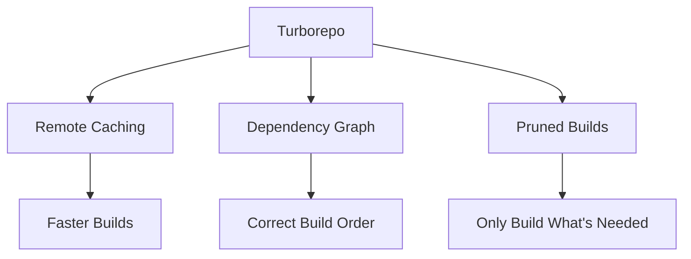
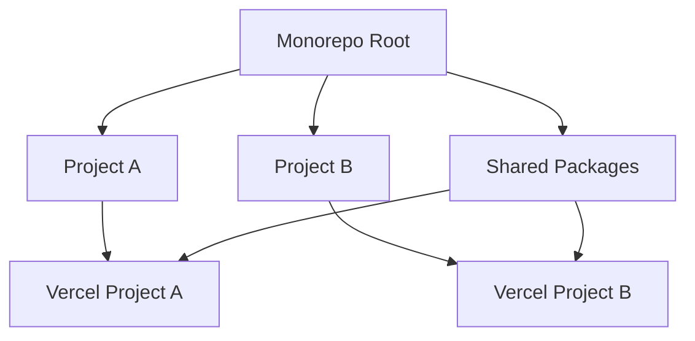
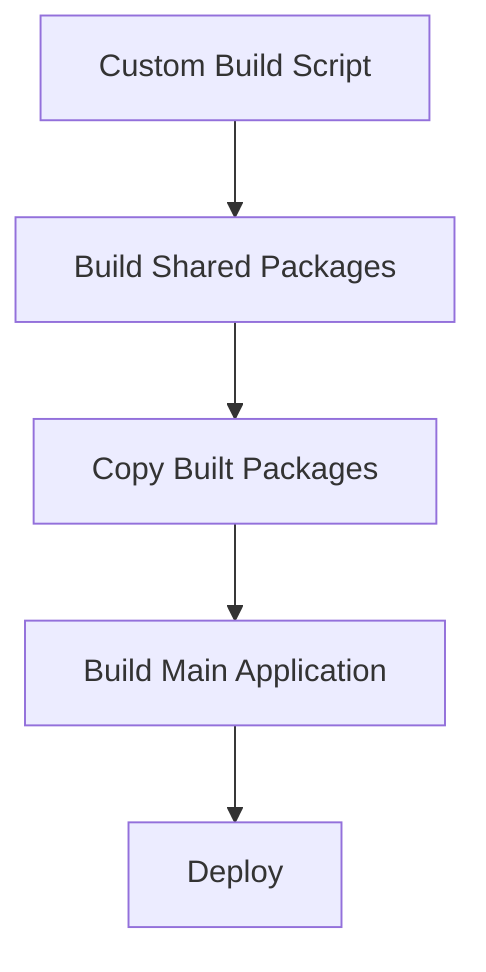

# 09-P1-Monorepo-Vercel-Deployment-Strategy

**Status**: Draft  
**Created**: April 11, 2025  
**Phase**: 1 - Foundation  
**Component**: Deployment Strategy

## 1. Overview

This document outlines a comprehensive strategy for deploying the UB Ecosystem monorepo to Vercel. The current challenge is that the `ub-reader` application depends on local workspace packages that aren't published to npm, causing deployment failures when Vercel tries to install these dependencies.

## 2. Monorepo Deployment Challenges

When deploying a monorepo to Vercel, several challenges arise:

1. **Local Dependencies**: Applications depend on local packages that aren't published to npm
2. **Build Order**: Dependencies need to be built before the applications that use them
3. **Workspace Protocol**: The `workspace:*` protocol isn't supported in all environments
4. **Configuration**: Each application needs its own deployment configuration

## 3. Proper Deployment Solutions

### 3.1 Turborepo with Remote Caching

Turborepo is designed specifically for monorepos and has excellent integration with Vercel.



**Implementation Steps**:

1. Configure Turborepo properly in the monorepo
2. Set up remote caching with Vercel
3. Define the dependency graph in `turbo.json`
4. Configure Vercel to use Turborepo for builds

**Benefits**:

- Faster builds through caching
- Proper handling of dependencies
- Built-in support in Vercel

### 3.2 Vercel's Monorepo Project Structure

Vercel has built-in support for monorepos with multiple projects.



**Implementation Steps**:

1. Create separate Vercel projects for each application
2. Configure each project with the correct root directory
3. Set up build settings to include shared packages
4. Use Vercel's monorepo support features

**Benefits**:

- Clean separation of concerns
- Independent deployments
- Shared code between projects

### 3.3 Custom Build Pipeline

Create a custom build pipeline that builds all dependencies before the main application.



**Implementation Steps**:

1. Create a custom build script that:
   - Builds all shared packages
   - Copies the built packages to the application's node_modules
   - Builds the main application
2. Configure Vercel to use this custom build script

**Benefits**:

- Complete control over the build process
- No reliance on specific monorepo tools
- Works with any monorepo structure

## 4. Recommended Approach

After evaluating the options, the recommended approach is to use **Turborepo with Vercel's monorepo support**. This provides the best balance of:

1. **Developer Experience**: Turborepo is designed for monorepos and works well with Vercel
2. **Build Performance**: Remote caching and pruned builds improve performance
3. **Maintainability**: Clear structure and configuration
4. **Scalability**: Easy to add more applications and packages

## 5. Implementation Plan

### 5.1 Configure Turborepo

1. Update `turbo.json` to properly define the dependency graph:

```json
{
  "$schema": "https://turbo.build/schema.json",
  "globalDependencies": ["**/.env.*local"],
  "pipeline": {
    "build": {
      "dependsOn": ["^build"],
      "outputs": ["dist/**", ".next/**", "!.next/cache/**"]
    },
    "lint": {
      "outputs": []
    },
    "dev": {
      "cache": false,
      "persistent": true
    },
    "clean": {
      "cache": false
    }
  }
}
```

2. Ensure each package has a proper `build` script in its `package.json`

### 5.2 Configure Vercel Project

1. Create a new Vercel project for `ub-pub`
2. Configure the project:
   - **Framework**: Next.js
   - **Root Directory**: `apps/ub-reader`
   - **Build Command**: `npx turbo run build --filter=ub-reader...`
   - **Install Command**: `npm install`
   - **Output Directory**: `.next`
3. Set environment variables:
   - `NEXT_PUBLIC_PUBLICATION_ID`: `ub`
   - `TURBO_TOKEN`: (if using remote caching)
   - `TURBO_TEAM`: (if using remote caching)
4. Set Node.js version to 18.x

### 5.3 Update Package References

1. Ensure all internal package references use a consistent format:

```json
"dependencies": {
  "@ub-ecosystem/audio-services": "workspace:*",
  "@ub-ecosystem/config": "workspace:*",
  // other dependencies
}
```

2. Make sure all packages have proper `main`, `types`, and `exports` fields in their `package.json`

### 5.4 CI/CD Pipeline

1. Set up GitHub Actions for CI/CD:
   - Run tests on pull requests
   - Deploy to Vercel on merge to main
2. Configure Vercel GitHub integration for preview deployments

## 6. Testing and Validation

1. Test the deployment process locally:
   - Run `npx turbo run build --filter=ub-reader...`
   - Verify that all dependencies are built correctly
2. Deploy to Vercel and verify:
   - Build logs show the correct build order
   - Application works as expected
   - All dependencies are properly included

## 7. Monitoring and Maintenance

1. Set up monitoring for deployments
2. Document the deployment process
3. Train team members on the monorepo deployment strategy

## 8. Conclusion

This approach provides a robust, scalable solution for deploying the UB Ecosystem monorepo to Vercel. By leveraging Turborepo and Vercel's monorepo support, we can ensure that all dependencies are properly built and included in the deployment, while maintaining a clean, maintainable structure.
