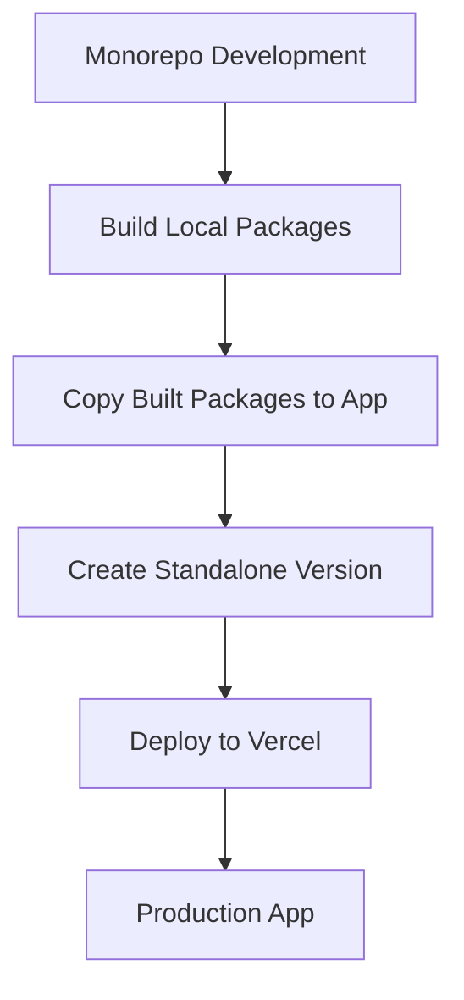

# 10-P1-Vercel-Deployment-Standalone-Strategy

**Status**: Draft  
**Created**: April 11, 2025  
**Phase**: 1 - Foundation  
**Component**: Deployment Strategy

## 1. Problem Analysis

We've encountered persistent issues deploying the UB Ecosystem monorepo to Vercel:

```
npm warn workspaces ub-reader in filter set, but no workspace folder present
npm error code EUNSUPPORTEDPROTOCOL
npm error Unsupported URL Type "workspace:": workspace:*
```

These errors indicate:

1. **Workspace Structure Recognition**: Vercel is not correctly recognizing the workspace folder structure
2. **Protocol Support**: The npm version used by Vercel doesn't support the workspace protocol
3. **Dependency Resolution**: Internal dependencies can't be resolved during deployment

Despite multiple approaches (using Turborepo, modifying configuration files, changing dependency references), we're still encountering issues with the monorepo deployment.

## 2. Root Cause Analysis

The fundamental issue is that Vercel's deployment process doesn't fully support the complex interdependencies in a monorepo when:

1. The app depends on local packages
2. Those packages aren't published to npm
3. The deployment process can't build those dependencies first

This is a common challenge with monorepos, especially when deploying to platforms that expect standalone applications.

## 3. Proposed Solution: Standalone Deployment Approach

Instead of trying to make Vercel work with the monorepo structure, we'll create a standalone deployment package specifically for Vercel. This approach:

1. Creates a self-contained version of the app with all dependencies
2. Eliminates reliance on workspace protocol and monorepo structure
3. Provides a clean, reliable deployment process



## 4. Implementation Plan

### 4.1 Create a Deployment Branch

Create a dedicated `vercel-deploy` branch for deployment:

```bash
git checkout -b vercel-deploy
```

This branch will contain the standalone version of the app, separate from the monorepo development branch.

### 4.2 Prepare Local Packages

For each local package dependency:

1. Build the package
2. Copy the built files to a local directory within the app
3. Update references to use these local copies

### 4.3 Create a Standalone package.json

Create a modified `package.json` for the app that:

1. Removes workspace dependencies
2. Adds direct dependencies to npm packages
3. Includes any necessary scripts for Vercel deployment

### 4.4 Configure Vercel Deployment

Set up Vercel to deploy from the `vercel-deploy` branch:

1. Create a new Vercel project
2. Set the branch to `vercel-deploy`
3. Configure build settings for the standalone app

### 4.5 Automate the Process

Create a script to automate the standalone package creation:

1. Build all dependencies
2. Create the standalone version
3. Push to the deployment branch

## 5. Detailed Implementation Steps

### 5.1 Create a Standalone Version Script

Create a script (`create-standalone.js`) that:

```javascript
const fs = require('fs');
const path = require('path');
const { execSync } = require('child_process');

// Build all dependencies
console.log('Building dependencies...');
execSync('npm run build --workspace=@ub-ecosystem/audio-services');
execSync('npm run build --workspace=@ub-ecosystem/config');
// ... other dependencies

// Create vendor directory
const vendorDir = path.join('apps', 'ub-reader', 'vendor');
if (!fs.existsSync(vendorDir)) {
  fs.mkdirSync(vendorDir, { recursive: true });
}

// Copy built packages
console.log('Copying built packages...');
copyPackage('@ub-ecosystem/audio-services');
copyPackage('@ub-ecosystem/config');
// ... other packages

// Update package.json
console.log('Updating package.json...');
const packageJsonPath = path.join('apps', 'ub-reader', 'package.json');
const packageJson = require(packageJsonPath);

// Replace workspace dependencies with local paths
packageJson.dependencies = {
  ...packageJson.dependencies,
  '@ub-ecosystem/audio-services': 'file:./vendor/audio-services',
  '@ub-ecosystem/config': 'file:./vendor/config',
  // ... other dependencies
  next: packageJson.dependencies.next,
  react: packageJson.dependencies.react,
  'react-dom': packageJson.dependencies.react - dom,
};

fs.writeFileSync(packageJsonPath, JSON.stringify(packageJson, null, 2));

// Helper function to copy a package
function copyPackage(packageName) {
  const shortName = packageName.split('/')[1];
  const srcDir = path.join('packages', shortName, 'dist');
  const destDir = path.join(vendorDir, shortName);

  if (!fs.existsSync(destDir)) {
    fs.mkdirSync(destDir, { recursive: true });
  }

  // Copy dist files
  fs.cpSync(srcDir, destDir, { recursive: true });

  // Create package.json for the vendor package
  const vendorPackageJson = {
    name: packageName,
    version: '0.1.0',
    main: 'index.js',
    types: 'index.d.ts',
  };

  fs.writeFileSync(path.join(destDir, 'package.json'), JSON.stringify(vendorPackageJson, null, 2));
}

console.log('Standalone version created successfully!');
```

### 5.2 Create a Deployment Script

Create a script (`deploy-to-vercel.js`) that:

```javascript
const { execSync } = require('child_process');

// Create standalone version
console.log('Creating standalone version...');
require('./create-standalone.js');

// Switch to deployment branch
console.log('Switching to deployment branch...');
try {
  execSync('git checkout vercel-deploy');
} catch (error) {
  execSync('git checkout -b vercel-deploy');
}

// Commit changes
console.log('Committing changes...');
execSync('git add apps/ub-reader');
execSync('git commit -m "Update standalone version for Vercel deployment"');

// Push to remote
console.log('Pushing to remote...');
execSync('git push -u origin vercel-deploy');

console.log('Deployment branch updated successfully!');
```

### 5.3 Update Vercel Configuration

Create a simplified `vercel.json` for the standalone app:

```json
{
  "version": 2,
  "buildCommand": "npm run build",
  "installCommand": "npm install",
  "outputDirectory": ".next",
  "headers": [
    {
      "source": "/(.*)",
      "headers": [
        {
          "key": "Cache-Control",
          "value": "no-store, no-cache, must-revalidate, proxy-revalidate"
        }
      ]
    }
  ],
  "trailingSlash": false
}
```

## 6. Vercel Project Configuration

When setting up the Vercel project:

1. **Repository**: Same GitHub repository
2. **Branch**: `vercel-deploy`
3. **Root Directory**: `apps/ub-reader`
4. **Framework Preset**: Next.js
5. **Build Command**: Leave empty (use from vercel.json)
6. **Output Directory**: Leave empty (use from vercel.json)
7. **Environment Variables**:
   - `NEXT_PUBLIC_PUBLICATION_ID`: `ub`

## 7. Development Workflow

This approach creates a separation between development and deployment:

1. **Development**: Work in the main branch with the full monorepo structure
2. **Deployment**: Run the deployment script to update the standalone version
3. **Vercel**: Automatically deploys from the deployment branch

This workflow allows you to:

- Maintain the benefits of the monorepo for development
- Have reliable deployments to Vercel
- Keep the deployment process automated

## 8. Advantages of This Approach

1. **Reliability**: Eliminates dependency on Vercel's monorepo support
2. **Simplicity**: Creates a clean, standalone version for deployment
3. **Compatibility**: Works with Vercel's deployment model
4. **Maintainability**: Keeps development and deployment concerns separate
5. **Automation**: Process can be fully automated

## 9. Limitations and Considerations

1. **Extra Build Step**: Requires an additional build step before deployment
2. **Branch Management**: Need to maintain a separate deployment branch
3. **Synchronization**: Must ensure the standalone version is updated when needed

## 10. Conclusion

The standalone deployment approach provides a robust solution for deploying the UB Ecosystem to Vercel. By creating a self-contained version of the app specifically for deployment, we can avoid the complexities of monorepo deployment while maintaining the benefits of monorepo development.

This approach is a common pattern for monorepo projects that need to deploy to platforms with limited monorepo support, and it offers a reliable path forward for the UB Ecosystem deployment.
