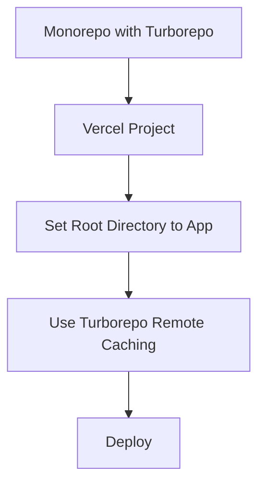
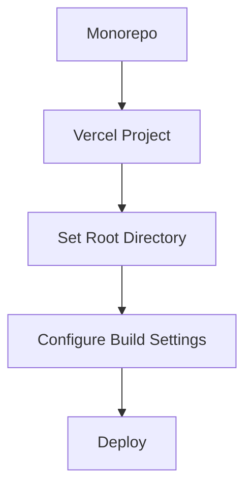
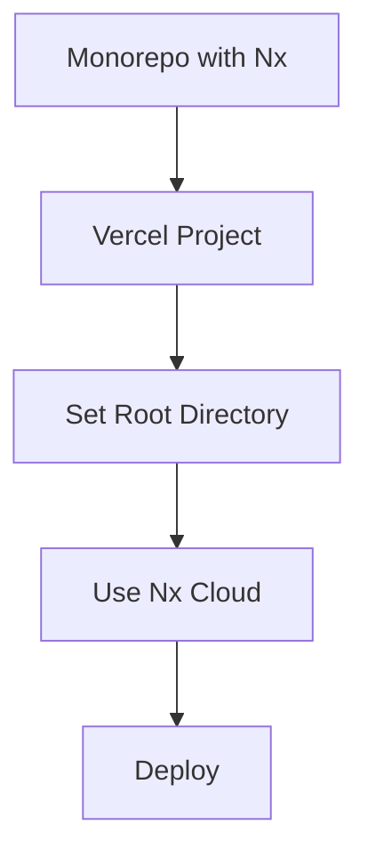
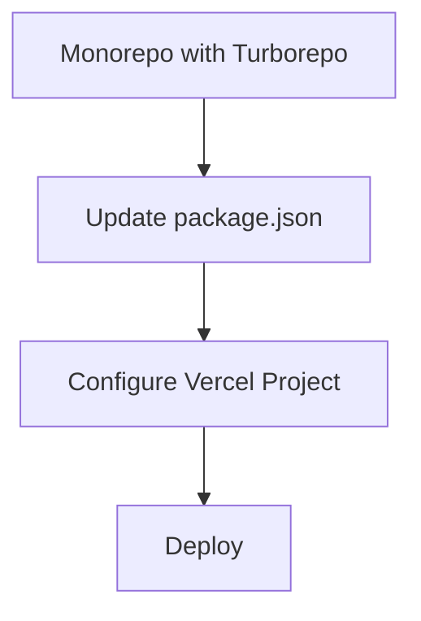

# 11-P1-Vercel-Monorepo-Standard-Practices

**Status**: Draft  
**Created**: April 11, 2025  
**Phase**: 1 - Foundation  
**Component**: Deployment Strategy

## 1. Standard Monorepo Deployment Approaches

Deploying monorepos to Vercel is a common task with several standard approaches. Let's review the industry-standard practices for deploying monorepos to Vercel:

### 1.1 Turborepo with Vercel Integration

This is the most standard and recommended approach for Turborepo monorepos:



**Configuration**:

- Root Directory: Set to the app directory (e.g., `apps/ub-reader`)
- Build Command: `npx turbo run build --filter=ub-reader...`
- Environment Variables: `TURBO_TOKEN` and `TURBO_TEAM` for remote caching

**Benefits**:

- Official support from Vercel (Vercel owns Turborepo)
- Efficient builds with remote caching
- Proper dependency resolution

### 1.2 Project Imports with Monorepo Configuration

Another standard approach is to use Vercel's project import with specific monorepo configuration:



**Configuration**:

- Root Directory: Set to the app directory
- Build Command: Custom command that builds dependencies first
- Install Command: Standard npm install

**Benefits**:

- Simple configuration
- Works with most monorepo structures
- No additional tools required

### 1.3 Nx with Vercel Integration

For Nx-based monorepos:



**Configuration**:

- Root Directory: Set to the app directory
- Build Command: `npx nx build app-name`
- Environment Variables: Nx Cloud tokens

**Benefits**:

- Efficient builds with Nx computation caching
- Proper dependency resolution
- Good integration with Vercel

## 2. Current Challenges with UB Ecosystem

The UB Ecosystem monorepo is facing specific challenges with Vercel deployment:

### 2.1 Workspace Protocol Support

The primary issue is that Vercel's npm version doesn't fully support the workspace protocol:

```
npm error code EUNSUPPORTEDPROTOCOL
npm error Unsupported URL Type "workspace:": workspace:*
```

This is a limitation of the deployment platform, not a problem with the monorepo structure itself.

### 2.2 Workspace Recognition

Vercel is not correctly recognizing the workspace folder structure:

```
npm warn workspaces ub-reader in filter set, but no workspace folder present
```

This suggests that the root directory setting might not be correctly configured.

## 3. Recommended Standard Approach

Based on industry standards and the specific challenges we're facing, here's the recommended approach:

### 3.1 Turborepo with Explicit Dependencies



**Steps**:

1. **Update package.json**:

   - Use explicit versions instead of workspace protocol
   - Ensure all dependencies are properly listed

2. **Configure Vercel Project**:

   - Root Directory: `apps/ub-reader`
   - Build Command: `npx turbo run build --filter=ub-reader...`
   - Node.js Version: 18.x (LTS)

3. **Add Turborepo Configuration**:
   - Update `turbo.json` to properly define the dependency graph
   - Ensure all packages have proper build scripts

This approach follows Vercel's recommended practices for Turborepo monorepos while addressing the specific issues we're facing.

## 4. Implementation Plan

### 4.1 Update Package References

Update `apps/ub-reader/package.json` to use explicit versions:

```json
"dependencies": {
  "@ub-ecosystem/audio-services": "0.1.0",
  "@ub-ecosystem/config": "0.1.0",
  "@ub-ecosystem/content-transformer": "0.1.0",
  "@ub-ecosystem/data-models": "0.1.0",
  "@ub/highlighting": "0.1.0",
  "@ub-ecosystem/reference-parser": "0.1.0",
  "@ub-ecosystem/state-management": "0.1.0",
  "@ub-ecosystem/ui": "0.1.0",
  "next": "^13.4.1",
  "react": "^18.2.0",
  "react-dom": "^18.2.0"
}
```

### 4.2 Update Vercel Configuration

Create a minimal `apps/ub-reader/vercel.json`:

```json
{
  "version": 2,
  "buildCommand": "cd ../.. && npx turbo run build --filter=ub-reader...",
  "outputDirectory": ".next"
}
```

### 4.3 Update Turborepo Configuration

Ensure `turbo.json` properly defines the dependency graph:

```json
{
  "$schema": "https://turbo.build/schema.json",
  "globalDependencies": ["**/.env.*local"],
  "pipeline": {
    "build": {
      "dependsOn": ["^build"],
      "outputs": ["dist/**", ".next/**", "!.next/cache/**"]
    },
    "dev": {
      "cache": false,
      "persistent": true
    }
  }
}
```

### 4.4 Configure Vercel Project

In the Vercel dashboard:

1. Create a new project
2. Import the GitHub repository
3. Set the root directory to `apps/ub-reader`
4. Set Node.js version to 18.x
5. Add environment variables:
   - `NEXT_PUBLIC_PUBLICATION_ID`: `ub`

## 5. Conclusion

This approach follows industry-standard practices for deploying Turborepo monorepos to Vercel. It addresses the specific challenges we're facing while maintaining the integrity of the monorepo structure.

By using explicit versions instead of workspace protocol and properly configuring the Turborepo build process, we can deploy the UB Ecosystem to Vercel without resorting to workarounds or non-standard practices.
