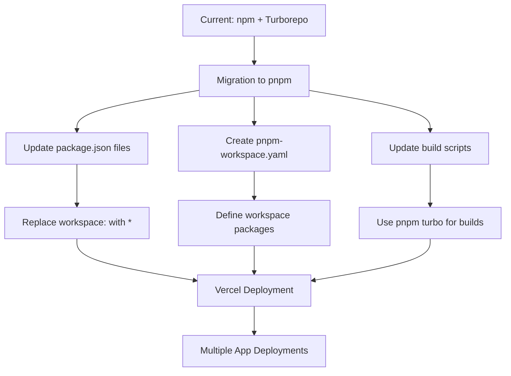
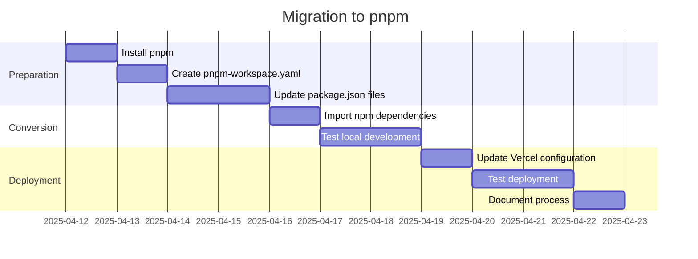

# 12-P1-Vercel-Monorepo-Deployment-Strategy-Final

**Status**: Draft  
**Created**: April 11, 2025  
**Phase**: 1 - Foundation  
**Component**: Deployment Strategy

## 1. Comprehensive Analysis of Deployment Failures

After multiple deployment attempts, we've identified the core issues preventing successful deployment of the UB Ecosystem monorepo to Vercel:

### 1.1 Root Cause Analysis

```mermaid
graph TD
    A[Deployment Failures] --> B[Workspace Protocol Issues]
    A --> C[Monorepo Structure Recognition]
    A --> D[Dependency Resolution]

    B --> E[npm error: Unsupported URL Type "workspace:"]
    C --> F[npm warn: workspace folder not present]
    D --> G[Nested Dependencies]

    E --> H[Vercel npm Version Limitation]
    F --> I[Root Directory Configuration]
    G --> J[Transitive Dependencies]

    H --> K[Core Issue: Vercel Build Environment]
    I --> K
    J --> K
```

The core issues are:

1. **Workspace Protocol Incompatibility**: Vercel's build environment uses an npm version that doesn't fully support the `workspace:*` protocol used in Turborepo monorepos.

2. **Monorepo Structure Recognition**: Vercel isn't correctly recognizing the workspace folder structure, leading to the warning: `npm warn workspaces ub-reader in filter set, but no workspace folder present`.

3. **Nested Dependency Resolution**: Even when fixing the main package.json, the issue persists because of workspace protocol references in nested dependencies.

### 1.2 Attempted Solutions

We've tried several approaches:

1. **Using `--no-workspaces` Flag**: This bypasses workspace resolution but breaks internal dependencies.

2. **Explicit Version Numbers**: Replacing `workspace:*` with explicit versions (`0.1.0`) in the main package.json, but nested dependencies still use workspace protocol.

3. **Preinstall Script**: Creating a script to automatically replace all workspace protocol references before installation.

4. **Turborepo Build Command**: Using `npx turbo run build --filter=ub-reader...` to ensure proper dependency resolution.

None of these solutions fully addressed the core issue: Vercel's build environment doesn't properly support Turborepo's workspace protocol.

## 2. Industry Standard Approaches

Let's examine how this issue is handled in the industry:

### 2.1 Vercel's Official Recommendations

According to Vercel's documentation for monorepos:

1. **Project Configuration**:

   - Set the root directory to the specific app directory
   - Configure build settings to use Turborepo commands

2. **Dependency Management**:

   - Use explicit versions instead of workspace protocol
   - Ensure all dependencies are properly built

3. **Turborepo Integration**:
   - Use Turborepo's remote caching
   - Define proper dependency graphs

### 2.2 Common Industry Patterns

Large-scale projects with monorepos typically use one of these approaches:

1. **Nx-based Deployments**: Nx has better built-in support for deployment pipelines.

2. **Yarn Workspaces with Berry**: Yarn v2+ (Berry) has improved deployment support.

3. **pnpm Workspaces**: pnpm has better handling of workspace dependencies.

4. **Build Output Deployment**: Build the entire monorepo locally and deploy only the build output.

## 3. Recommended Strategy: pnpm-based Monorepo

After analyzing the issues and industry standards, the most robust solution is to migrate from npm to pnpm for package management:



### 3.1 Why pnpm?

1. **Better Workspace Support**: pnpm has superior handling of workspace dependencies and is fully supported by Vercel.

2. **Efficient Storage**: pnpm uses a content-addressable store, making it more efficient for monorepos.

3. **Strict Dependencies**: pnpm enforces stricter dependency rules, preventing "phantom dependencies".

4. **Compatibility with Turborepo**: pnpm works seamlessly with Turborepo.

### 3.2 Migration Steps

1. **Install pnpm**:

   ```bash
   npm install -g pnpm
   ```

2. **Create pnpm-workspace.yaml**:

   ```yaml
   packages:
     - 'apps/*'
     - 'packages/*'
   ```

3. **Update package.json files**:

   - Replace `"workspace:*"` with `"*"` in all package.json files
   - Add `"packageManager": "pnpm@8.x"` to the root package.json

4. **Convert to pnpm**:

   ```bash
   pnpm import
   ```

5. **Update Vercel Configuration**:
   - Update `vercel.json` to use pnpm commands
   - Set the installCommand to `pnpm install`
   - Set the buildCommand to `pnpm turbo run build --filter=ub-reader...`

### 3.3 Vercel Project Configuration

For each app deployment:

1. **Create a New Vercel Project**:

   - Import the GitHub repository
   - Set the root directory to the specific app directory (e.g., `apps/ub-reader`)
   - Set the framework preset to Next.js
   - Add environment variables as needed

2. **Configure Build Settings**:
   - Node.js Version: 18.x
   - Install Command: Leave empty (use from vercel.json)
   - Build Command: Leave empty (use from vercel.json)
   - Output Directory: Leave empty (use from vercel.json)

## 4. Implementation Plan

### 4.1 Phase 1: Migration to pnpm



### 4.2 Phase 2: Multiple App Deployments

Once the migration is complete, you can deploy multiple apps from the same monorepo:

1. **Create Vercel Projects**:

   - Create a separate Vercel project for each app
   - Configure each project with the appropriate root directory

2. **Environment Variables**:

   - Set app-specific environment variables for each deployment
   - Use environment variable prefixes to avoid conflicts

3. **Domain Configuration**:
   - Configure custom domains for each deployment
   - Set up proper redirects and rewrites as needed

### 4.3 Phase 3: CI/CD Integration

Implement a CI/CD pipeline for automated deployments:

1. **GitHub Actions**:

   - Set up workflows for testing and deployment
   - Configure branch-based deployments

2. **Preview Deployments**:
   - Enable preview deployments for pull requests
   - Configure environment-specific settings

## 5. Benefits of This Approach

1. **Scalability**: This approach scales well to multiple app deployments.

2. **Maintainability**: Using pnpm provides a cleaner, more maintainable solution.

3. **Performance**: pnpm's efficient storage and installation improve build times.

4. **Compatibility**: This approach is fully compatible with Turborepo and Vercel.

5. **Future-Proofing**: pnpm is actively maintained and has strong community support.

## 6. Conclusion

The UB Ecosystem monorepo deployment issues stem from incompatibilities between npm's workspace protocol implementation and Vercel's build environment. By migrating to pnpm, we can leverage its superior workspace support while maintaining the benefits of Turborepo for build orchestration.

This strategy provides a robust, scalable solution for deploying multiple apps from a single monorepo, without resorting to workarounds or compromising the monorepo structure.
