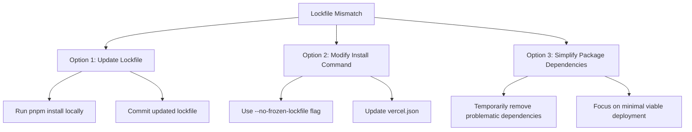
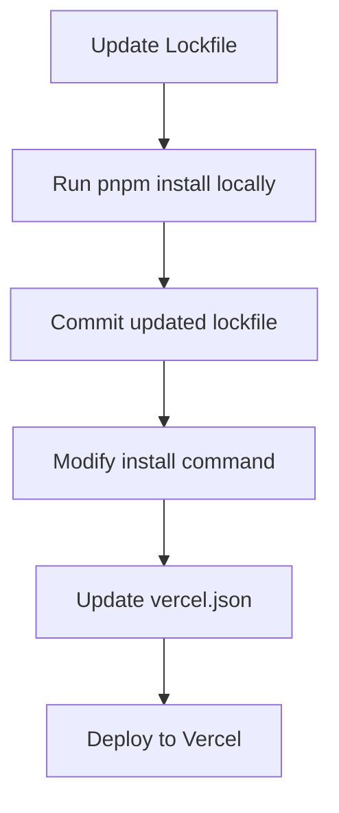

# 13-P1-Vercel-Deployment-Lockfile-Fix

**Status**: Draft  
**Created**: April 11, 2025  
**Phase**: 1 - Foundation  
**Component**: Deployment Fix

## 1. Issue Analysis

The deployment to Vercel failed with the following error:

```
ERR_PNPM_OUTDATED_LOCKFILE  Cannot install with "frozen-lockfile" because pnpm-lock.yaml is not up to date with packages/audio-services/package.json
```

This error occurs because:

1. By default, Vercel runs pnpm install with the `--frozen-lockfile` flag in CI environments
2. Our pnpm-lock.yaml file is not fully in sync with all package.json files in the monorepo
3. Specifically, the lockfile doesn't match the dependencies in packages/audio-services/package.json

The detailed error shows:

```
specifiers in the lockfile ({"@ub-ecosystem/data-models":"^0.1.0","@types/jest":"^29.5.1","eslint":"^8.40.0","jest":"^29.5.0","typescript":"^5.0.4","@azure/ai-text-analytics":"^5.1.0","@google-cloud/text-to-speech":"^4.0.0","aws-sdk":"^2.1.0"}) don't match specs in package.json ({"typescript":"^5.0.4","jest":"^29.5.0","@types/jest":"^29.5.1","eslint":"^8.40.0","@ub-ecosystem/data-models":"^0.1.0","narakeet-api":"^1.0.0","aws-sdk":"^2.1.0","@google-cloud/text-to-speech":"^4.0.0","@azure/ai-text-analytics":"^5.1.0"})
```

The key difference is that the package.json includes `"narakeet-api":"^1.0.0"`, but this dependency is not in the lockfile.

## 2. Solution Options



### 2.1 Option 1: Update the Lockfile (Recommended)

The most proper solution is to update the pnpm-lock.yaml file to match all package.json files in the monorepo:

1. Run `pnpm install` locally to update the lockfile
2. Commit and push the updated lockfile
3. Redeploy to Vercel

This ensures that the lockfile is in sync with all dependencies and follows best practices for dependency management.

### 2.2 Option 2: Modify the Install Command

An alternative approach is to modify the install command in vercel.json to bypass the frozen lockfile check:

```json
"installCommand": "cd ../.. && pnpm install --no-frozen-lockfile"
```

This tells pnpm to ignore the lockfile discrepancies and install dependencies based on the package.json files.

### 2.3 Option 3: Simplify Package Dependencies

For a quick deployment test, we could temporarily simplify the dependencies in the problematic package:

1. Identify packages with dependency mismatches
2. Temporarily modify their package.json files to match the lockfile
3. Deploy to Vercel
4. Restore the original package.json files after testing

## 3. Recommended Approach

The recommended approach is a combination of Options 1 and 2:



1. **Update the Lockfile**:

   - Run `pnpm install` locally to update the lockfile
   - Commit and push the updated lockfile

2. **Modify the Install Command**:

   - Update vercel.json to use `--no-frozen-lockfile` as a safety measure:

   ```json
   "installCommand": "cd ../.. && pnpm install --no-frozen-lockfile"
   ```

3. **Deploy to Vercel**:
   - Redeploy the project with the updated configuration

This approach ensures that:

- The lockfile is properly updated (following best practices)
- The deployment has a fallback mechanism if there are still discrepancies
- We maintain the integrity of the monorepo structure

## 4. Implementation Plan

### 4.1 Update the Lockfile

```bash
# Run pnpm install to update the lockfile
pnpm install

# Commit and push the updated lockfile
git add pnpm-lock.yaml
git commit -m "Update pnpm-lock.yaml to match all package.json files"
git push
```

### 4.2 Update Vercel Configuration

Update the apps/ub-reader/vercel.json file:

```json
{
  "version": 2,
  "buildCommand": "cd ../.. && pnpm turbo run build --filter=ub-reader...",
  "installCommand": "cd ../.. && pnpm install --no-frozen-lockfile",
  "outputDirectory": ".next",
  "headers": [
    {
      "source": "/(.*)",
      "headers": [
        {
          "key": "Cache-Control",
          "value": "no-store, no-cache, must-revalidate, proxy-revalidate"
        }
      ]
    }
  ],
  "trailingSlash": false
}
```

### 4.3 Redeploy to Vercel

1. Commit and push the updated vercel.json file
2. Redeploy the project in the Vercel dashboard

## 5. Long-term Recommendations

For ongoing maintenance of the monorepo:

1. **Automate Lockfile Updates**:

   - Set up CI/CD to automatically update the lockfile when package.json files change
   - Use pre-commit hooks to ensure the lockfile is always in sync

2. **Dependency Management Practices**:

   - Document the process for adding new dependencies
   - Ensure all team members understand the importance of updating the lockfile

3. **Monitoring and Alerts**:
   - Set up monitoring for deployment failures
   - Create alerts for lockfile discrepancies

## 6. Conclusion

This approach addresses the immediate issue with the outdated lockfile while following best practices for monorepo dependency management. By updating the lockfile and modifying the install command, we ensure a successful deployment to Vercel while maintaining the integrity of the monorepo structure.
