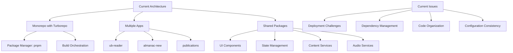
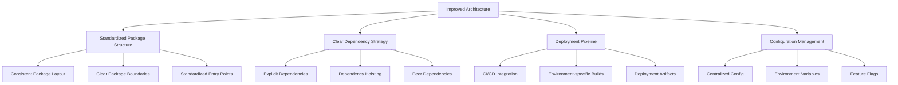
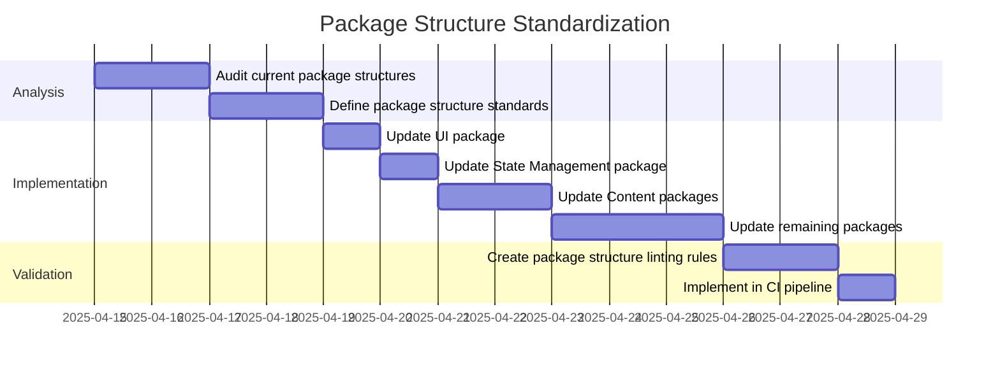
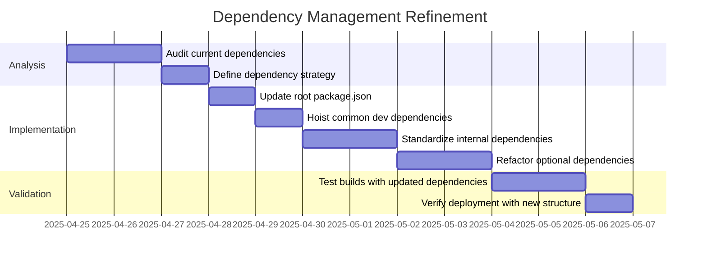
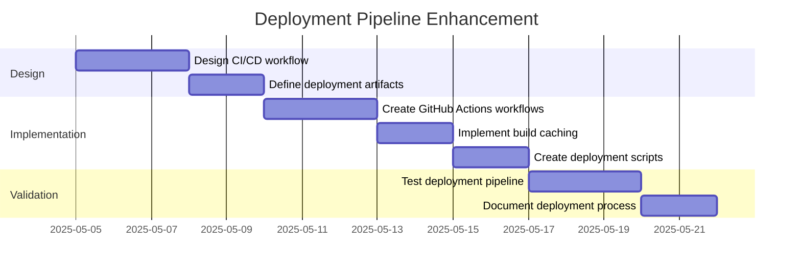
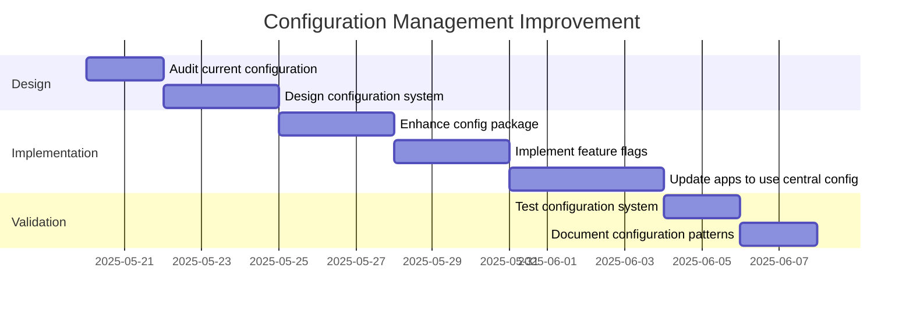

# 14-P1-Code Structure Improvement Plan

**Status**: Draft  
**Created**: April 11, 2025  
**Phase**: 1 - Foundation  
**Component**: Architecture Refinement

## 1. Current Architecture Assessment

After reviewing the codebase and deployment strategies, I've identified several areas where the code structure could be improved to create a more exemplary, maintainable, and deployment-friendly architecture.



### 1.1 Strengths

1. **Monorepo Structure**: The project correctly uses a monorepo structure with apps and packages directories.
2. **Package Sharing**: Common functionality is extracted into shared packages.
3. **Build Orchestration**: Turborepo is used for efficient build orchestration.
4. **Package Manager**: Migration to pnpm improves workspace dependency handling.

### 1.2 Areas for Improvement

1. **Dependency Management**: Inconsistent dependency declarations across packages.
2. **Configuration Standardization**: Lack of standardized configuration across packages.
3. **Deployment Strategy**: Ad-hoc fixes for deployment issues rather than systematic solutions.
4. **Package Boundaries**: Unclear boundaries between some packages.
5. **Optional Dependencies**: Overuse of optional dependencies causing deployment issues.
6. **Documentation**: Limited inline documentation and architecture documentation.

## 2. Proposed Architecture Improvements



### 2.1 Standardized Package Structure

Each package in the monorepo should follow a consistent structure:

```
packages/package-name/
├── README.md           # Package documentation
├── package.json        # Package manifest
├── tsconfig.json       # TypeScript configuration
├── src/                # Source code
│   ├── index.ts        # Main entry point
│   ├── types/          # TypeScript type definitions
│   └── components/     # Components (if applicable)
├── tests/              # Test files
└── examples/           # Usage examples
```

### 2.2 Clear Dependency Strategy

1. **Explicit Dependencies**:

   - Use exact versions for internal dependencies (`"0.1.0"` instead of `"^0.1.0"`)
   - Use caret ranges for external dependencies (`"^1.2.3"`)

2. **Optional Dependencies**:

   - Move truly optional dependencies to peer dependencies with appropriate documentation
   - Create plugin system for extensible features (like audio providers)

3. **Development Dependencies**:
   - Hoist common dev dependencies to the root package.json
   - Use workspace protocol for internal dependencies in development

### 2.3 Deployment Pipeline

1. **CI/CD Integration**:

   - Implement GitHub Actions workflows for testing, building, and deploying
   - Create separate workflows for each app

2. **Environment Configuration**:

   - Standardize environment variable naming and usage
   - Create environment-specific configuration files

3. **Build Artifacts**:
   - Generate deployment-ready artifacts for each app
   - Implement caching strategy for build outputs

### 2.4 Configuration Management

1. **Centralized Configuration**:

   - Move common configuration to the `packages/config` package
   - Create typed configuration objects

2. **Feature Flags**:

   - Implement a feature flag system for conditional features
   - Store feature flags in a central location

3. **Runtime Configuration**:
   - Separate build-time and runtime configuration
   - Implement configuration validation

## 3. Implementation Plan

### 3.1 Phase 1: Package Structure Standardization



### 3.2 Phase 2: Dependency Management Refinement



### 3.3 Phase 3: Deployment Pipeline Enhancement



### 3.4 Phase 4: Configuration Management Improvement



## 4. Specific Code Structure Improvements

### 4.1 Package Dependencies

Update the `packages/audio-services/package.json` to use a plugin architecture:

```json
{
  "name": "@ub-ecosystem/audio-services",
  "version": "0.1.0",
  "main": "dist/index.js",
  "types": "dist/index.d.ts",
  "scripts": {
    "build": "tsc",
    "dev": "tsc --watch",
    "lint": "eslint src/**/*.ts",
    "test": "jest"
  },
  "dependencies": {
    "@ub-ecosystem/data-models": "0.1.0"
  },
  "peerDependencies": {
    "narakeet-api": "^1.0.0",
    "aws-sdk": "^2.1.0",
    "@google-cloud/text-to-speech": "^4.0.0",
    "@azure/ai-text-analytics": "^5.1.0"
  },
  "peerDependenciesMeta": {
    "narakeet-api": {
      "optional": true
    },
    "aws-sdk": {
      "optional": true
    },
    "@google-cloud/text-to-speech": {
      "optional": true
    },
    "@azure/ai-text-analytics": {
      "optional": true
    }
  },
  "devDependencies": {
    "typescript": "^5.0.4",
    "jest": "^29.5.0",
    "@types/jest": "^29.5.1",
    "eslint": "^8.40.0"
  }
}
```

### 4.2 Vercel Configuration

Update the `apps/ub-reader/vercel.json` to use a more robust configuration:

```json
{
  "version": 2,
  "buildCommand": "cd ../.. && pnpm turbo run build --filter=ub-reader...",
  "installCommand": "cd ../.. && pnpm install --no-frozen-lockfile",
  "outputDirectory": ".next",
  "headers": [
    {
      "source": "/(.*)",
      "headers": [
        {
          "key": "Cache-Control",
          "value": "no-store, no-cache, must-revalidate, proxy-revalidate"
        }
      ]
    }
  ],
  "trailingSlash": false,
  "env": {
    "NEXT_PUBLIC_PUBLICATION_ID": "ub",
    "NODE_ENV": "production"
  }
}
```

### 4.3 Package Entry Points

Standardize package entry points with barrel files:

```typescript
// packages/ui/src/index.ts
export * from './components';
export * from './hooks';
export * from './utils';
export * from './types';

// Explicitly re-export specific components for better documentation
export { Button } from './components/Button';
export { Card } from './components/Card';
export { Modal } from './components/Modal';
// ...
```

### 4.4 Documentation

Add comprehensive README files to each package:

````markdown
# @ub-ecosystem/ui

UI component library for the UB Ecosystem.

## Installation

```bash
pnpm add @ub-ecosystem/ui
```
````

## Usage

```tsx
import { Button, Card } from '@ub-ecosystem/ui';

function MyComponent() {
  return (
    <Card>
      <h2>Hello World</h2>
      <Button variant="primary">Click Me</Button>
    </Card>
  );
}
```

## Components

- `Button`: A customizable button component
- `Card`: A container component with optional shadow
- `Modal`: A dialog component with backdrop

## Development

```bash
# Install dependencies
pnpm install

# Start development server
pnpm dev

# Build the package
pnpm build

# Run tests
pnpm test
```

```

## 5. Benefits of the Improved Architecture

1. **Maintainability**: Standardized package structure makes the codebase more maintainable.
2. **Scalability**: Clear package boundaries and dependency strategy enable easier scaling.
3. **Deployment Reliability**: Robust deployment pipeline reduces deployment failures.
4. **Developer Experience**: Consistent patterns and documentation improve developer onboarding.
5. **Performance**: Optimized build and dependency management improve performance.
6. **Future-Proofing**: Modular architecture allows for easier updates and migrations.

## 6. Conclusion

The proposed improvements to the code structure will create a more exemplary architecture that addresses the current issues with deployment and maintainability. By standardizing package structure, refining dependency management, enhancing the deployment pipeline, and improving configuration management, the UB Ecosystem monorepo will be more robust, scalable, and developer-friendly.

These changes align with industry best practices for monorepo management and will provide a solid foundation for future development and deployment of the UB Ecosystem applications.
```
