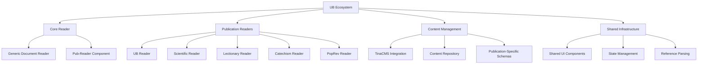
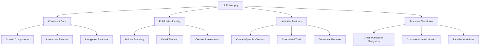
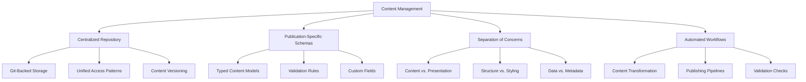

# 15-P1-Publication Ecosystem Philosophy

**Status**: Draft  
**Created**: April 11, 2025  
**Phase**: 1 - Foundation  
**Component**: Ecosystem Vision

## 1. Understanding the Publication Ecosystem

The UB Ecosystem is designed around a family of publication readers that share a common core while maintaining distinct identities and purposes. This document explores the human-centered philosophy behind this approach and how it shapes the content management strategy.

### 1.1 The Publication Family

The UB Ecosystem consists of multiple publication readers, each serving a specific purpose while maintaining a connection to the core Urantia Book:

1. **UB Reader**: The primary reader for the Urantia Book, serving as the foundation and reference implementation.

2. **Scientific Reader**: Designed for scientific publications with features tailored to academic content, such as math formula rendering and citation handling.

3. **Lectionary Reader**: Focused on liturgical content with features like calendar integration and service planning.

4. **Catechism Reader**: Structured for Q&A format content with topic indexing and cross-referencing.

5. **PopRev Reader**: Designed for thematic grouping and commentary on popular revelations.

6. **Almanac-New**: A special publication with its own unique structure and purpose.

### 1.2 Common Features and Settings

While each publication has its unique purpose, they share common features and settings that create a consistent experience:

1. **Core Reading Experience**:

   - Text display with consistent typography and layout principles
   - Navigation controls (table of contents, next/previous, search)
   - Annotation capabilities (highlighting, notes, bookmarks)
   - Reference handling and cross-referencing

2. **User Preferences**:

   - Font size and family settings
   - Theme selection (light/dark/sepia)
   - Layout options (margins, line spacing)
   - Reading history and position tracking

3. **Search Functionality**:

   - Full-text search within publications
   - Advanced filters relevant to each publication type
   - Search result highlighting and navigation

4. **Offline Capabilities**:
   - Content storage for offline reading
   - Synchronization of annotations and preferences
   - Background updates when online

## 2. UI Philosophy for Publications

The UI approach for the various publications balances consistency with publication-specific branding and features.

### 2.1 Consistent Core with Publication Identity

Each publication reader maintains a consistent core experience while expressing its unique identity:

1. **Shared UI Framework**:

   - Common component library with consistent behavior
   - Standardized layout grids and spacing
   - Unified interaction patterns and gestures

2. **Publication-Specific Branding**:

   - Distinct color schemes that reflect the publication's purpose
   - Typography variations within a consistent hierarchy
   - Custom iconography that maintains a shared visual language

3. **Content-Appropriate Presentation**:
   - Layouts optimized for the specific content type
   - Specialized components for unique content features
   - Visual treatments that enhance content comprehension

### 2.2 Standalone Yet Connected

The publications are designed to be standalone experiences while maintaining connections to the broader ecosystem:

1. **Independent Applications**:

   - Each publication has its own URL and deployment
   - Complete functionality without requiring other publications
   - Publication-specific features and content

2. **Ecosystem Awareness**:

   - Cross-references to related content in other publications
   - Shared user accounts and preferences
   - Consistent navigation patterns across publications

3. **Branded Variations of UB-Pub**:
   - Each publication is a branded variation of the core UB publication reader
   - Publications reference their specific version of the core reader
   - Customizations build upon rather than replace the core functionality

## 3. Content Management Philosophy

The content management approach is designed to make future work primarily about content rather than implementation.

### 3.1 TinaCMS Integration

The TinaCMS integration provides a unified content management approach:

1. **Git-Backed Content**:

   - All content stored in Git repositories
   - Version history and change tracking
   - Collaborative editing with branch-based workflows

2. **Visual Editing Interface**:

   - User-friendly interface for content creators
   - WYSIWYG editing for non-technical users
   - Form-based editing for structured content

3. **Publication-Specific Schemas**:
   - Custom content models for each publication type
   - Validation rules to ensure content integrity
   - Specialized fields for unique content requirements

### 3.2 Content Repository Structure

The content repository is organized to support multiple publications while maintaining consistency:

1. **Hierarchical Organization**:

   - Content organized by publication type
   - Consistent structure across publications
   - Clear separation of content and configuration

2. **Content Indexing**:

   - Publication-specific indexes for efficient access
   - Cross-publication reference mapping
   - Search optimization through metadata

3. **Asset Management**:
   - Centralized media library
   - Publication-specific asset collections
   - Shared assets for cross-publication use

### 3.3 Future-Focused Content Management

The content management philosophy is designed to make future work primarily about content rather than implementation:

1. **Content-First Approach**:

   - Focus on creating and managing content
   - Implementation details abstracted away
   - Content structures drive presentation

2. **Separation of Concerns**:

   - Content separate from presentation
   - Structure separate from styling
   - Data separate from metadata

3. **Automated Workflows**:
   - Content transformation pipelines
   - Validation and quality checks
   - Publishing and deployment automation

## 4. The Human Side of Publications

Understanding the human aspects of the various publications is essential to creating meaningful experiences.

### 4.1 Reader Personas and Needs

Different publications serve different reader personas with unique needs:

1. **UB Reader**:

   - Core audience seeking spiritual insight and guidance
   - Focus on deep reading and study
   - Need for annotation and reference tools

2. **Scientific Reader**:

   - Academic audience seeking scholarly content
   - Focus on research and analysis
   - Need for citation and formula support

3. **Lectionary Reader**:

   - Religious practitioners planning services
   - Focus on liturgical calendar and readings
   - Need for planning and presentation tools

4. **Catechism Reader**:

   - Students and teachers of religious doctrine
   - Focus on Q&A format and topical study
   - Need for indexing and cross-referencing

5. **PopRev Reader**:
   - General audience seeking accessible content
   - Focus on thematic grouping and commentary
   - Need for contextual explanations and guidance

### 4.2 Content Creator Experience

The content management system is designed with content creators in mind:

1. **Simplified Workflows**:

   - Intuitive interfaces for content creation
   - Streamlined publishing processes
   - Clear feedback and validation

2. **Collaboration Support**:

   - Multi-user editing capabilities
   - Role-based permissions
   - Review and approval workflows

3. **Publication-Specific Tools**:
   - Specialized editors for different content types
   - Custom validation rules for each publication
   - Purpose-built templates and components

## 5. Implementation Philosophy

The implementation philosophy focuses on creating a system where future work is primarily about content management rather than technical development.

### 5.1 Develop Once, Deploy Many

The core principle of "Develop Once, Deploy Many" guides the implementation:

1. **Shared Core Components**:

   - Develop core functionality in shared packages
   - Reuse components across all publications
   - Maintain consistent behavior and appearance

2. **Publication-Specific Extensions**:

   - Extend core components for unique needs
   - Create publication-specific features as needed
   - Customize appearance while maintaining consistency

3. **Configuration-Driven Customization**:
   - Use configuration to drive publication differences
   - Minimize code duplication across publications
   - Enable non-technical customization where possible

### 5.2 Content-Driven Development

The development approach prioritizes content needs:

1. **Content Models First**:

   - Define content structures before implementation
   - Create schemas based on content requirements
   - Design components to support content models

2. **Adaptive Rendering**:

   - Components adapt to different content types
   - Responsive design for all device sizes
   - Accessible presentation for all users

3. **Extensible Architecture**:
   - Plugin system for new content types
   - Extension points for publication-specific features
   - API-driven integration for external systems

## 6. Conclusion: A Unified Ecosystem of Distinct Publications

The UB Ecosystem represents a unified approach to creating a family of publication readers that share core functionality while maintaining distinct identities. By focusing on common features, consistent UI patterns, and a centralized content management approach, the ecosystem enables efficient development and consistent user experiences across all publications.

The philosophy of "standalone yet connected" ensures that each publication can function independently while benefiting from the shared infrastructure and cross-publication capabilities. This approach allows for specialized features and branding while maintaining a cohesive ecosystem experience.

Most importantly, the content management philosophy shifts the focus from technical implementation to content creation and management. By providing robust tools and workflows for content creators, the ecosystem enables future work to be primarily about content rather than code, making it accessible to non-technical users while maintaining the technical excellence of the platform.

This human-centered approach to the publication ecosystem ensures that both readers and content creators have meaningful, efficient, and enjoyable experiences, regardless of which publication they are using.
