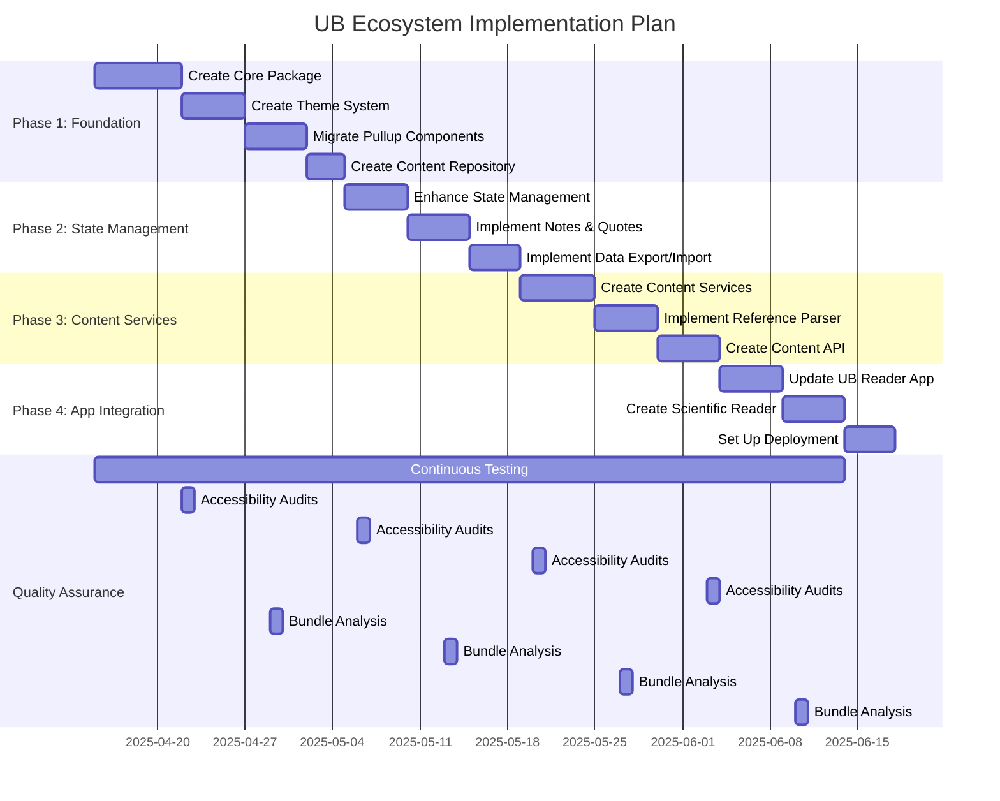

# UB Ecosystem Implementation Plan 2025

**STATUS: ACTIVE - CURRENT IMPLEMENTATION PLAN**

_This document outlines the implementation plan for the UB Ecosystem architecture, leveraging the improved development tools and quality safeguards._

Last Updated: April 12, 2025

## Table of Contents

1. [Overview](#overview)
2. [Implementation Timeline](#implementation-timeline)
3. [Phase 1: Foundation](#phase-1-foundation-weeks-1-2)
4. [Phase 2: State Management](#phase-2-state-management-weeks-3-4)
5. [Phase 3: Content Services](#phase-3-content-services-weeks-5-6)
6. [Phase 4: App Integration](#phase-4-app-integration-weeks-7-8)
7. [Continuous Quality Assurance](#continuous-quality-assurance)
8. [Key Success Metrics](#key-success-metrics)
9. [Development Tools](#development-tools)

## Overview

This implementation plan builds upon the UB Ecosystem Architecture Plan 2025 and incorporates the enhanced development tools and quality safeguards recently added to the project. The plan is designed to ensure high code quality, accessibility, and maintainability throughout the implementation process.

The implementation will follow the four phases outlined in the architecture plan:

1. **Foundation**: Core package, theme system, pullup components, content repository
2. **State Management**: Enhanced state management, notes and quotes, data export/import
3. **Content Services**: Content storage, reference parser, content API
4. **App Integration**: UB Reader app, scientific reader, deployment

Throughout all phases, we will leverage the improved development tools and quality safeguards to ensure high-quality code and prevent regressions.

## Implementation Timeline

## Phase 1: Foundation (Weeks 1-2)

### 1.1: Create Core Package

**Tasks:**

- Create package structure with TypeScript configuration
- Implement document model with TypeScript interfaces
- Create extension system with plugin architecture
- Develop reader context provider with proper typing
- Write unit tests with jest and jest-axe

**Quality Focus:**

- Ensure 100% TypeScript coverage, no `any` types
- Add accessibility tests for all interactive components
- Maintain bundle size under target thresholds

**Deliverables:**

- `packages/core` package with complete documentation
- Unit tests with >80% coverage
- TypeScript interfaces for all public APIs

### 1.2: Create Theme System

**Tasks:**

- Implement theme definitions with CSS modules
- Create ThemeProvider with React context
- Develop useTheme hook with proper TypeScript typing
- Implement theme switching functionality
- Create default themes (light, dark, traditional)

**Quality Focus:**

- Add accessibility tests for contrast ratios
- Ensure theme consistency across components
- Validate theme switching with automated tests

**Deliverables:**

- `packages/theme-system` package with documentation
- Theme definitions for light, dark, and traditional themes
- ThemeProvider component and useTheme hook

### 1.3: Migrate Pullup Components

**Tasks:**

- Move components to UI package with presentation-only pattern
- Update to use theme system with proper styling
- Ensure components follow accessibility guidelines
- Refactor to remove business logic from components
- Add comprehensive tests for all components

**Quality Focus:**

- Add jest-axe tests for all components
- Ensure keyboard navigation works correctly
- Validate touch interactions for mobile devices

**Deliverables:**

- `packages/ui/components/pullup` directory with migrated components
- Accessibility tests for all components
- Documentation with usage examples

### 1.4: Create Central Content Repository

**Tasks:**

- Organize content files in structured directories
- Create content index with TypeScript interfaces
- Implement content loading utilities
- Add validation for content structure
- Create documentation for content organization

**Quality Focus:**

- Add validation for content structure
- Ensure efficient loading of content
- Create tests for content loading edge cases

**Deliverables:**

- Organized content directory structure
- Content index with TypeScript interfaces
- Content loading utilities with documentation

## Phase 2: State Management (Weeks 3-4)

### 2.1: Enhance State Management

**Tasks:**

- Implement localStorage persistence with type safety
- Create contexts with proper TypeScript interfaces
- Develop custom hooks for state access
- Add synchronization capabilities
- Implement state validation

**Quality Focus:**

- Test for memory leaks and performance
- Ensure type safety for all state operations
- Validate state persistence across sessions

**Deliverables:**

- `packages/state-management` package with documentation
- Custom hooks for state access
- Persistence utilities with tests

### 2.2: Implement Notes and Quotes Management

**Tasks:**

- Create contexts with persistence and proper typing
- Implement CRUD operations with validation
- Add sorting and filtering capabilities
- Develop UI components for notes and quotes
- Implement reference linking

**Quality Focus:**

- Ensure data integrity with tests
- Validate CRUD operations with edge cases
- Test performance with large datasets

**Deliverables:**

- Notes and quotes management system
- UI components for notes and quotes
- Documentation with usage examples

### 2.3: Implement Data Export/Import

**Tasks:**

- Create utilities for data export with proper formats
- Implement data import with validation
- Add JSON download/upload with error handling
- Develop migration utilities for format changes
- Add documentation for data formats

**Quality Focus:**

- Test edge cases and error scenarios
- Validate data integrity during import/export
- Ensure backward compatibility

**Deliverables:**

- Data export/import utilities
- Migration utilities for format changes
- Documentation for data formats

## Phase 3: Content Services (Weeks 5-6)

### 3.1: Create Content Services Package

**Tasks:**

- Implement content storage with proper interfaces
- Create content transformers with validation
- Consolidate existing functionality with improved typing
- Add caching for improved performance
- Implement content search

**Quality Focus:**

- Performance testing for large content
- Validate content transformation edge cases
- Test caching effectiveness

**Deliverables:**

- `packages/content-services` package with documentation
- Content storage and transformation utilities
- Caching system with performance tests

### 3.2: Implement Reference Parser

**Tasks:**

- Create reference parsing utilities with proper typing
- Implement reference processor with validation
- Add reference extraction with error handling
- Develop reference linking system
- Create documentation for reference formats

**Quality Focus:**

- Test with various reference formats
- Validate error handling for invalid references
- Ensure performance with large documents

**Deliverables:**

- Reference parsing utilities
- Reference processor with validation
- Documentation for reference formats

### 3.3: Create Content API

**Tasks:**

- Implement unified content API with TypeScript interfaces
- Create content service provider with proper typing
- Add content indexing and search with performance optimization
- Implement API versioning
- Add comprehensive documentation

**Quality Focus:**

- API consistency and error handling
- Performance testing for search operations
- Validate API versioning

**Deliverables:**

- Unified content API
- Content service provider
- API documentation with examples

## Phase 4: App Integration (Weeks 7-8)

### 4.1: Update UB Reader App

**Tasks:**

- Update dependencies with proper versioning
- Create app providers with proper context hierarchy
- Implement traditional reader with all features
- Add error boundaries and fallbacks
- Implement analytics

**Quality Focus:**

- End-to-end testing with Cypress
- Performance testing for initial load
- Accessibility validation

**Deliverables:**

- Updated UB Reader app
- End-to-end tests
- Performance benchmarks

### 4.2: Create Scientific Reader

**Tasks:**

- Implement scientific extension with proper typing
- Create scientific reader component with accessibility
- Add scientific-specific features with tests
- Implement specialized UI components
- Add documentation for scientific features

**Quality Focus:**

- Specialized accessibility tests
- Performance testing for scientific content
- Validate scientific-specific features

**Deliverables:**

- Scientific reader extension
- Specialized UI components
- Documentation for scientific features

### 4.3: Set Up Deployment

**Tasks:**

- Configure Vercel deployment with proper settings
- Create API routes for content with caching
- Add deployment documentation with clear instructions
- Implement CI/CD pipeline
- Set up monitoring and alerting

**Quality Focus:**

- Performance monitoring
- Deployment validation
- Error tracking

**Deliverables:**

- Vercel deployment configuration
- CI/CD pipeline
- Deployment documentation

## Continuous Quality Assurance

Throughout the implementation, we'll leverage our new tools for continuous quality assurance:

### Regular Accessibility Audits

- **Frequency**: Bi-weekly
- **Tools**: jest-axe, browser extensions
- **Focus Areas**:
  - WCAG 2.1 AA compliance
  - Keyboard navigation
  - Screen reader compatibility
  - Color contrast

### Bundle Analysis

- **Frequency**: Bi-weekly
- **Tools**: @next/bundle-analyzer
- **Focus Areas**:
  - Initial bundle size
  - Chunk splitting
  - Tree shaking effectiveness
  - Dependency size

### TypeScript Validation

- **Frequency**: Daily (CI pipeline)
- **Tools**: TypeScript compiler, ESLint
- **Focus Areas**:
  - Type coverage
  - No `any` types
  - Interface consistency
  - Type exports

### Code Quality Checks

- **Frequency**: On every commit
- **Tools**: ESLint, Prettier, Stylelint
- **Focus Areas**:
  - Code style consistency
  - Best practices
  - Potential bugs
  - Unused code

### Automated Testing

- **Frequency**: On every PR
- **Tools**: Vitest, Testing Library, Cypress
- **Focus Areas**:
  - Unit tests
  - Integration tests
  - End-to-end tests
  - Coverage thresholds

## Key Success Metrics

The following metrics will be used to measure the success of the implementation:

### Code Quality

- Zero TypeScript errors
- Zero ESLint warnings
- Zero accessibility issues
- > 80% test coverage

### Performance

- Bundle size under 200KB initial load
- Time to Interactive (TTI) under 3 seconds
- First Contentful Paint (FCP) under 1 second
- Core Web Vitals passing

### Accessibility

- WCAG 2.1 AA compliance for all components
- Keyboard navigation for all interactive elements
- Screen reader compatibility
- Color contrast ratios meeting standards

### Documentation

- Complete API documentation
- Usage examples for all components
- Architecture documentation
- Deployment guides

### User Experience

- Consistent UI across all reader types
- Smooth transitions and animations
- Intuitive navigation
- Responsive design for all screen sizes

## Development Tools

The implementation will leverage the following development tools:

### Code Quality Tools

- **Prettier**: Code formatting
- **ESLint**: Static code analysis
- **Stylelint**: CSS linting
- **TypeScript**: Static type checking

### Testing Tools

- **Vitest**: Test runner
- **Testing Library**: Component testing
- **jest-axe**: Accessibility testing
- **Cypress**: End-to-end testing

### Build Tools

- **Turbo**: Monorepo build system
- **@next/bundle-analyzer**: Bundle analysis
- **TypeScript**: Compilation

### Git Hooks

- **Husky**: Git hooks
- **lint-staged**: Pre-commit linting
- **commitlint**: Commit message validation

For detailed information on these tools, refer to the [DEV_TOOLS.md](./DEV_TOOLS.md) document.
