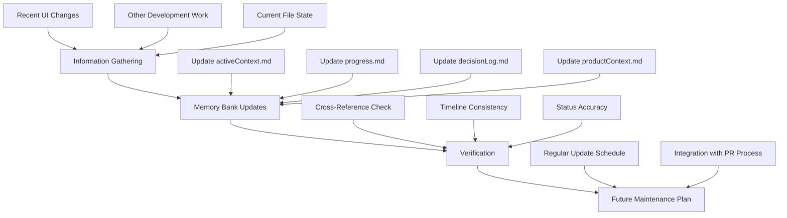

# RooFlow Memory Bank Update Plan

## Overview

This plan outlines a structured approach to update the RooFlow memory bank files to reflect recent development progress, with special emphasis on documenting the UI changes implemented since April 21, 2025. Keeping the memory bank up-to-date ensures that the RooFlow system maintains accurate project context across development sessions.

## Assessment of Current State

- RooFlow and Boomerang configuration is properly set up in roocode.config.json
- Memory bank files (activeContext.md, productContext.md, decisionLog.md, progress.md) were last updated on April 21, 2025
- Significant UI changes have been implemented as documented in UB-Reader-UI-Changes-Summary.md
- This creates a "context gap" that needs to be addressed to maintain the effectiveness of RooFlow's persistent memory

## Update Process



## Detailed Update Steps

### 1. Information Gathering

#### UI Changes Documentation

Based on UB-Reader-UI-Changes-Summary.md, capture the following UI changes:

1. **Section Title Styling**: Changes from uppercase to natural case
2. **Pullup Bar Improvements**: Reduced height, always-visible handle, state management
3. **Tab Layout Adjustments**: Adjacent labels, spacing reductions, left alignment
4. **Text Alignment Settings**: New options in Settings tab
5. **Paragraph Numbering Format**: Improved paragraph number display
6. **Notes Feature Coordination**: Separate column for indicators

#### Additional Development Work

- Review Git commits since April 21
- Identify any other completed implementation tasks or bug fixes
- Document any architectural changes not related to UI

### 2. Memory Bank File Updates

#### Update activeContext.md

- **Current Focus**: Add UI improvement implementation as recently completed
- **Current Task Details**: Update with next priorities after UI changes
- **Active Components**: Update to reflect modified components:
  - Pullup component with improved behavior
  - Text alignment features
  - Paragraph numbering & notes indicators improvements
- **Current Challenges**: Revise based on current state
- **Recent Changes**: Add entries for the six UI changes with dates

Example entry format:

```
- [5/2/2025] Completed UI improvements including:
  - Section title styling normalization
  - Pullup bar behavior enhancements
  - Tab layout adjustments for better cohesion
  - Text alignment settings implementation
  - Paragraph numbering format refinements
  - Notes feature coordination improvements
```

#### Update progress.md

- Update "Overall Progress" pie chart (likely increase "Completed" percentage)
- Move relevant tasks from "In Progress" to "Completed":
  - [ ] Refine paragraph numbering (positioning, styling, alignment)
  - [ ] Improve pullup drag behavior (responsiveness, visual feedback)
  - [ ] Create basic settings UI mockups (theme toggles, font controls)
- Add any new "In Progress" tasks that have been started
- Update "Dependencies and Blockers" to reflect resolved issues

#### Update decisionLog.md

Add a new entry for the UI changes decision implementation:

```
## 2025-05-02: UI Improvements Implementation

**Decision**: Implement a comprehensive set of UI improvements focused on readability, usability, and visual cohesion.

**Rationale**:
- Improve readability with natural case for section titles
- Enhance pullup usability with less intrusive design and consistent behavior
- Create cohesive tab layout with adjacent labels
- Provide text alignment options for user preference
- Separate notes indicators from paragraph numbers for clarity

**Implementation**:
- Modified section title CSS to use natural case instead of uppercase
- Reduced pullup minimum height and ensured handle visibility
- Adjusted tab spacing and alignment for cohesion
- Added text alignment options in Settings tab
- Created separate column for notes indicators
- Implemented state reset when toggling tabs
```

#### Update productContext.md

- Review "Current Priorities" section and update based on progress
- Ensure "Key Features" accurately reflects the enhanced UI components
- No changes needed to architecture or repository structure unless those have changed

### 3. Verification Process

- Cross-reference all memory bank files to ensure consistency
- Verify UI changes are properly reflected across all files
- Check that dates and timelines align across documentation
- Ensure task status is consistent between files

### 4. Future Maintenance Plan

- Establish a bi-weekly schedule for memory bank updates
- Consider integrating updates with the PR process
- Create a checklist for memory bank updates to ensure consistency

## Implementation Timeline

1. **Day 1**: Complete information gathering and prepare updates
2. **Day 2**: Update all memory bank files
3. **Day 3**: Verify consistency and establish maintenance plan

## Conclusion

Following this plan will ensure that the RooFlow memory bank accurately reflects the current state of the UB Reader project, with particular emphasis on properly documenting the significant UI changes that have been implemented since the last update. This will maintain the effectiveness of RooFlow's persistent memory for future development sessions.
