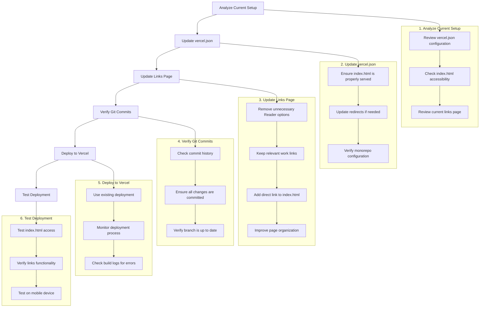

# UB Reader Deployment Update Plan

**Created**: May 1, 2025  
**Status**: Approved

## Current Situation Analysis

- The current deployment is at https://ub-reader-2.vercel.app/
- It shows a "UB Reader - Work Links" page with various links
- We want to keep this page but update it to only show relevant links
- We need to ensure index.html is accessible for testing on mobile devices
- The project is a monorepo with multiple publication deployments

## Implementation Plan

## Detailed Steps

### 1. Update vercel.json Configuration

The current vercel.json in apps/ub-reader has:

- Build and install commands for the monorepo
- Cache control headers
- A redirect from /paper/1 to /

We need to ensure it properly serves index.html as the homepage. Here's what we'll do:

1. Review the current configuration
2. Update the redirects section if needed to ensure index.html is accessible
3. Add any necessary rewrites to serve index.html as the homepage

### 2. Update the Links Page

We'll update the current "UB Reader - Work Links" page to:

1. Remove the unnecessary "Reader options" section
2. Keep only the relevant links to current work
3. Add a prominent direct link to index.html for testing
4. Improve the organization and layout of the page

### 3. Verify Git Commits

Before deploying, we'll:

1. Check that all necessary changes are committed
2. Verify that the commit history is clean and organized
3. Ensure the branch is up to date with any remote changes

### 4. Deploy to Vercel

For the deployment:

1. Use the existing Vercel project setup
2. Monitor the deployment process for any errors
3. Check the build logs to ensure everything is built correctly

### 5. Test the Deployment

After deployment:

1. Test accessing index.html directly
2. Verify all links on the updated page work correctly
3. Test the deployment on a mobile device to ensure everything works as expected

## Technical Considerations

1. **Monorepo Structure**: The project is set up as a monorepo with multiple publications. We need to ensure the deployment configuration respects this structure.

2. **Vercel Configuration**: The vercel.json file is crucial for controlling how the application is served. We'll need to ensure it's properly configured for the monorepo structure and to serve index.html.

3. **pnpm Workspace**: The project uses pnpm for package management. The vercel-preinstall.js script handles workspace dependencies for Vercel deployment.

4. **Next.js Configuration**: The next.config.js file contains important settings for the Next.js application, including transpilation of workspace packages.
