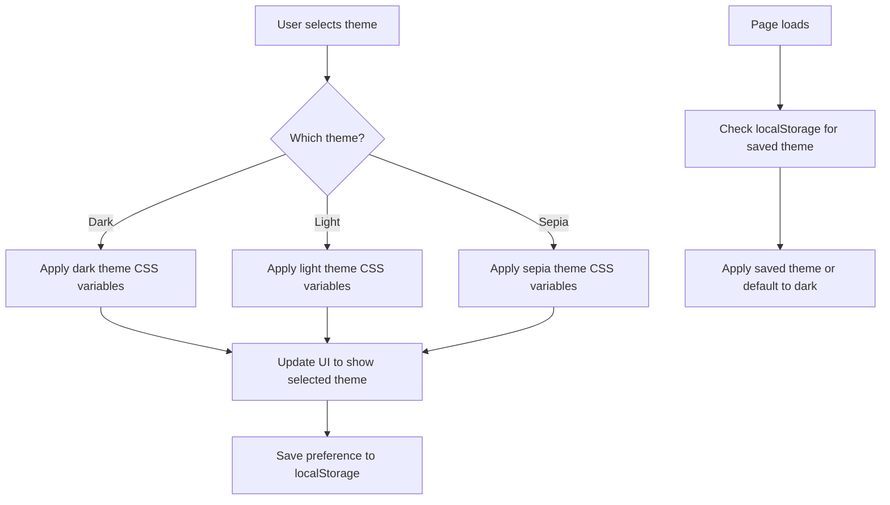

# Background Color Scheme Implementation Plan

## Overview

This plan outlines the steps to implement the requested background color scheme for the UB Reader application. The implementation will focus on both paper-1-alpha.html and index.html files, which share the same structure and CSS variables.

## Current State Analysis

Both HTML files currently use a dark theme with the following CSS variables:

```css
:root {
  /* Colors */
  --bg-color: #1a1a1a;
  --text-color: #e2e8f0;
  --header-bg-color: #222;
  --header-text-color: #fff;
  --border-color: #333;
  --accent-color: #0088ff;
  --pullup-bg-color: #222;
  --pullup-text-color: #fff;
  --pullup-handle-color: #666;
}
```

The files already have theme switching UI in the settings panel with options for Dark, Light, and Sepia themes, but the actual theme switching functionality is not implemented in the JavaScript.

## Requested Color Scheme

From the Background color scheme.md file:

**Dark Mode:**

- Outer frame: true black (#000000)
- Reading background: dark gray (#181A1B or #23272F)
- Text: soft off-white (#E8E6E3)

**Light Mode:**

- Frame: pure white (#FFFFFF) or off-white (#F5F6F7)
- Reading background: very light gray or cream (#FAFAFA or #F7F6F3)
- Text: dark gray (#222222)

## Implementation Plan

### 1. Enhance CSS Variables for Theme Support

Modify the CSS variables section to include theme-specific variables:

```css
:root {
  /* Layout measurements (unchanged) */
  --title-bar-height: 60px;
  --paper-bar-height: 40px;
  --pullup-closed-height: 40px;
  --reading-max-width: 700px;
  --content-padding: 20px;

  /* Default theme (dark) */
  --outer-frame-color: #000000;
  --reading-bg-color: #181a1b;
  --text-color: #e8e6e3;
  --header-bg-color: #000000;
  --header-text-color: #e8e6e3;
  --border-color: #333;
  --accent-color: #0088ff;
  --pullup-bg-color: #000000;
  --pullup-text-color: #e8e6e3;
  --pullup-handle-color: #666;
  /* Shadow for visual separation */
  --shadow-color: rgba(0, 0, 0, 0.2);
}

/* Light theme class */
.light-theme-active {
  --outer-frame-color: #ffffff;
  --reading-bg-color: #f7f6f3;
  --text-color: #222222;
  --header-bg-color: #ffffff;
  --header-text-color: #222222;
  --border-color: #ddd;
  --pullup-bg-color: #ffffff;
  --pullup-text-color: #222222;
  --pullup-handle-color: #aaa;
  --shadow-color: rgba(0, 0, 0, 0.1);
}

/* Sepia theme class */
.sepia-theme-active {
  --outer-frame-color: #f5f2e9;
  --reading-bg-color: #f4ecd8;
  --text-color: #5f4b32;
  --header-bg-color: #f5f2e9;
  --header-text-color: #5f4b32;
  --border-color: #e0d6c2;
  --pullup-bg-color: #f5f2e9;
  --pullup-text-color: #5f4b32;
  --pullup-handle-color: #c4b6a0;
  --shadow-color: rgba(0, 0, 0, 0.08);
}
```

### 2. Update CSS Selectors to Use New Variables

Update the CSS selectors to use the new variables:

```css
/* Add transition effect for smooth theme switching */
body,
.reading-area,
.title-bar,
.paper-bar,
.pullup-footer {
  transition:
    background-color 0.3s ease,
    color 0.3s ease,
    border-color 0.3s ease,
    box-shadow 0.3s ease;
}

body {
  font-family: var(--font-family);
  font-size: var(--base-font-size);
  line-height: 1.6;
  color: var(--text-color);
  background-color: var(--outer-frame-color);
  min-height: 100vh;
  position: relative;
}

.reading-area {
  /* Existing properties */
  background-color: var(--reading-bg-color);
  color: var(--text-color);
  /* Add padding and border-radius for visual separation */
  padding: 2rem;
  border-radius: 8px;
  /* Add subtle shadow for visual separation from outer frame */
  box-shadow: 0 2px 10px var(--shadow-color);
  margin-bottom: 2rem;
}
```

### 3. Implement Theme Switching JavaScript

Add JavaScript to handle theme switching:

```javascript
// Theme switching functionality
const themeOptions = document.querySelectorAll('.theme-option');
const body = document.body;

// Function to set theme
function setTheme(theme) {
  // Remove all theme classes
  body.classList.remove('light-theme-active', 'sepia-theme-active');

  // Add the selected theme class if not dark (dark is default)
  if (theme === 'light') {
    body.classList.add('light-theme-active');
  } else if (theme === 'sepia') {
    body.classList.add('sepia-theme-active');
  }

  // Update selected state in UI
  themeOptions.forEach(option => {
    if (option.dataset.theme === theme) {
      option.classList.add('theme-option-selected');
    } else {
      option.classList.remove('theme-option-selected');
    }
  });

  // Save preference to localStorage
  localStorage.setItem('ub-reader-theme', theme);
}

// Add click event listeners to theme options
themeOptions.forEach(option => {
  option.addEventListener('click', function () {
    const theme = this.dataset.theme;
    setTheme(theme);
  });
});

// Load saved theme preference on page load
document.addEventListener('DOMContentLoaded', function () {
  const savedTheme = localStorage.getItem('ub-reader-theme') || 'dark';
  setTheme(savedTheme);
});
```

### 4. Update Theme Preview Colors

Update the theme preview colors in the settings panel to match the new color scheme:

```css
.dark-theme {
  background-color: #181a1b;
  border: 1px solid #000000;
}

.light-theme {
  background-color: #f7f6f3;
  border: 1px solid #ffffff;
}

.sepia-theme {
  background-color: #f4ecd8;
  border: 1px solid #f5f2e9;
}
```

## Implementation Approach

1. First, implement the changes in paper-1-alpha.html as a prototype
2. Test the implementation to ensure proper theme switching and visual appearance
3. Once confirmed working, apply the same changes to index.html
4. Ensure the theme preference is saved and loaded correctly between page refreshes

## Accessibility Considerations

- Ensure all text meets WCAG AA contrast requirements in all themes
- Test with screen readers to confirm proper semantic structure
- Verify keyboard navigation works correctly for theme switching

## Visual Diagram



## Next Steps

After implementing this color scheme:

1. Implement user preference detection (prefers-color-scheme media query)
2. Add high contrast theme option for enhanced accessibility
3. Consider adding custom theme creation capability for advanced users
4. Explore additional visual refinements based on user feedback
