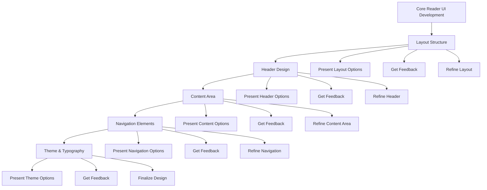

# Core Reader UI Development Plan

**Status**: Approved  
**Created**: April 12, 2025  
**Phase**: 1 - Foundation  
**Component**: Reader UI

## Overview

This document outlines the collaborative, iterative approach to developing the Core Reader UI for the UB Reader application. The plan focuses on a step-by-step process with regular feedback checkpoints to ensure the final product meets both design best practices and user preferences.

## Development Approach Diagram

## Iterative Development Steps

### Step 1: Layout Structure (Collaborative Design)

1. **Present Basic Layout Options**
   - Option A: Fixed header with scrollable content
   - Option B: Sticky header that minimizes on scroll
   - Option C: Full-height sidebar with content area
2. **Design Considerations to Discuss**
   - Reading comfort: How much content should be visible at once?
   - Screen utilization: Balance between whitespace and content density
   - Mobile vs. desktop experience: How should the layout adapt?
3. **Feedback Checkpoint**
   - Get user preferences on overall layout structure
   - Discuss any specific layout requirements
   - Refine the chosen layout based on feedback

### Step 2: Header Design (Collaborative Design)

1. **Present Header Options**
   - Option A: Minimal header with just title and essential controls
   - Option B: Feature-rich header with navigation, search, and settings
   - Option C: Expandable header that can show/hide additional options
2. **Design Considerations to Discuss**
   - Navigation accessibility: How easily can users navigate between sections?
   - Visual hierarchy: What elements should be most prominent?
   - Branding: How should the UB Reader identity be represented?
3. **Feedback Checkpoint**
   - Get user preferences on header style and functionality
   - Discuss placement of navigation controls
   - Refine header design based on feedback

### Step 3: Content Area (Collaborative Design)

1. **Present Content Display Options**
   - Option A: Clean, book-like layout with paragraph numbers
   - Option B: Enhanced layout with margin notes and indicators
   - Option C: Academic layout with footnotes and references
2. **Design Considerations to Discuss**
   - Reading flow: How to maintain focus on the content
   - Information density: Balance between text and supporting elements
   - Paragraph numbering: How to make it useful without being distracting
3. **Feedback Checkpoint**
   - Get user preferences on content presentation
   - Discuss paragraph styling and numbering
   - Refine content area based on feedback

### Step 4: Navigation Elements (Collaborative Design)

1. **Present Navigation Options**
   - Option A: Dropdown menus for book and section navigation
   - Option B: Slide-in panels for hierarchical navigation
   - Option C: Breadcrumb navigation with quick access points
2. **Design Considerations to Discuss**
   - Navigation efficiency: How quickly can users find specific content?
   - Context awareness: How to show users where they are in the book
   - Discoverability: How to make navigation options obvious but not intrusive
3. **Feedback Checkpoint**
   - Get user preferences on navigation style
   - Discuss interaction patterns for navigation
   - Refine navigation elements based on feedback

### Step 5: Theme & Typography (Collaborative Design)

1. **Present Theme Options**
   - Option A: Dark theme with high contrast for night reading
   - Option B: Light theme with paper-like background
   - Option C: Customizable theme with user preferences
2. **Design Considerations to Discuss**
   - Reading comfort: Font size, line height, and spacing
   - Eye strain reduction: Color schemes and contrast levels
   - Accessibility: Ensuring readability for all users
3. **Feedback Checkpoint**
   - Get user preferences on theme and typography
   - Discuss font choices and sizing
   - Finalize theme and typography based on feedback

## Implementation Approach

For each step:

1. Implement a basic version based on this plan
2. Present it to the user with options and considerations
3. Collect feedback on preferences and desired changes
4. Refine the implementation based on feedback
5. Move to the next step while incorporating lessons from previous steps

This approach ensures we're building exactly what the user wants while benefiting from UI design best practices. We'll maintain a focus on reading comfort, ease of use, and a clean, professional appearance throughout the process.

## Technical Components

The implementation will leverage existing components in the codebase:

- **Header**: Building on ReaderHeader.tsx
- **Content Display**: Using UBParagraph, UBNumberedList, UBSectionDivider, UBTable
- **Interactive Elements**: Incorporating HighlightProvider, PullupContainer, PullupPanel
- **Theme Management**: Utilizing ThemeSettingsPanel

## Progress Tracking

We'll track progress through each step using the following status indicators:

- **Not Started**: Step has not begun
- **In Progress**: Currently implementing or discussing
- **Feedback**: Awaiting user feedback
- **Refinement**: Incorporating feedback
- **Completed**: Step is finished and approved

## Next Steps

1. Switch to Code mode to begin implementation of Step 1: Layout Structure
2. Create a basic implementation with multiple layout options
3. Present options to the user for feedback
4. Refine based on feedback before moving to Step 2
