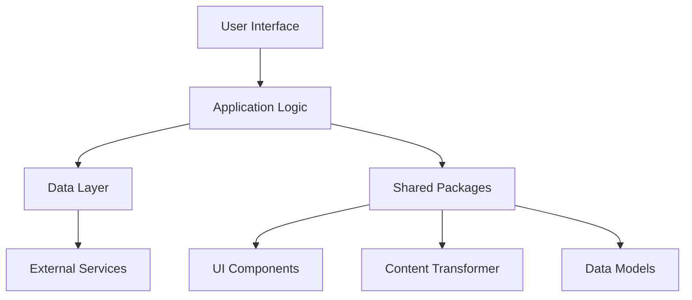

# [App Name] Application

## Overview

[Brief description of the application's purpose and functionality]

## Features

- [Feature 1]
- [Feature 2]
- [Feature 3]
- [Feature 4]

## Architecture



## Directory Structure

```
app-name/
├── app/                  # Next.js app directory
│   ├── layout.tsx        # Root layout
│   ├── page.tsx          # Home page
│   └── [routes]/         # Application routes
├── components/           # App-specific components
│   ├── ui/               # UI components
│   └── features/         # Feature-specific components
├── lib/                  # App-specific utilities
├── contexts/             # React contexts
├── hooks/                # Custom React hooks
├── styles/               # CSS and styling
├── public/               # Static assets
├── next.config.js        # Next.js configuration
├── package.json          # Dependencies and scripts
└── README.md             # This file
```

## Dependencies

This application uses the following shared packages:

- `@ub-ecosystem/ui`: UI components
- `@ub-ecosystem/content-transformer`: Document transformation
- `@ub-ecosystem/data-models`: Data models
- `@ub-ecosystem/reference-parser`: Reference parsing
- `@ub-ecosystem/audio-services`: Audio playback (if applicable)

## Getting Started

### Prerequisites

- Node.js 16.x or higher
- npm 9.x or higher

### Installation

From the repository root:

```bash
# Install all dependencies
npm install

# Or install only this app's dependencies
npm install --workspace=apps/[app-name]
```

### Development

From the repository root:

```bash
# Start only this application
npm run dev -- --filter=[app-name]

# Or from the app directory
cd apps/[app-name]
npm run dev
```

### Building

From the repository root:

```bash
# Build only this application
npm run build -- --filter=[app-name]

# Or from the app directory
cd apps/[app-name]
npm run build
```

## Configuration

### Environment Variables

Create a `.env.local` file in the app directory with the following variables:

```
# Required environment variables
NEXT_PUBLIC_API_URL=https://api.example.com

# Optional environment variables
NEXT_PUBLIC_FEATURE_FLAG_X=true
```

### Feature Flags

This application uses the following feature flags:

- `FEATURE_X`: Enables X feature
- `FEATURE_Y`: Enables Y feature

## Deployment

### Vercel Deployment

1. Create a new project in Vercel
2. Connect to the GitHub repository
3. Set the root directory to `apps/[app-name]`
4. Configure environment variables
5. Deploy

See the [deployment guide](../../docs/deployment/vercel-deployment.md) for detailed instructions.

## Testing

```bash
# Run tests
npm run test

# Run tests with coverage
npm run test:coverage
```

## Troubleshooting

### Common Issues

- **Issue 1**: [Description and solution]
- **Issue 2**: [Description and solution]

## Contributing

Please read the [Contributing Guide](../../CONTRIBUTING.md) for details on our code of conduct and the process for submitting pull requests.
