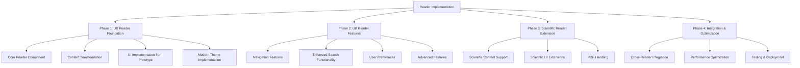

# Reader Implementation Plan (Updated)

## Overview

This document outlines a comprehensive plan for implementing both the UB Reader and Scientific Reader applications, incorporating design elements and functionality from the improved-demo.html prototype. The UB Reader will be developed first as the foundation, with its design informing and supporting the subsequent Scientific Reader development.



## Key Design Elements from Improved Demo

The implementation will incorporate the following key design elements from the improved-demo.html prototype:

1. **Navigation Menu (Hamburger Menu)**:

   - Hierarchical structure with parts and papers
   - Fixed top container for active parts
   - Fixed bottom container for inactive parts
   - Expandable/collapsible sections

2. **Sticky Headers**:

   - Persistent display of part title, paper title, and section title while scrolling
   - Proper z-index management for overlapping elements

3. **Modern UI Design**:

   - Clean, modern interface with consistent styling
   - Dark theme with good contrast for readability
   - Responsive design for different screen sizes

4. **Reading Experience**:

   - Clear typography and spacing for comfortable reading
   - Paragraph numbering with proper alignment
   - Section navigation with smooth scrolling

5. **Settings Panel**:
   - Comprehensive display and reading settings
   - Theme, font size, font style options
   - Line spacing and text width controls

## Modern Theme Implementation

The reader will offer two distinct theme options for content formatting:

1. **Modern Theme** (Default):

   - Sans-serif font for improved digital legibility
   - Increased boldness for italicized words and words in ALL CAPS
   - Proper alignment for numbered lists and tables (numbers under numbers, text under text)
   - Visual indicators (faint lines) between paragraphs that indicate topic changes
   - Text that wraps more naturally for better readability
   - Optimized for reading on digital devices, especially phones and tablets

2. **Traditional Theme** (Fallback option):
   - Formatting that matches the original book's presentation
   - Numbered lists displayed as numbered paragraphs
   - Standard emphasis for italicized text
   - Traditional paragraph spacing without visual indicators
   - Preserves the historical presentation familiar to long-time readers

The implementation will include:

1. **Typography System**:

   - Configuration to switch between sans-serif (modern) and serif (traditional) font families
   - Conditional styling for emphasis (bold italics in modern, standard italics in traditional)
   - Proper font scaling across device sizes in both themes

2. **List and Table Formatting**:

   - Two distinct rendering approaches for numbered lists:
     - Modern: Proper column alignment with numbers under numbers and text under text
     - Traditional: Paragraph-style with numbers inline with text
   - Proper table formatting in the modern theme while preserving original formatting in traditional theme
   - Special handling for lists with rows of dots between elements

3. **Theme Toggle Component**:
   - Easily accessible theme toggle in the settings menu
   - Brief descriptions of each theme option
   - Visual preview of how each theme affects the text
   - Smooth transitions when switching between themes

## Phase 1: UB Reader Foundation (3 weeks)

### 1.1 Directory Structure Setup

```
apps/
  ub-reader/                # UB Reader application
    app/                    # Next.js app directory
      page.tsx              # Main page
      layout.tsx            # Layout component
      paper/[id]/           # Dynamic route for papers
        page.tsx            # Paper page
        section/[sectionId]/# Dynamic route for sections
          page.tsx          # Section page
    components/             # Reader-specific components
      navigation/           # Navigation components
        hamburger-menu.tsx  # Hamburger menu component
        part-toggle.tsx     # Part toggle component
        paper-list.tsx      # Paper list component
      reader/               # Reader components
        sticky-header.tsx   # Sticky header component
        section-title.tsx   # Section title component
        paragraph.tsx       # Paragraph component
      settings/             # Settings components
        settings-panel.tsx  # Settings panel component
        theme-selector.tsx  # Theme selector component
        font-controls.tsx   # Font controls component
      themes/               # Theme components
        modern-theme.tsx    # Modern theme component
        traditional-theme.tsx # Traditional theme component
        theme-toggle.tsx    # Theme toggle component
    styles/                 # CSS styles
      reader.css            # Reader styles
      navigation.css        # Navigation styles
      settings.css          # Settings styles
      themes/               # Theme styles
        modern.css          # Modern theme styles
        traditional.css     # Traditional theme styles
    content/                # UB content
    public/                 # Static assets
```

### 1.2 Core Reader Component Enhancement

Enhance the document reader component in `packages/ui/src/document-reader` to serve as the foundation for both readers:

1. **Document Structure Support**

   - Implement a flexible document model that can represent both UB and scientific content
   - Support hierarchical content with parts, papers, sections, and paragraphs
   - Add metadata handling for different document types

2. **Content Rendering**

   - Create a modular rendering system that can be extended for different content types
   - Implement basic text formatting (paragraphs, headings, lists, etc.)
   - Add support for images and basic media

3. **Reader Settings**
   - Implement settings panel similar to the improved demo
   - Add support for theme, font size, font style
   - Add support for line spacing and text width
   - Implement settings persistence using local storage

### 1.3 Content Transformation System

Enhance the document transformer system in `packages/content-transformer` to support various content formats:

1. **Transformer Enhancements**

   - Refine the markdown transformer for better content parsing
   - Enhance the docx transformer for improved document structure extraction
   - Implement a JSON transformer for UB content

2. **Content Normalization**

   - Standardize document structure across different formats
   - Normalize metadata extraction
   - Create consistent content models

3. **Content Validation**
   - Implement validation for document structure
   - Add checks for required metadata
   - Create error reporting for invalid content

### 1.4 UI Implementation from Prototype

Implement the UI design from the improved-demo.html prototype:

1. **Navigation Menu**

   - Implement the hamburger menu with the same structure as the prototype
   - Create the fixed top container for active parts
   - Create the fixed bottom container for inactive parts
   - Implement part toggle functionality with expansion/collapse

2. **Sticky Headers**

   - Implement sticky headers for part title, paper title, and section title
   - Ensure proper scrolling behavior and z-index management
   - Add section navigation dropdown with smooth scrolling

3. **Reading Area**

   - Implement the reading area with proper styling
   - Create paragraph components with numbering
   - Add proper spacing and typography for comfortable reading

4. **Settings Panel**
   - Implement the settings panel with the same options as the prototype
   - Add theme switching functionality
   - Implement font size and style controls
   - Add line spacing and text width options

### 1.5 Modern Theme Implementation

Implement the Modern Theme and Traditional Theme options:

1. **Theme Configuration System**

   - Create a theme context provider for managing theme state
   - Implement theme switching functionality
   - Store theme preference in localStorage

2. **Typography Implementation**

   - Create typography components for both themes
   - Implement conditional styling for emphasis
   - Add proper font scaling for different devices

3. **List and Table Formatting**

   - Implement modern list formatting with proper alignment
   - Create traditional list formatting that matches the original book
   - Add special handling for tables and lists with separators

4. **Theme Toggle UI**
   - Create a theme toggle component in the settings panel
   - Add visual previews of each theme
   - Implement smooth transitions between themes

## Phase 2: UB Reader Features (4 weeks)

### 2.1 Navigation Features

Implement comprehensive navigation features for the UB Reader:

1. **Enhanced Hamburger Menu**

   - Refine the hamburger menu implementation
   - Add active state tracking for current paper and section
   - Implement smooth transitions and animations
   - Ensure proper mobile responsiveness

2. **Section Navigation**

   - Enhance the section navigation dropdown
   - Add breadcrumb navigation for the current location
   - Implement keyboard shortcuts for navigation
   - Add swipe gestures for mobile navigation

3. **Previous/Next Navigation**

   - Add previous/next buttons for sequential navigation
   - Implement keyboard shortcuts for navigation
   - Add swipe gestures for mobile navigation

4. **History Navigation**
   - Implement history tracking for visited sections
   - Add back/forward navigation
   - Create a history view for quick access to recently visited sections

### 2.2 Enhanced Search Functionality

Implement comprehensive search functionality for the UB Reader:

1. **User-Friendly Search Interface**

   - Create a prominent, intuitive search entry field
   - Implement auto-suggestions as the user types
   - Add search history for quick access to previous searches
   - Support natural language queries and advanced syntax

2. **Search Results Display**

   - Show whole paragraphs in search results if not too long
   - For longer paragraphs, show the matching text with context above and below
   - Implement highlighting of search terms in results
   - Default to displaying results in Paper Order (sequential by paper/section)
   - Add alternative sorting options (relevance, date, etc.)

3. **Search Filters and Refinement**

   - Add filters for search results (by part, paper, section, etc.)
   - Implement faceted search for refining results
   - Create saved searches functionality
   - Add support for boolean operators (AND, OR, NOT)

4. **Reference Search**
   - Add support for reference search (e.g., Paper 1:5.9)
   - Implement direct navigation to references
   - Create a reference lookup tool with auto-completion

### 2.3 User Preferences

Enhance user preferences for the UB Reader:

1. **Preference Storage**

   - Implement local storage for preferences
   - Add support for syncing preferences (if applicable)
   - Create preference reset functionality

2. **Reading Preferences**

   - Enhance theme selection (light, dark, sepia, etc.)
   - Add more font options and size controls
   - Implement custom theme creation

3. **Display Preferences**

   - Add options for showing/hiding verse numbers
   - Implement margin and padding controls
   - Add support for column layout options

4. **Navigation Preferences**
   - Add options for navigation behavior
   - Implement preferences for history tracking
   - Create customization options for the table of contents

### 2.4 Advanced Features

Implement advanced features for the UB Reader:

1. **Bookmarks and Annotations**

   - Add support for bookmarking sections
   - Implement highlighting functionality
   - Add note-taking capabilities
   - Create a bookmark/annotation manager

2. **Enhanced Copy Functionality**

   - Implement a toggle in settings for "Copy with or without reference"
   - Create a standardized format for copied text with references: "[paper:section.paragraph] [text]"
   - For multiple paragraphs, include references for each paragraph
   - Special handling for lists: when reference numbers are before list numbers/elements, only reference the first element
   - Add toast notifications for user feedback when text is copied
   - Implement keyboard shortcuts for copying with/without references

3. **Sharing Functionality**

   - Implement sharing of sections or passages
   - Add support for generating shareable links
   - Create export functionality for selections with proper formatting

4. **Offline Support**

   - Implement content caching for offline access
   - Add support for offline search
   - Create synchronization for offline changes

5. **Text-to-Speech (Future Enhancement)**
   - Plan for browser-based TTS integration
   - Research UB pronunciation guides for correct pronunciation
   - Design an interface for TTS controls
   - Consider options for highlighting text during playback

## Phase 3: Scientific Reader Extension (4 weeks)

### 3.1 Scientific Reader Directory Structure

```
apps/
  publications/
    scientific/             # Scientific Reader application
      app/                  # Next.js app directory
        page.tsx            # Main page
        layout.tsx          # Layout component
        [id]/               # Dynamic route for papers
          page.tsx          # Paper page
      components/           # Scientific-specific components
        math/               # Math rendering components
        citations/          # Citation components
        tables/             # Table components
        pdf-viewer/         # PDF viewing components
      styles/               # CSS styles
      content/              # Scientific content
      public/               # Static assets
```

### 3.2 Scientific Content Support

Extend the document transformer system to support scientific content:

1. **Scientific Markdown Support**

   - Enhance the markdown transformer for scientific notation
   - Add support for mathematical formulas (KaTeX/MathJax)
   - Implement handling for citations and references
   - Add support for tables and figures

2. **Scientific DOCX Support**

   - Enhance the docx transformer for scientific documents
   - Implement extraction of mathematical formulas
   - Add support for extracting tables and figures
   - Create handling for citations and references

3. **PDF Viewing Support**

   - Implement basic PDF viewing capability
   - Add support for zooming and panning
   - Create a mobile-friendly PDF viewer
   - Implement page navigation for PDFs

4. **Content Processors**
   - Create specialized processors for scientific content
   - Implement a math processor for formula rendering
   - Add a citation processor for reference formatting
   - Create a code processor for syntax highlighting

### 3.3 Scientific UI Extensions

Extend the reader UI for scientific content:

1. **Mathematical Formula Rendering**

   - Implement KaTeX/MathJax integration
   - Add support for inline and block formulas
   - Create proper formula numbering and referencing

2. **Table and Figure Display**

   - Implement responsive table rendering
   - Add support for figure display with captions
   - Create proper numbering and referencing for tables and figures

3. **Citation and Reference Handling**

   - Implement citation rendering in various formats
   - Add support for reference lists
   - Create linking between citations and references

4. **Code Snippet Display**
   - Implement syntax highlighting for code snippets
   - Add support for line numbers
   - Create copy functionality for code snippets

### 3.4 Scientific Reader Features

Implement features specific to the Scientific Reader:

1. **Paper Navigation**

   - Create a specialized navigation system for scientific papers
   - Implement section navigation (Abstract, Methods, Results, etc.)
   - Add support for figure and table navigation

2. **Reference Management**

   - Implement a reference manager for scientific papers
   - Add support for citation lookup
   - Create a bibliography view

3. **Search Enhancements**

   - Add specialized search for scientific content
   - Implement search by author, title, keywords, etc.
   - Create filters for publication date, topic, etc.

4. **Export and Sharing**
   - Implement export functionality for citations
   - Add support for sharing specific sections or figures
   - Create export options for bibliographic information

## Phase 4: Integration and Optimization (3 weeks)

### 4.1 Cross-Reader Integration

Implement integration between the UB Reader and Scientific Reader:

1. **Shared Components**

   - Refine shared components for consistency
   - Implement a component library for both readers
   - Create documentation for component usage

2. **Navigation Integration**

   - Implement cross-linking between readers
   - Add support for navigating between related content
   - Create a unified navigation experience

3. **Search Integration**

   - Implement cross-reader search capability
   - Add support for searching across all content types
   - Create a unified search interface

4. **User Preference Synchronization**
   - Implement synchronization of user preferences between readers
   - Add support for reader-specific preferences
   - Create a unified preference management system

### 4.2 Performance Optimization

Optimize performance for both readers:

1. **Rendering Optimization**

   - Implement virtualization for large documents
   - Add lazy loading for images and media
   - Create efficient rendering of complex elements

2. **Search Optimization**

   - Implement efficient search indexing
   - Add caching for search results
   - Create optimized search algorithms

3. **Resource Management**

   - Implement efficient resource loading
   - Add memory management for large documents
   - Create optimized asset handling

4. **Mobile Optimization**
   - Implement responsive design optimizations
   - Add touch-friendly controls
   - Create efficient layouts for small screens

### 4.3 Testing and Deployment

Implement comprehensive testing and deployment:

1. **Automated Testing**

   - Implement unit tests for components and utilities
   - Add integration tests for reader functionality
   - Create end-to-end tests for user flows

2. **Performance Testing**

   - Implement performance benchmarks
   - Add load testing for large documents
   - Create performance monitoring

3. **Deployment Pipeline**

   - Implement CI/CD for automated testing and deployment
   - Add staging environment for testing
   - Create production deployment process

4. **Monitoring and Analytics**
   - Implement error tracking and reporting
   - Add usage analytics
   - Create monitoring dashboards

## Implementation Timeline

1. **Phase 1: UB Reader Foundation** - 3 weeks

   - Week 1: Directory structure setup and core reader component
   - Week 2: Content transformation system and UI implementation from prototype
   - Week 3: Modern theme implementation

2. **Phase 2: UB Reader Features** - 4 weeks

   - Week 4: Navigation features
   - Week 5: Enhanced search functionality
   - Week 6: User preferences
   - Week 7: Advanced features

3. **Phase 3: Scientific Reader Extension** - 4 weeks

   - Week 8: Scientific reader directory structure and content support
   - Week 9: Scientific UI extensions
   - Week 10: Scientific reader features
   - Week 11: PDF viewing support

4. **Phase 4: Integration and Optimization** - 3 weeks
   - Week 12: Cross-reader integration
   - Week 13: Performance optimization
   - Week 14: Testing and deployment

Total estimated time: 14 weeks

## CSS Implementation Strategy

The CSS implementation will be based on the styles from the improved-demo.html prototype, with the following enhancements:

1. **Modular CSS Structure**

   - Create separate CSS files for different components
   - Use CSS modules or a similar approach for scoping
   - Implement a consistent naming convention

2. **Responsive Design**

   - Enhance the responsive design for better mobile support
   - Implement proper breakpoints for different screen sizes
   - Create mobile-specific optimizations

3. **Theme System**

   - Implement a theme system with CSS variables
   - Create light, dark, and sepia themes for UI
   - Implement Modern and Traditional content formatting themes
   - Add support for custom themes

4. **Animation and Transitions**
   - Add smooth animations for navigation and UI elements
   - Implement transitions for state changes
   - Ensure animations are performant and accessible

## JavaScript Implementation Strategy

The JavaScript implementation will be based on the functionality from the improved-demo.html prototype, with the following enhancements:

1. **React Components**

   - Convert the vanilla JavaScript to React components
   - Implement proper state management
   - Create reusable hooks for common functionality

2. **TypeScript Integration**

   - Add TypeScript for better type safety
   - Create interfaces for component props
   - Implement type checking for data models

3. **Performance Optimizations**

   - Use React.memo for component memoization
   - Implement useCallback and useMemo for optimization
   - Add virtualization for large lists

4. **Accessibility Enhancements**
   - Ensure proper keyboard navigation
   - Add ARIA attributes for screen readers
   - Implement focus management

## Next Steps

1. **Immediate Actions**

   - Set up the UB Reader directory structure
   - Create the basic React components based on the improved demo
   - Implement the core CSS styles from the prototype

2. **Short-Term Actions**

   - Implement the hamburger menu with the same structure as the prototype
   - Create the sticky headers with proper scrolling behavior
   - Implement the Modern and Traditional theme options

3. **Medium-Term Actions**

   - Add enhanced search functionality with paragraph context display
   - Implement copy functionality with reference toggle
   - Create the scientific reader extension

4. **Long-Term Actions**
   - Optimize performance for large documents
   - Implement cross-reader integration
   - Deploy and monitor the readers

This updated plan incorporates the design elements and functionality from the improved-demo.html prototype, with a focus on building the UB Reader first as a foundation for the Scientific Reader. It also includes enhanced search functionality, improved copy functionality with reference handling for multiple paragraphs, and the Modern Theme implementation as described in the project notes.
