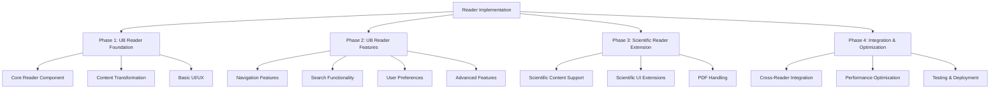

# Reader Implementation Plan

## Overview

This document outlines a comprehensive plan for implementing both the UB Reader and Scientific Reader applications. The UB Reader will be developed first as the foundation, with its design informing and supporting the subsequent Scientific Reader development.



## Phase 1: UB Reader Foundation (3 weeks)

### 1.1 Directory Structure Setup

```
apps/
  ub-reader/                # UB Reader application
    app/                    # Next.js app directory
      page.tsx              # Main page
      layout.tsx            # Layout component
      paper/[id]/           # Dynamic route for papers
        page.tsx            # Paper page
        section/[sectionId]/# Dynamic route for sections
          page.tsx          # Section page
    components/             # Reader-specific components
    content/                # UB content
    public/                 # Static assets
    styles/                 # CSS styles
```

### 1.2 Core Reader Component Enhancement

Enhance the document reader component in `packages/ui/src/document-reader` to serve as the foundation for both readers:

1. **Document Structure Support**

   - Implement a flexible document model that can represent both UB and scientific content
   - Support hierarchical content with sections, subsections, etc.
   - Add metadata handling for different document types

2. **Content Rendering**

   - Create a modular rendering system that can be extended for different content types
   - Implement basic text formatting (paragraphs, headings, lists, etc.)
   - Add support for images and basic media

3. **Reader Settings**
   - Implement settings panel for the reader
   - Add support for font size, font family, line spacing, etc.
   - Add support for color themes (day/night mode)
   - Add support for display preferences

### 1.3 Content Transformation System

Enhance the document transformer system in `packages/content-transformer` to support various content formats:

1. **Transformer Enhancements**

   - Refine the markdown transformer for better content parsing
   - Enhance the docx transformer for improved document structure extraction
   - Implement a JSON transformer for UB content

2. **Content Normalization**

   - Standardize document structure across different formats
   - Normalize metadata extraction
   - Create consistent content models

3. **Content Validation**
   - Implement validation for document structure
   - Add checks for required metadata
   - Create error reporting for invalid content

### 1.4 Basic UI/UX Implementation

Implement the basic UI/UX for the UB Reader:

1. **Layout Components**

   - Create the main layout with header, content area, and footer
   - Implement responsive design for different screen sizes
   - Add basic navigation elements

2. **Reader Interface**

   - Implement the reader interface with content display
   - Add basic controls for navigation and settings
   - Create a clean, distraction-free reading experience

3. **Accessibility**
   - Ensure proper semantic HTML
   - Implement keyboard navigation
   - Add screen reader support
   - Ensure sufficient color contrast

## Phase 2: UB Reader Features (4 weeks)

### 2.1 Navigation Features

Implement comprehensive navigation features for the UB Reader:

1. **Table of Contents**

   - Create a collapsible table of contents
   - Implement highlighting for the current section
   - Add search within the table of contents

2. **Breadcrumb Navigation**

   - Implement breadcrumb navigation for the current location
   - Add links to parent sections
   - Show the current position in the document hierarchy

3. **Previous/Next Navigation**

   - Add previous/next buttons for sequential navigation
   - Implement keyboard shortcuts for navigation
   - Add swipe gestures for mobile navigation

4. **History Navigation**
   - Implement history tracking for visited sections
   - Add back/forward navigation
   - Create a history view for quick access to recently visited sections

### 2.2 Search Functionality

Implement search functionality for the UB Reader:

1. **Full-Text Search**

   - Implement full-text search across all content
   - Add support for phrase searching
   - Implement relevance ranking for search results

2. **Reference Search**

   - Add support for reference search (e.g., Paper 1:5.9)
   - Implement direct navigation to references
   - Create a reference lookup tool

3. **Search Results Display**

   - Create a clean, organized display of search results
   - Show context for each result
   - Implement highlighting of search terms in results

4. **Search Filters**
   - Add filters for search results (by paper, section, etc.)
   - Implement sorting options for results
   - Add support for advanced search syntax

### 2.3 User Preferences

Implement user preferences for the UB Reader:

1. **Preference Storage**

   - Implement local storage for preferences
   - Add support for syncing preferences (if applicable)
   - Create preference reset functionality

2. **Reading Preferences**

   - Add controls for font size, font family, line spacing, etc.
   - Implement theme selection (light, dark, sepia, etc.)
   - Add support for custom themes

3. **Display Preferences**

   - Add options for showing/hiding verse numbers
   - Implement margin and padding controls
   - Add support for column layout options

4. **Navigation Preferences**
   - Add options for navigation behavior
   - Implement preferences for history tracking
   - Create customization options for the table of contents

### 2.4 Advanced Features

Implement advanced features for the UB Reader:

1. **Bookmarks and Annotations**

   - Add support for bookmarking sections
   - Implement highlighting functionality
   - Add note-taking capabilities
   - Create a bookmark/annotation manager

2. **Sharing Functionality**

   - Implement sharing of sections or passages
   - Add support for generating shareable links
   - Create export functionality for selections

3. **Audio Integration**

   - Add support for text-to-speech
   - Implement audio playback controls
   - Create synchronized text highlighting during playback

4. **Offline Support**
   - Implement content caching for offline access
   - Add support for offline search
   - Create synchronization for offline changes

## Phase 3: Scientific Reader Extension (4 weeks)

### 3.1 Scientific Reader Directory Structure

```
apps/
  publications/
    scientific/             # Scientific Reader application
      app/                  # Next.js app directory
        page.tsx            # Main page
        layout.tsx          # Layout component
        [id]/               # Dynamic route for papers
          page.tsx          # Paper page
      components/           # Scientific-specific components
      content/              # Scientific content
      public/               # Static assets
      styles/               # CSS styles
```

### 3.2 Scientific Content Support

Extend the document transformer system to support scientific content:

1. **Scientific Markdown Support**

   - Enhance the markdown transformer for scientific notation
   - Add support for mathematical formulas (KaTeX/MathJax)
   - Implement handling for citations and references
   - Add support for tables and figures

2. **Scientific DOCX Support**

   - Enhance the docx transformer for scientific documents
   - Implement extraction of mathematical formulas
   - Add support for extracting tables and figures
   - Create handling for citations and references

3. **PDF Viewing Support**

   - Implement basic PDF viewing capability
   - Add support for zooming and panning
   - Create a mobile-friendly PDF viewer
   - Implement page navigation for PDFs

4. **Content Processors**
   - Create specialized processors for scientific content
   - Implement a math processor for formula rendering
   - Add a citation processor for reference formatting
   - Create a code processor for syntax highlighting

### 3.3 Scientific UI Extensions

Extend the reader UI for scientific content:

1. **Mathematical Formula Rendering**

   - Implement KaTeX/MathJax integration
   - Add support for inline and block formulas
   - Create proper formula numbering and referencing

2. **Table and Figure Display**

   - Implement responsive table rendering
   - Add support for figure display with captions
   - Create proper numbering and referencing for tables and figures

3. **Citation and Reference Handling**

   - Implement citation rendering in various formats
   - Add support for reference lists
   - Create linking between citations and references

4. **Code Snippet Display**
   - Implement syntax highlighting for code snippets
   - Add support for line numbers
   - Create copy functionality for code snippets

### 3.4 Scientific Reader Features

Implement features specific to the Scientific Reader:

1. **Paper Navigation**

   - Create a specialized navigation system for scientific papers
   - Implement section navigation (Abstract, Methods, Results, etc.)
   - Add support for figure and table navigation

2. **Reference Management**

   - Implement a reference manager for scientific papers
   - Add support for citation lookup
   - Create a bibliography view

3. **Search Enhancements**

   - Add specialized search for scientific content
   - Implement search by author, title, keywords, etc.
   - Create filters for publication date, topic, etc.

4. **Export and Sharing**
   - Implement export functionality for citations
   - Add support for sharing specific sections or figures
   - Create export options for bibliographic information

## Phase 4: Integration and Optimization (3 weeks)

### 4.1 Cross-Reader Integration

Implement integration between the UB Reader and Scientific Reader:

1. **Shared Components**

   - Refine shared components for consistency
   - Implement a component library for both readers
   - Create documentation for component usage

2. **Navigation Integration**

   - Implement cross-linking between readers
   - Add support for navigating between related content
   - Create a unified navigation experience

3. **Search Integration**

   - Implement cross-reader search capability
   - Add support for searching across all content types
   - Create a unified search interface

4. **User Preference Synchronization**
   - Implement synchronization of user preferences between readers
   - Add support for reader-specific preferences
   - Create a unified preference management system

### 4.2 Performance Optimization

Optimize performance for both readers:

1. **Rendering Optimization**

   - Implement virtualization for large documents
   - Add lazy loading for images and media
   - Create efficient rendering of complex elements

2. **Search Optimization**

   - Implement efficient search indexing
   - Add caching for search results
   - Create optimized search algorithms

3. **Resource Management**

   - Implement efficient resource loading
   - Add memory management for large documents
   - Create optimized asset handling

4. **Mobile Optimization**
   - Implement responsive design optimizations
   - Add touch-friendly controls
   - Create efficient layouts for small screens

### 4.3 Testing and Deployment

Implement comprehensive testing and deployment:

1. **Automated Testing**

   - Implement unit tests for components and utilities
   - Add integration tests for reader functionality
   - Create end-to-end tests for user flows

2. **Performance Testing**

   - Implement performance benchmarks
   - Add load testing for large documents
   - Create performance monitoring

3. **Deployment Pipeline**

   - Implement CI/CD for automated testing and deployment
   - Add staging environment for testing
   - Create production deployment process

4. **Monitoring and Analytics**
   - Implement error tracking and reporting
   - Add usage analytics
   - Create monitoring dashboards

## Implementation Timeline

1. **Phase 1: UB Reader Foundation** - 3 weeks

   - Week 1: Directory structure setup and core reader component
   - Week 2: Content transformation system
   - Week 3: Basic UI/UX implementation

2. **Phase 2: UB Reader Features** - 4 weeks

   - Week 4: Navigation features
   - Week 5: Search functionality
   - Week 6: User preferences
   - Week 7: Advanced features

3. **Phase 3: Scientific Reader Extension** - 4 weeks

   - Week 8: Scientific reader directory structure and content support
   - Week 9: Scientific UI extensions
   - Week 10: Scientific reader features
   - Week 11: PDF viewing support

4. **Phase 4: Integration and Optimization** - 3 weeks
   - Week 12: Cross-reader integration
   - Week 13: Performance optimization
   - Week 14: Testing and deployment

Total estimated time: 14 weeks

## Technical Considerations

### Shared Component Architecture

The reader components will follow a hierarchical architecture:

1. **Base Components** (`packages/ui/src/components`)

   - Basic UI elements (buttons, inputs, etc.)
   - Layout components (containers, grids, etc.)
   - Utility components (loaders, error displays, etc.)

2. **Reader Core** (`packages/ui/src/document-reader`)

   - Document renderer
   - Navigation components
   - Settings panel
   - Search interface

3. **UB Reader Extensions** (`apps/ub-reader/components`)

   - UB-specific components
   - Paper navigation
   - UB content rendering

4. **Scientific Reader Extensions** (`apps/publications/scientific/components`)
   - Scientific-specific components
   - Formula rendering
   - Citation handling
   - Table and figure display

### Content Transformation Pipeline

The content transformation pipeline will follow this process:

1. **Content Loading**

   - Load content from the appropriate source
   - Determine the content format
   - Select the appropriate transformer

2. **Transformation**

   - Parse the content using the selected transformer
   - Extract document structure and metadata
   - Convert to the standardized document model

3. **Processing**

   - Apply content processors for specific elements
   - Process mathematical formulas, citations, etc.
   - Generate additional metadata as needed

4. **Validation**

   - Validate the transformed document
   - Check for required elements and metadata
   - Generate warnings or errors as needed

5. **Rendering**
   - Render the document using the appropriate components
   - Apply user preferences
   - Handle interactive elements

### State Management

The reader applications will use a consistent state management approach:

1. **Document State**

   - Current document and metadata
   - Document structure and navigation state
   - Content loading and error states

2. **User Preference State**

   - Reading preferences (font, theme, etc.)
   - Display preferences
   - Navigation preferences

3. **Interaction State**

   - Current position in the document
   - Search state and results
   - Bookmarks and annotations

4. **Application State**
   - Current view and mode
   - UI state (sidebar open/closed, etc.)
   - Error and loading states

## Next Steps

1. **Immediate Actions**

   - Set up the UB Reader directory structure
   - Enhance the core reader component
   - Implement the basic content transformation pipeline

2. **Short-Term Actions**

   - Implement the basic UB Reader UI
   - Add navigation and search functionality
   - Create user preference management

3. **Medium-Term Actions**

   - Implement advanced UB Reader features
   - Set up the Scientific Reader directory structure
   - Add scientific content support

4. **Long-Term Actions**
   - Implement scientific UI extensions
   - Add PDF viewing support
   - Optimize performance and deploy

This plan provides a comprehensive roadmap for implementing both the UB Reader and Scientific Reader applications, with a focus on building the UB Reader first as a foundation for the Scientific Reader.
