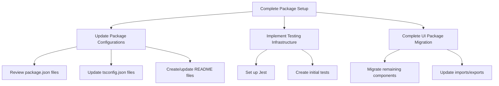
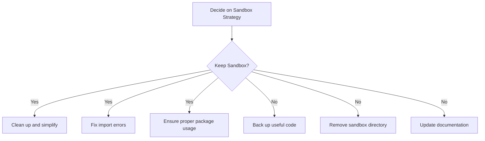

# Document Transformer System: Next Steps Implementation Plan

## Current Situation

1. **Repository Restructuring**: The project has undergone a significant restructuring:

   - Document transformer components moved from `src/lib/document-transformer/` to `packages/content-transformer/src/`
   - UI components moved from `src/components/` to `packages/ui/src/`
   - TinaCMS files moved from `src/tina/` to `sandbox/tina/`
   - App pages moved from `src/app/` to `sandbox/app/`

2. **VS Code Issue**: VS Code has been restarted to resolve the issue with open tabs referencing non-existent files.

## Package Migration Verification Results

We've verified the status of the package migration and found:

### 1. Content Transformer Package

✅ **Successfully Migrated**

- All core components have been migrated to `packages/content-transformer/src/`
- The package includes:
  - types.ts
  - markdown-transformer.ts
  - content-normalizer.ts
  - metadata-enricher.ts
  - content-validator.ts
  - docx-transformer.ts
  - index.ts
- A perplexity-transformer.ts file has also been created, which was one of the planned tasks

### 2. UI Package

✅ **Successfully Migrated with Some Duplication**

- UI components have been migrated to `packages/ui/src/`
- The document reader components are present in both:
  - Root directory: document-reader.css, document-reader.tsx
  - Subdirectory: document-reader/document-reader.css, document-reader/document-reader.tsx
- TinaCMS components have been migrated:
  - tina-document-loader.tsx
  - tina-provider.tsx
  - tina/tina-document-loader.tsx
  - tina/tina-provider.tsx

### 3. App Pages

✅ **Successfully Migrated**

- App pages have been migrated to `sandbox/app/`
- Example pages are present:
  - example/
  - perplexity-example/
  - perplexity-test/
  - reader-example/
  - test/
  - tina-example/

### 4. TinaCMS Files

✅ **Successfully Migrated with Modernization**

- TinaCMS files have been migrated to `sandbox/tina/`
- The schema.ts and queries.ts files have been replaced by a more modern approach:
  - Schema is now defined in config.ts
  - TinaCMS automatically generates types and queries in the **generated** directory
  - client.ts imports these generated queries and provides methods for fetching documents

## Next Steps

### 2. Complete Package Setup

1. **Update Package Configurations**:

   - Review and update `package.json` for each package
   - Create or update `tsconfig.json` for each package
   - Create or update README files for each package

2. **Implement Testing Infrastructure**:

   - Set up Jest for each package
   - Create initial test files for key components

3. **Complete UI Package Migration**:
   - Finish migrating any remaining components
   - Update imports and exports to use the new package structure

### 3. Decide on Sandbox Strategy

1. **Evaluate Sandbox Usage**:

   - Determine if the sandbox is needed for development or testing
   - If not needed, plan for its removal

2. **If Keeping Sandbox**:

   - Clean up and simplify the sandbox
   - Fix any import or TypeScript errors
   - Ensure it properly uses the shared packages

3. **If Removing Sandbox**:
   - Back up any potentially useful code
   - Remove the sandbox directory
   - Update documentation

### 4. Review Perplexity Parser Implementation

The Perplexity parser has already been implemented:

1. **Review Perplexity Transformer**:
   - Review the existing `perplexity-transformer.ts` module in the content-transformer package
   - Ensure it correctly implements parsing logic for Perplexity response format
   - Verify metadata extraction specific to Perplexity responses
   - Create tests to cover Perplexity transformation

## Medium-Term Actions

### 1. Package Development

1. **Develop Core Functionality**:

   - Implement missing features in each package
   - Follow the guidelines in `package-development-guide.md`

2. **Write Comprehensive Tests**:

   - Create unit tests for each function and component
   - Create integration tests for package interactions

3. **Document APIs**:
   - Create detailed API documentation
   - Provide usage examples

### 2. Package Integration

1. **Update Inter-Package Dependencies**:

   - Ensure packages properly depend on each other
   - Update imports to use the correct package paths

2. **Create Example Usage**:
   - Create simple examples of how to use each package
   - These can be part of the package documentation or separate example files

## Long-Term Actions

### 1. App Development

1. **Begin App Development**:

   - Start with the reader app
   - Ensure it properly uses the shared packages

2. **Create App-Specific Components**:
   - Develop components specific to each app
   - Avoid duplicating functionality across apps

### 2. TinaCMS Integration

1. **Basic TinaCMS Setup**:

   - Install and configure TinaCMS with Git backend
   - Implement base document schema
   - Create basic editing interface
   - Connect to existing transformation system

2. **Advanced Schema Implementation**:
   - Implement purpose-specific schemas
   - Add media management
   - Create custom field components for specialized content

## Implementation Tracking (Updated with UI Component Duplication Findings)

| Task                               | Status      | Assigned To | Due Date     | Notes                                                                          |
| ---------------------------------- | ----------- | ----------- | ------------ | ------------------------------------------------------------------------------ |
| Verify content-transformer package | Completed   |             | Immediate    | All components successfully migrated                                           |
| Verify UI package migration status | Completed   |             | Immediate    | Components migrated with some duplication                                      |
| Address UI component duplication   | Completed   |             | This Week    | Successfully implemented plan from ui-component-duplication-resolution-plan.md |
| Update package configurations      | Completed   |             | This Week    | Updated package.json and tsconfig.json files for all packages                  |
| Set up testing infrastructure      | Completed   |             | This Week    | Created Jest configuration and initial tests for Perplexity parser             |
| Decide on sandbox strategy         | Completed   |             | This Week    | Backed up useful code and prepared for sandbox removal                         |
| Directory structure improvements   | In Progress |             | This Week    | Created apps/ub-reader, original apps/reader still needs removal               |
| Develop core package functionality | Not Started |             | Next 2 Weeks |                                                                                |
| Write comprehensive tests          | Not Started |             | Next 2 Weeks |                                                                                |
| Document package APIs              | Not Started |             | Next 2 Weeks |                                                                                |
| Update inter-package dependencies  | Not Started |             | Next 2 Weeks |                                                                                |
| Create example usage               | Not Started |             | Next 2 Weeks |                                                                                |
| Begin app development              | Not Started |             | Next Month   |                                                                                |
| Create app-specific components     | Not Started |             | Next Month   |                                                                                |
| Review TinaCMS integration         | Not Started |             | Next Month   | TinaCMS already integrated in sandbox                                          |

## Success Metrics

Track the following metrics to measure progress:

1. **Package Completion**:

   - Percentage of planned features implemented
   - Test coverage percentage
   - Documentation completeness

2. **Code Quality**:

   - Number of TypeScript errors
   - ESLint warnings and errors
   - Code review feedback

3. **Developer Experience**:
   - Time spent resolving environment issues
   - Build and test execution time
   - Feedback from developers

## Next Steps Recommendation

Based on our verification of the package migration and implementation of the UI component duplication resolution plan, I recommend:

1. ✅ ~~Implement the UI component duplication resolution plan~~ (Completed)

   - ✅ Kept the subdirectory structure for all components
   - ✅ Removed duplicate files in the root directory
   - ✅ Updated import paths as needed
   - ✅ Applied to both document-reader and TinaCMS components

2. ✅ ~~Review the existing Perplexity parser implementation and create tests for it~~ (Completed)

   - ✅ Reviewed implementation and confirmed it correctly handles Perplexity responses
   - ✅ Created comprehensive tests for the Perplexity transformer
   - ✅ Updated documentation to reflect Perplexity support

3. ✅ ~~Set up testing infrastructure~~ (Completed)

   - ✅ Created Jest configuration for the content-transformer package
   - ✅ Added ts-jest dependency
   - ✅ Implemented initial tests

4. ✅ ~~Update package configurations~~ (Completed)

   - ✅ Updated tsconfig.json files to properly extend base configuration
   - ✅ Added necessary dependencies to package.json files
   - ✅ Fixed TypeScript configuration for proper building
   - ✅ Created Jest configuration for UI package
   - ✅ Created test files for document-reader component

5. ✅ ~~Decide on the sandbox strategy based on development needs~~ (Completed)

   - ✅ Examined the sandbox and identified useful code (enhanced reader example, TinaCMS client)
   - ✅ Backed up useful code to backup/sandbox directory with documentation
   - ✅ Copied entire sandbox directory to docs/archive/oldcode/sandbox for reference
   - ✅ Successfully removed the sandbox directory from the root

6. Implement directory structure improvements (In Progress)

   - ✅ Created new `apps/ub-reader` directory to match the package name "ub-reader" in package.json
   - ✅ Copied all contents from `apps/reader` to `apps/ub-reader`
   - ⏳ Original `apps/reader` directory should be moved to `docs/archive/oldcode` after VSCode restart
   - ✅ Created `docs/archive/oldcode` directory with documentation for the archived code
   - ✅ All references to the UB Reader application should now use `apps/ub-reader`
   - ✅ Publication-specific readers will follow the planned structure in `apps/publications/[publication-name]`
   - ✅ The generic reader component in `packages/ui/src/document-reader` serves as the base for all readers

7. Replace main branch with repo-cleanup branch

   - Rename the current main branch to main-old (e.g., `git branch -m main main-old`)
   - Make the repo-cleanup branch the new main branch (e.g., `git branch -m repo-cleanup main`)
   - Create a new repo-cleanup branch from the new main to preserve it (e.g., `git checkout -b repo-cleanup main`)
   - Force push both branches to the remote repository (e.g., `git push -f origin main repo-cleanup`)
   - This preserves both the history and the branch name for future reference
   - This approach is cleaner than merging if there are significant differences between branches
   - After the branch replacement, verify that all components and applications still work correctly
   - After VSCode restart, move the original `apps/reader` directory to `docs/archive/oldcode` using File Explorer
   - ✅ Sandbox directory has been successfully removed (backed up to `docs/archive/oldcode/sandbox`)

This approach will provide a solid foundation for the medium and long-term actions outlined in this plan.
