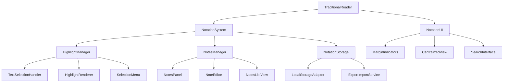

# Notation System Implementation Plan for UB Reader

## Overview

This document outlines the architecture and implementation plan for adding highlighting and notes functionality to the TraditionalReader component in the UB Reader application. The plan is based on the PPLX notation plan and focuses on creating a robust, user-friendly annotation system that supports both casual reading and in-depth study of the Urantia Papers.

## Architecture

The notation system will be implemented as a set of components, hooks, and services that integrate with the existing TraditionalReader. The architecture follows a modular approach to ensure maintainability and extensibility.



## 1. Data Model

### Highlight Model

```typescript
// Highlight color options
type HighlightColor = 'yellow' | 'green' | 'orange' | 'purple';

// Highlight data structure
interface Highlight {
  id: string;
  paperNumber: number;
  sectionId: string;
  selectedText: string;
  color: HighlightColor;
  noteId?: string;
  createdAt: number; // timestamp
  tags: string[];
  // Selection range information for re-applying highlights
  startOffset: number;
  endOffset: number;
  startContainer: string; // XPath or other identifier
  endContainer: string;
}
```

### Note Model

```typescript
// Note data structure
interface Note {
  id: string;
  highlightId: string;
  content: string;
  createdAt: number;
  updatedAt: number;
  // Optional formatting data
  formatting?: {
    bold?: [number, number][]; // Ranges of bold text (start, end)
    italic?: [number, number][]; // Ranges of italic text
    lists?: {
      type: 'bullet' | 'numbered';
      items: string[];
      startIndex: number;
    }[];
  };
}
```

### Collection Model (for organizing highlights and notes)

```typescript
// Collection for organizing related highlights
interface Collection {
  id: string;
  name: string;
  description?: string;
  highlightIds: string[];
  createdAt: number;
}
```

## 2. Core Components

### 2.1 NotationContext

A React context to provide notation functionality throughout the application:

```typescript
interface NotationContextValue {
  // Highlights
  highlights: Highlight[];
  addHighlight: (highlight: Omit<Highlight, 'id' | 'createdAt'>) => string;
  updateHighlight: (id: string, updates: Partial<Highlight>) => void;
  removeHighlight: (id: string) => void;
  getHighlightsByPaper: (paperNumber: number) => Highlight[];
  getHighlightsBySection: (sectionId: string) => Highlight[];

  // Notes
  notes: Note[];
  addNote: (note: Omit<Note, 'id' | 'createdAt' | 'updatedAt'>) => string;
  updateNote: (id: string, updates: Partial<Note>) => void;
  removeNote: (id: string) => void;
  getNotesByHighlight: (highlightId: string) => Note | null;

  // Collections
  collections: Collection[];
  addCollection: (collection: Omit<Collection, 'id' | 'createdAt'>) => string;
  updateCollection: (id: string, updates: Partial<Collection>) => void;
  removeCollection: (id: string) => void;

  // UI State
  activeHighlight: string | null;
  setActiveHighlight: (id: string | null) => void;
  activeNote: string | null;
  setActiveNote: (id: string | null) => void;
  isNotePanelOpen: boolean;
  openNotePanel: () => void;
  closeNotePanel: () => void;

  // Search
  searchHighlights: (query: string) => Highlight[];
  searchNotes: (query: string) => Note[];
}
```

### 2.2 TextSelectionHandler

A component that detects and handles text selection events:

```typescript
interface TextSelectionHandlerProps {
  onSelection: (selection: {
    text: string;
    range: Range;
    sectionId: string;
    paperNumber: number;
  }) => void;
  children: React.ReactNode;
}
```

### 2.3 SelectionMenu

A floating menu that appears when text is selected:

```typescript
interface SelectionMenuProps {
  selection: {
    text: string;
    range: Range;
    sectionId: string;
    paperNumber: number;
  } | null;
  onHighlight: (color: HighlightColor) => void;
  onAddNote: () => void;
  onCopy: () => void;
  onCancel: () => void;
}
```

### 2.4 HighlightRenderer

A component that renders highlights in the document:

```typescript
interface HighlightRendererProps {
  highlights: Highlight[];
  onHighlightClick: (id: string) => void;
}
```

### 2.5 NotesPanel

A panel for viewing and editing notes:

```typescript
interface NotesPanelProps {
  isOpen: boolean;
  onClose: () => void;
  activeHighlight: Highlight | null;
  activeNote: Note | null;
  onSaveNote: (content: string, formatting?: Note['formatting']) => void;
  onDeleteNote: () => void;
}
```

### 2.6 NotesListView

A component for viewing all notes and highlights:

```typescript
interface NotesListViewProps {
  highlights: Highlight[];
  notes: Note[];
  onHighlightClick: (id: string) => void;
  onNoteClick: (id: string) => void;
  sortBy: 'paper' | 'date' | 'color';
  filterBy: {
    papers?: number[];
    colors?: HighlightColor[];
    tags?: string[];
    hasNotes?: boolean;
  };
}
```

## 3. Storage Implementation

### 3.1 LocalStorageAdapter

A service for storing and retrieving notation data from localStorage:

```typescript
interface StorageAdapter {
  getHighlights: () => Highlight[];
  saveHighlight: (highlight: Highlight) => void;
  updateHighlight: (id: string, updates: Partial<Highlight>) => void;
  deleteHighlight: (id: string) => void;

  getNotes: () => Note[];
  saveNote: (note: Note) => void;
  updateNote: (id: string, updates: Partial<Note>) => void;
  deleteNote: (id: string) => void;

  getCollections: () => Collection[];
  saveCollection: (collection: Collection) => void;
  updateCollection: (id: string, updates: Partial<Collection>) => void;
  deleteCollection: (id: string) => void;

  // Bulk operations
  exportData: () => {
    highlights: Highlight[];
    notes: Note[];
    collections: Collection[];
  };
  importData: (data: { highlights: Highlight[]; notes: Note[]; collections: Collection[] }) => void;
}
```

### 3.2 ExportImportService

A service for exporting and importing notation data:

```typescript
interface ExportImportService {
  exportToJSON: () => string;
  importFromJSON: (json: string) => void;
  exportToMarkdown: () => string;
  exportToPDF: () => Blob;
}
```

## 4. Integration with TraditionalReader

### 4.1 Component Modifications

The TraditionalReader component will need the following modifications:

1. Wrap the component with NotationProvider
2. Add TextSelectionHandler to the content container
3. Add SelectionMenu component
4. Add NotesPanel component
5. Add HighlightRenderer to the content container
6. Add a new "Notes & Highlights" button to the header
7. Add NotesListView component for the centralized view

### 4.2 CSS Modifications

Add new CSS variables and styles for highlights and notes:

```css
/* Highlight colors */
.app-container {
  --highlight-yellow: rgba(255, 255, 0, 0.3);
  --highlight-green: rgba(0, 255, 0, 0.3);
  --highlight-orange: rgba(255, 165, 0, 0.3);
  --highlight-purple: rgba(128, 0, 128, 0.3);

  /* Dark theme adjustments */
  --highlight-yellow-dark: rgba(255, 255, 0, 0.5);
  --highlight-green-dark: rgba(0, 255, 0, 0.5);
  --highlight-orange-dark: rgba(255, 165, 0, 0.5);
  --highlight-purple-dark: rgba(128, 0, 128, 0.5);
}

/* Highlight styles */
.highlighted-text {
  position: relative;
  cursor: pointer;
}

.highlighted-text.yellow {
  color: var(--highlight-yellow);
}

.highlighted-text.green {
  color: var(--highlight-green);
}

.highlighted-text.orange {
  color: var(--highlight-orange);
}

.highlighted-text.purple {
  color: var(--highlight-purple);
}

/* Note indicator */
.note-indicator {
  display: inline-block;
  width: 12px;
  height: 12px;
  border-radius: 50%;
  background-color: var(--reader-primary-color);
  margin-left: 4px;
  vertical-align: super;
  font-size: 0.75rem;
}

/* Margin indicators */
.margin-indicator {
  position: absolute;
  left: -20px;
  width: 4px;
  height: 1em;
  border-radius: 2px;
}

.margin-indicator.yellow {
  background-color: var(--highlight-yellow);
}

.margin-indicator.green {
  background-color: var(--highlight-green);
}

.margin-indicator.orange {
  background-color: var(--highlight-orange);
}

.margin-indicator.purple {
  background-color: var(--highlight-purple);
}

.margin-indicator.has-note {
  width: 6px;
}
```

## 5. Implementation Phases

### Phase 1: Core Infrastructure (Week 1)

1. Create data models and types
2. Implement NotationContext and Provider
3. Implement LocalStorageAdapter
4. Add basic CSS for highlights

### Phase 2: Highlighting Functionality (Week 2)

1. Implement TextSelectionHandler
2. Create SelectionMenu component
3. Implement highlight creation and rendering
4. Add margin indicators for highlights

### Phase 3: Notes Functionality (Week 3)

1. Implement NotesPanel component
2. Create NoteEditor with basic formatting
3. Add note indicators to highlighted text
4. Implement note creation and editing

### Phase 4: Organization & Management (Week 4)

1. Create NotesListView component
2. Implement sorting and filtering
3. Add tagging system
4. Develop search functionality

### Phase 5: UX Refinement & Additional Features (Week 5)

1. Implement ExportImportService
2. Add keyboard shortcuts
3. Improve mobile experience
4. Add multi-note comparison
5. Implement citation generation

## 6. Technical Considerations

### Performance

- Use efficient DOM manipulation for highlighting
- Implement virtualized lists for large collections of notes
- Optimize storage with batched updates
- Use memoization for expensive computations

### Accessibility

- Ensure keyboard navigation for all features
- Provide appropriate ARIA attributes
- Test with screen readers
- Maintain sufficient color contrast for highlights

### Browser Compatibility

- Test on all modern browsers (Chrome, Firefox, Safari, Edge)
- Use feature detection for advanced functionality
- Provide fallbacks for unsupported features

## 7. Testing Strategy

### Unit Tests

- Test individual components and hooks
- Test storage adapter
- Test utility functions

### Integration Tests

- Test highlight creation and rendering
- Test note creation and editing
- Test data persistence

### End-to-End Tests

- Test complete user flows
- Test performance with large documents
- Test on different devices and browsers

## 8. Future Enhancements

- Server synchronization for cross-device access
- Advanced formatting options for notes
- AI-assisted tagging and organization
- Collaborative annotations
- Integration with study tools and references

## Conclusion

This implementation plan provides a comprehensive roadmap for adding highlighting and notes functionality to the UB Reader. By following a phased approach, we can deliver value incrementally while ensuring a robust and user-friendly annotation system.

The architecture is designed to be modular and extensible, allowing for future enhancements and integration with other components of the application. The focus on user experience ensures that the notation system will be intuitive and helpful for both casual readers and serious students of the Urantia Papers.
