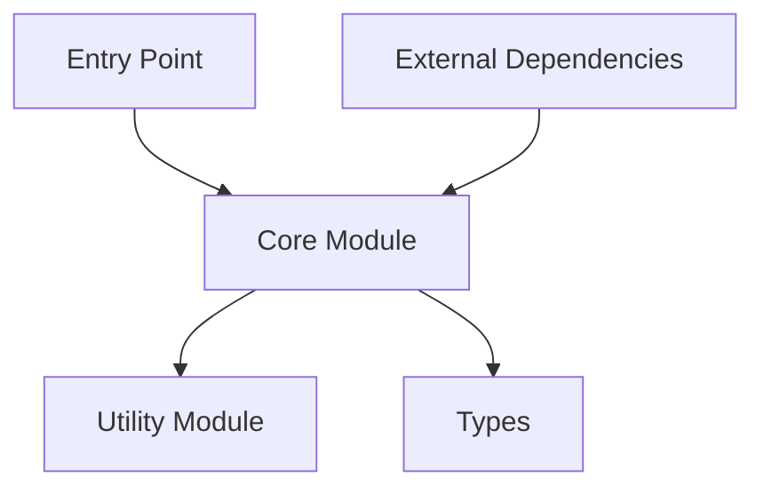

# @ub-ecosystem/[package-name]

## Overview

[Brief description of the package's purpose and functionality]

## Installation

```bash
# From the repository root (for development)
npm install

# Or install only this package
npm install --workspace=packages/[package-name]

# For external usage
npm install @ub-ecosystem/[package-name]
```

## Features

- [Feature 1]
- [Feature 2]
- [Feature 3]
- [Feature 4]

## API Reference

### Component/Function Name

```typescript
import { ComponentName } from '@ub-ecosystem/[package-name]';

// Usage example
const result = ComponentName({
  prop1: 'value1',
  prop2: 'value2',
});
```

#### Props/Parameters

| Name  | Type   | Required | Description          |
| ----- | ------ | -------- | -------------------- |
| prop1 | string | Yes      | Description of prop1 |
| prop2 | string | No       | Description of prop2 |

#### Returns

| Type       | Description                     |
| ---------- | ------------------------------- |
| ReturnType | Description of the return value |

#### Example

```typescript
import { ComponentName } from "@ub-ecosystem/[package-name]";

function Example() {
  return <ComponentName prop1="value1" prop2="value2" />;
}
```

### Utility Function

```typescript
import { utilityFunction } from '@ub-ecosystem/[package-name]';

// Usage example
const result = utilityFunction(param1, param2);
```

#### Parameters

| Name   | Type   | Required | Description           |
| ------ | ------ | -------- | --------------------- |
| param1 | string | Yes      | Description of param1 |
| param2 | number | No       | Description of param2 |

#### Returns

| Type       | Description                     |
| ---------- | ------------------------------- |
| ReturnType | Description of the return value |

#### Example

```typescript
import { utilityFunction } from '@ub-ecosystem/[package-name]';

const result = utilityFunction('example', 42);
console.log(result);
```

## Architecture



## Directory Structure

```
package-name/
├── src/                  # Source code
│   ├── index.ts          # Entry point
│   ├── components/       # React components
│   ├── utils/            # Utility functions
│   └── types/            # TypeScript types
├── dist/                 # Compiled output
├── tests/                # Test files
├── package.json          # Dependencies and scripts
└── README.md             # This file
```

## Dependencies

This package depends on:

- `dependency1`: Purpose of dependency
- `dependency2`: Purpose of dependency

## Development

### Building

```bash
# From the repository root
npm run build -- --filter=[package-name]

# Or from the package directory
cd packages/[package-name]
npm run build
```

### Testing

```bash
# From the repository root
npm run test -- --filter=[package-name]

# Or from the package directory
cd packages/[package-name]
npm run test
```

## Usage Examples

### Basic Usage

```typescript
import { ComponentName } from "@ub-ecosystem/[package-name]";

function App() {
  return <ComponentName prop1="value1" prop2="value2" />;
}
```

### Advanced Usage

```typescript
import { ComponentName, utilityFunction } from "@ub-ecosystem/[package-name]";

function AdvancedApp() {
  const processedData = utilityFunction("input", 42);

  return (
    <ComponentName
      prop1={processedData.value}
      prop2="value2"
      onEvent={(data) => {
        console.log("Event triggered", data);
      }}
    />
  );
}
```

## Troubleshooting

### Common Issues

- **Issue 1**: [Description and solution]
- **Issue 2**: [Description and solution]

## Contributing

Please read the [Contributing Guide](../../CONTRIBUTING.md) for details on our code of conduct and the process for submitting pull requests.

## License

This package is part of the PopRev2 platform and is licensed under the [LICENSE NAME].
