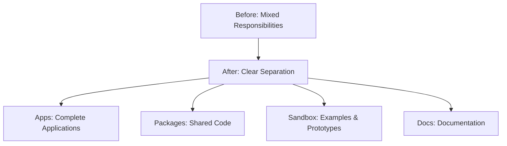
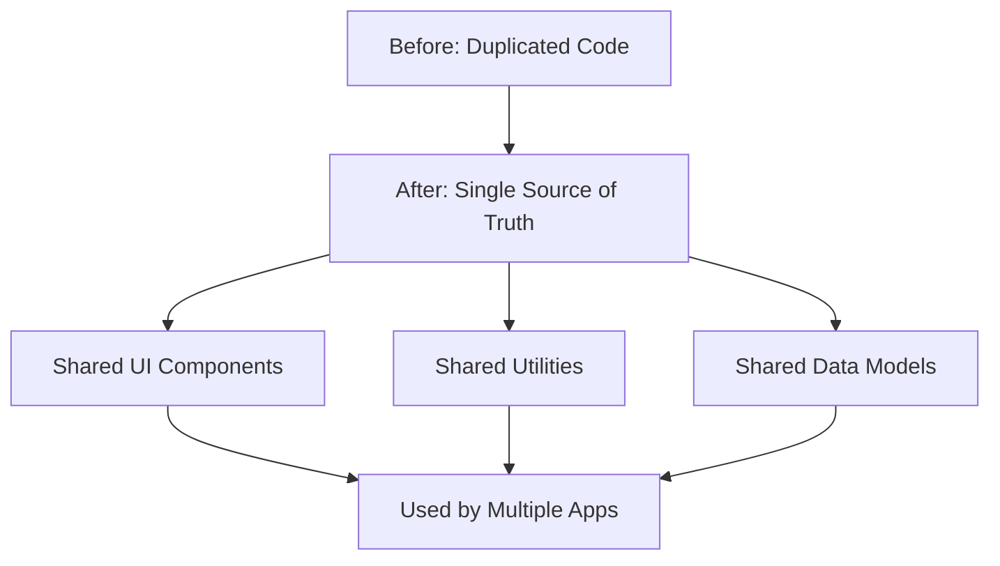
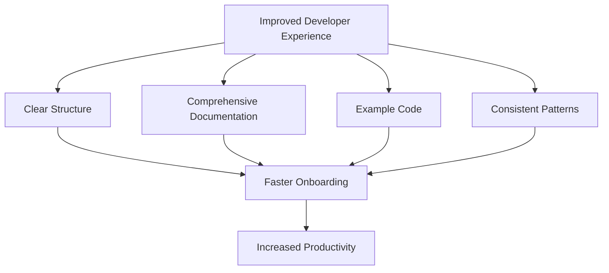

# Repository Cleanup: Benefits and Improvements

This document outlines the key benefits and improvements that will result from the repository cleanup effort.

## Current Challenges

The current repository structure presents several challenges:

1. **Duplication of Code**: Similar functionality exists in both `src/` and `apps/reader/`, leading to:

   - Maintenance overhead (fixes need to be applied in multiple places)
   - Inconsistent implementations
   - Confusion about which version to use

2. **Unclear Purpose of Directories**: The relationship between `src/` and `apps/` is not clearly defined, causing:

   - Uncertainty about where to add new code
   - Difficulty understanding the overall architecture
   - Challenges for new developers joining the project

3. **Shared Code Not Properly Isolated**: Components and utilities that should be shared are not in dedicated packages, resulting in:

   - Copy-paste code reuse
   - Inconsistent implementations
   - Difficulty updating shared functionality

4. **Insufficient Documentation**: The purpose and usage of components and directories are not well-documented, leading to:
   - Steep learning curve for new developers
   - Reduced development efficiency
   - Potential misuse of components

## Benefits of the Cleanup

The repository cleanup will address these challenges and provide numerous benefits:

### 1. Improved Code Organization

- **Clear Separation of Concerns**: Each directory has a specific purpose
- **Logical Grouping**: Related code is grouped together
- **Intuitive Structure**: Directory names clearly indicate their purpose
- **Scalable Architecture**: Easy to add new apps and packages

### 2. Reduced Duplication

- **Single Source of Truth**: Each component exists in only one location
- **Consistent Implementations**: All apps use the same shared components
- **Easier Maintenance**: Updates only need to be made in one place
- **Reduced Bug Surface**: Fewer implementations means fewer places for bugs to hide

### 3. Better Developer Experience

- **Faster Onboarding**: New developers can quickly understand the codebase
- **Reduced Cognitive Load**: Clear structure means less mental overhead
- **Self-Documenting Code**: Directory structure helps explain the architecture
- **Working Examples**: Sandbox provides practical examples of component usage

### 4. Enhanced Collaboration

- **Clear Ownership**: Each package and app has a defined purpose and owner
- **Parallel Development**: Teams can work on different apps simultaneously
- **Reduced Merge Conflicts**: Separation of concerns reduces code conflicts
- **Better Code Reviews**: Smaller, focused changes are easier to review

### 5. Improved Deployment Process

- **Independent Deployments**: Each app can be deployed separately
- **Simplified Configuration**: Vercel configuration is clearer and more focused
- **Reduced Build Times**: Only changed apps need to be rebuilt
- **More Reliable Deployments**: Smaller, focused deployments are less prone to issues

### 6. Better Testing and Quality Assurance

- **Isolated Testing**: Each package can be tested independently
- **Clearer Test Boundaries**: Tests focus on specific functionality
- **Improved Test Coverage**: Easier to ensure all code is tested
- **Faster Test Execution**: Tests can be run only for changed packages

### 7. Future-Proofing

- **Easier to Add Features**: Clear structure makes it obvious where new code should go
- **Simpler Refactoring**: Well-organized code is easier to refactor
- **Technology Migration**: Easier to update or replace specific components
- **Scalability**: Structure supports growth in codebase size and complexity

## Tangible Improvements

The cleanup will result in several tangible improvements:

### Development Efficiency

- **Before**: Developers spend time figuring out where code should go and which implementation to use
- **After**: Clear structure guides developers to the right location immediately

### Bug Fixing

- **Before**: Fixes might need to be applied in multiple places, with risk of missing some instances
- **After**: Fixes are applied once in the shared package, benefiting all consuming apps

### Onboarding

- **Before**: New developers need extensive guidance to understand the codebase
- **After**: Directory structure and documentation provide clear guidance

### Deployment

- **Before**: Deployment configuration is complex and error-prone
- **After**: Each app has clear, focused deployment configuration

### Code Quality

- **Before**: Inconsistent implementations and patterns across the codebase
- **After**: Shared packages enforce consistent patterns and best practices

## Conclusion

The repository cleanup is not just about organizing files—it's about creating a foundation for efficient, collaborative development. By addressing the current challenges and implementing a clear, logical structure, we'll significantly improve the development experience and code quality.

This investment in code organization will pay dividends throughout the lifecycle of the PopRev2 platform, making it easier to maintain, extend, and improve the codebase over time.

The cleanup process itself is designed to be incremental and non-disruptive, ensuring that development can continue while the improvements are being made. Each step in the process brings immediate benefits, with the full value realized upon completion of the cleanup.
