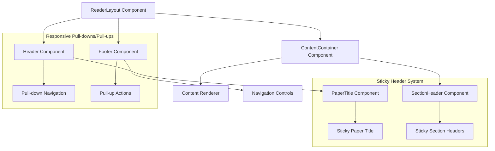

# Implementation Plan: Enhanced Reader Navigation Experience

## Overview

This plan outlines the implementation of sticky headers and responsive pull-downs/pull-ups for the UB Ecosystem reader applications. These features will enhance the reading experience by providing persistent context while maximizing content visibility.

## Architecture Considerations



## 1. Sticky Headers Implementation

### 1.1 Component Structure

We'll create two new components:

- `StickyPaperTitle`: Always visible at the top of the viewport
- `StickySectionHeader`: Dynamically updates as sections come into view

### 1.2 CSS Implementation

```css
/* Base styles for sticky elements */
.sticky-paper-title {
  position: sticky;
  top: 0;
  z-index: 10;
  background-color: var(--header-bg-color);
  border-bottom: 1px solid var(--border-color);
  padding: 12px 16px;
  transition: box-shadow 0.3s ease;
}

.sticky-section-header {
  position: sticky;
  top: 56px; /* Height of paper title */
  z-index: 9;
  background-color: var(--content-bg-color);
  border-bottom: 1px solid var(--border-color);
  padding: 8px 16px;
  transition: opacity 0.2s ease;
}

/* Shadow effect when scrolling */
.sticky-paper-title.scrolled {
  box-shadow: 0 2px 4px rgba(0, 0, 0, 0.1);
}
```

### 1.3 JavaScript Implementation with Intersection Observer

```typescript
import React, { useEffect, useRef, useState } from 'react';

export function StickyHeadersContainer({
  paperTitle,
  sections,
  currentSectionId,
  onSectionChange,
}) {
  const [activeSectionId, setActiveSectionId] = useState(currentSectionId);
  const [isScrolled, setIsScrolled] = useState(false);
  const observerRef = useRef<IntersectionObserver | null>(null);
  const sectionRefs = useRef<Map<string, HTMLElement>>(new Map());

  // Set up intersection observer for section headers
  useEffect(() => {
    observerRef.current = new IntersectionObserver(
      entries => {
        entries.forEach(entry => {
          const sectionId = entry.target.getAttribute('data-section-id');
          if (entry.isIntersecting && sectionId) {
            setActiveSectionId(sectionId);
            if (onSectionChange) {
              onSectionChange(sectionId);
            }
          }
        });
      },
      {
        threshold: 0,
        rootMargin: '-56px 0px 0px 0px', // Adjust based on paper title height
      }
    );

    // Observe all section headers
    sections.forEach(section => {
      const element = sectionRefs.current.get(section.id);
      if (element) {
        observerRef.current?.observe(element);
      }
    });

    return () => {
      observerRef.current?.disconnect();
    };
  }, [sections, onSectionChange]);

  // Handle scroll events for paper title shadow
  useEffect(() => {
    const handleScroll = () => {
      setIsScrolled(window.scrollY > 10);
    };

    window.addEventListener('scroll', handleScroll, { passive: true });
    return () => {
      window.removeEventListener('scroll', handleScroll);
    };
  }, []);

  // Get the active section data
  const activeSection = sections.find(section => section.id === activeSectionId);

  return (
    <>
      {/* Sticky paper title */}
      <div className={`sticky-paper-title ${isScrolled ? 'scrolled' : ''}`}>{paperTitle}</div>

      {/* Sticky section header */}
      {activeSection && <div className="sticky-section-header">{activeSection.title}</div>}

      {/* Actual section headers in content */}
      {sections.map(section => (
        <div
          key={section.id}
          ref={el => {
            if (el) sectionRefs.current.set(section.id, el);
          }}
          data-section-id={section.id}
          className="section-header"
        >
          {section.title}
        </div>
      ))}
    </>
  );
}
```

## 2. Responsive Pull-downs and Pull-ups

### 2.1 Component Structure

We'll enhance the existing Header and Footer components:

- `Header`: Will support pull-down behavior on small screens
- `Footer`: Will support pull-up behavior on small screens

### 2.2 CSS Implementation

```css
/* Base styles for pull-down/pull-up elements */
.reader-layout-header,
.reader-layout-footer {
  transition: transform 0.3s ease;
}

/* Mobile behavior (auto-hiding) */
@media (max-width: 1023px) {
  .reader-layout-header.hidden {
    transform: translateY(-100%);
  }

  .reader-layout-footer.hidden {
    transform: translateY(100%);
  }
}

/* Desktop behavior (persistent) */
@media (min-width: 1024px) {
  .reader-layout {
    padding-top: 0; /* No need for extra padding */
    padding-bottom: 0;
  }

  .reader-layout-header.hidden,
  .reader-layout-footer.hidden {
    transform: translateY(0); /* Override the hiding transform */
  }

  /* Optional: Adjust height/styling when persistent */
  .reader-layout-footer {
    height: 60px; /* Smaller height when persistent */
  }
}
```

### 2.3 JavaScript Implementation

```typescript
import React, { useEffect, useState } from 'react';

export function ResponsiveHeader({ children, className = '' }) {
  const [isHidden, setIsHidden] = useState(false);
  const [lastScrollY, setLastScrollY] = useState(0);
  const [isMobile, setIsMobile] = useState(false);

  // Check if we're on mobile
  useEffect(() => {
    const checkMobile = () => {
      setIsMobile(window.innerWidth < 1024);
    };

    checkMobile();
    window.addEventListener('resize', checkMobile);
    return () => window.removeEventListener('resize', checkMobile);
  }, []);

  // Handle scroll events for auto-hiding on mobile
  useEffect(() => {
    if (!isMobile) return;

    const handleScroll = () => {
      const currentScrollY = window.scrollY;

      // Show header when scrolling up, hide when scrolling down
      if (currentScrollY < lastScrollY || currentScrollY < 50) {
        setIsHidden(false);
      } else if (currentScrollY > lastScrollY && currentScrollY > 50) {
        setIsHidden(true);
      }

      setLastScrollY(currentScrollY);
    };

    window.addEventListener('scroll', handleScroll, { passive: true });
    return () => window.removeEventListener('scroll', handleScroll);
  }, [isMobile, lastScrollY]);

  return (
    <header className={`reader-layout-header ${isHidden ? 'hidden' : ''} ${className}`}>
      {children}
    </header>
  );
}

// Similar implementation for ResponsiveFooter
```

## 3. Integration with Existing Components

### 3.1 Enhancing ReaderLayout

```typescript
import React from 'react';
import { ResponsiveHeader } from './ResponsiveHeader';
import { ResponsiveFooter } from './ResponsiveFooter';
import { StickyHeadersContainer } from './StickyHeadersContainer';
import './ReaderLayout.css';

export function EnhancedReaderLayout({
  children,
  paperTitle,
  sections,
  currentSectionId,
  onSectionChange,
  showHeader = true,
  showFooter = true,
  showSidePanel = false,
  sidePanelContent,
  headerContent,
  footerContent,
  className = '',
}) {
  return (
    <div className={`reader-layout ${className}`}>
      {showHeader && <ResponsiveHeader>{headerContent}</ResponsiveHeader>}

      <div className="reader-layout-body">
        {showSidePanel && <aside className="reader-layout-sidebar">{sidePanelContent}</aside>}

        <main className="reader-layout-content">
          <StickyHeadersContainer
            paperTitle={paperTitle}
            sections={sections}
            currentSectionId={currentSectionId}
            onSectionChange={onSectionChange}
          />
          {children}
        </main>
      </div>

      {showFooter && <ResponsiveFooter>{footerContent}</ResponsiveFooter>}
    </div>
  );
}
```

## 4. User Preference Integration

We should allow users to customize this behavior:

```typescript
interface NavigationPreferences {
  // Whether to auto-hide navigation on small screens
  autoHideNavigation: boolean;

  // Whether to show sticky headers
  showStickyHeaders: boolean;

  // Whether to always show navigation regardless of screen size
  alwaysShowNavigation: boolean;
}

// Add to UserPreferencesModel in data-models package
```

## 5. Testing Strategy

1. **Unit Tests**:

   - Test sticky header behavior with different scroll positions
   - Verify responsive behavior at different viewport sizes
   - Test intersection observer functionality

2. **Integration Tests**:

   - Verify proper integration with ReaderLayout
   - Test navigation state persistence
   - Ensure proper theme integration

3. **User Testing**:
   - Test on various devices and screen sizes
   - Gather feedback on usability and readability

## 6. Implementation Timeline

| Task                               | Duration | Dependencies |
| ---------------------------------- | -------- | ------------ |
| Create sticky header components    | 2 days   | None         |
| Implement responsive header/footer | 2 days   | None         |
| Integrate with ReaderLayout        | 1 day    | Tasks 1-2    |
| Add user preferences               | 1 day    | Task 3       |
| Testing and refinement             | 2 days   | Tasks 1-4    |

## Questions for Consideration

1. Should we implement a gesture system for showing/hiding navigation on mobile (swipe up/down)?
2. Do we want to add animation effects when section headers change?
3. Should sticky headers be theme-specific or consistent across themes?
4. How should we handle very long paper or section titles in the sticky headers?
