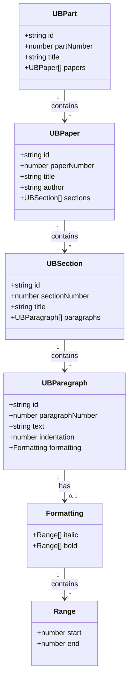
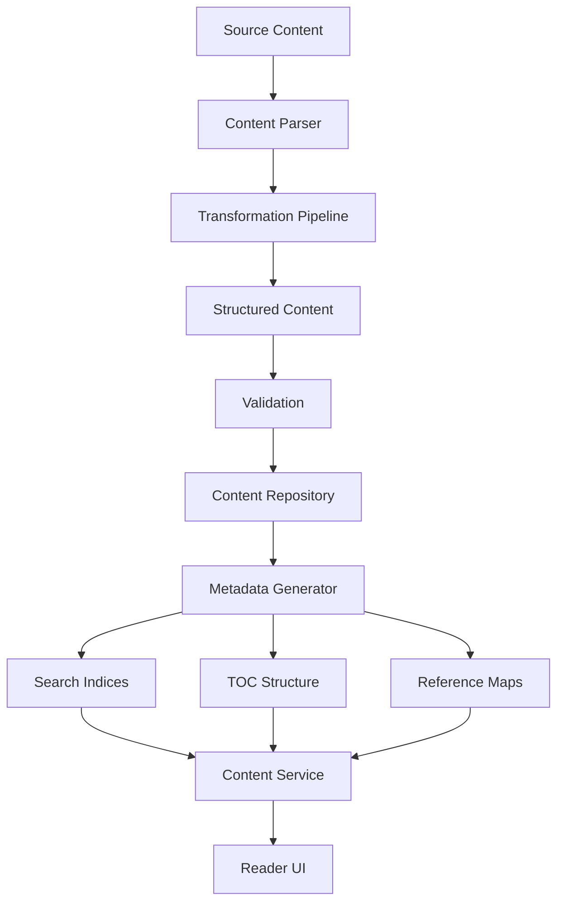
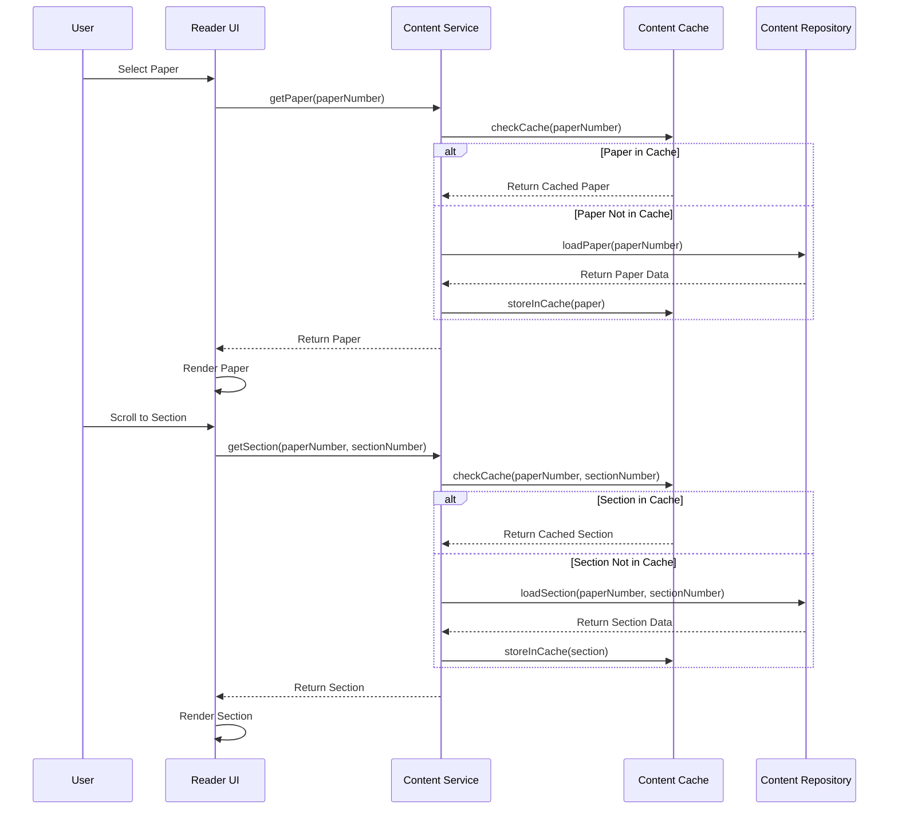
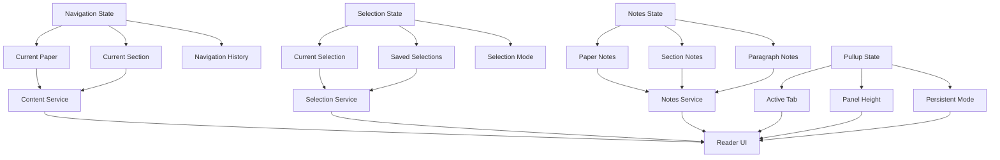
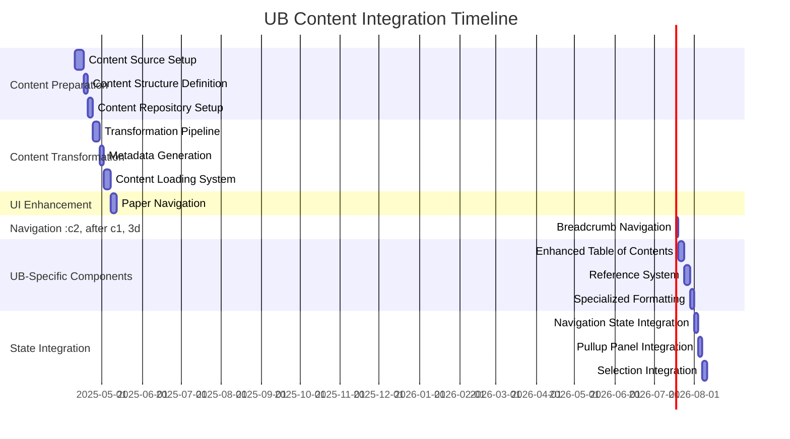

# Urantia Book Content Integration: Visual Diagram

The following diagrams illustrate the key components and processes involved in integrating the Urantia Book content into our reader application.

## Content Structure

## Content Transformation Process

## Content Loading Strategy

## State Management Integration

## Implementation Timeline

These diagrams provide a visual representation of our content integration plan, showing the data structure, transformation process, loading strategy, state management integration, and implementation timeline.
