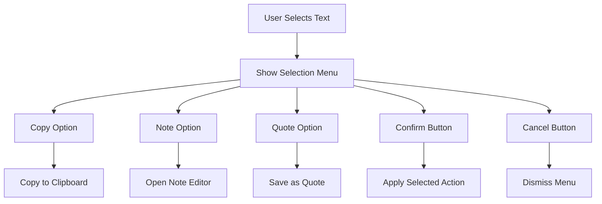

# Text Selection Menu Implementation

## Overview

This document outlines the implementation details for the custom text selection menu in the UB Reader. When a user selects text in the reader, a custom menu will appear offering options for copying, adding notes, and saving quotes.

## Selection Menu Design



## Menu Components

### 1. Selection Menu Container

The selection menu will appear near the selected text, positioned to avoid being cut off by screen edges.

```typescript
interface SelectionMenuProps {
  position: { top: number; left: number };
  selectedText: string;
  onCopy: () => void;
  onNote: () => void;
  onQuote: () => void;
  onConfirm: () => void;
  onCancel: () => void;
}
```

### 2. Action Buttons

The menu will include the following action buttons:

- **[copy]**: Copy the selected text to clipboard
- **[note]**: Create a note with the selected text
- **[quote]**: Save the selected text as a quote
- **✓** (checkmark): Apply the selected action
- **✕** (X): Cancel and dismiss the menu

### 3. Visual Design

The menu will have a clean, minimal design that matches the overall UB Reader aesthetic:

- Semi-transparent background
- Subtle drop shadow
- Clear iconography
- Consistent with the current theme (Traditional or Modern)

## Implementation Details

### 1. Selection Detection

```typescript
function handleTextSelection(event: MouseEvent) {
  const selection = window.getSelection();
  if (selection && !selection.isCollapsed) {
    const range = selection.getRangeAt(0);
    const rect = range.getBoundingClientRect();

    // Show selection menu at appropriate position
    showSelectionMenu({
      top: rect.bottom + window.scrollY,
      left: rect.left + window.scrollX,
    });
  }
}
```

### 2. Browser Right-Click Suppression

To prevent the browser's default context menu from appearing when right-clicking on selected text:

```typescript
function suppressDefaultContextMenu(event: MouseEvent) {
  const selection = window.getSelection();
  if (selection && !selection.isCollapsed) {
    event.preventDefault();
    // Show our custom selection menu instead
    handleTextSelection(event);
  }
}

// Add event listener
document.addEventListener('contextmenu', suppressDefaultContextMenu);
```

### 3. Selection Menu Component

```tsx
function SelectionMenu({
  position,
  selectedText,
  onCopy,
  onNote,
  onQuote,
  onConfirm,
  onCancel,
}: SelectionMenuProps) {
  const [selectedAction, setSelectedAction] = useState<'copy' | 'note' | 'quote' | null>(null);

  const handleActionSelect = (action: 'copy' | 'note' | 'quote') => {
    setSelectedAction(action);
  };

  const handleConfirm = () => {
    if (selectedAction === 'copy') onCopy();
    else if (selectedAction === 'note') onNote();
    else if (selectedAction === 'quote') onQuote();
    onConfirm();
  };

  return (
    <div className="selection-menu" style={{ top: position.top, left: position.left }}>
      <div className="selection-actions">
        <button
          className={`action-button ${selectedAction === 'copy' ? 'selected' : ''}`}
          onClick={() => handleActionSelect('copy')}
        >
          [copy]
        </button>
        <button
          className={`action-button ${selectedAction === 'note' ? 'selected' : ''}`}
          onClick={() => handleActionSelect('note')}
        >
          [note]
        </button>
        <button
          className={`action-button ${selectedAction === 'quote' ? 'selected' : ''}`}
          onClick={() => handleActionSelect('quote')}
        >
          [quote]
        </button>
      </div>
      <div className="selection-controls">
        <button className="confirm-button" onClick={handleConfirm}>
          ✓
        </button>
        <button className="cancel-button" onClick={onCancel}>
          ✕
        </button>
      </div>
    </div>
  );
}
```

### 4. Integration with State Management

The selection menu will be integrated with our state management system:

```typescript
// In SelectionContext.tsx
interface SelectionState {
  // ... existing properties
  showSelectionMenu: boolean;
  selectionMenuPosition: { top: number; left: number } | null;
  selectedAction: 'copy' | 'note' | 'quote' | null;
}

// Action types
enum SelectionActionType {
  // ... existing action types
  SHOW_SELECTION_MENU = 'SHOW_SELECTION_MENU',
  HIDE_SELECTION_MENU = 'HIDE_SELECTION_MENU',
  SET_SELECTED_ACTION = 'SET_SELECTED_ACTION',
}

// Action creators
const showSelectionMenu = (position: { top: number; left: number }) => ({
  type: SelectionActionType.SHOW_SELECTION_MENU,
  payload: { position },
});

const hideSelectionMenu = () => ({
  type: SelectionActionType.HIDE_SELECTION_MENU,
});

const setSelectedAction = (action: 'copy' | 'note' | 'quote' | null) => ({
  type: SelectionActionType.SET_SELECTED_ACTION,
  payload: { action },
});
```

## CSS Styling

```css
.selection-menu {
  position: absolute;
  background-color: rgba(255, 255, 255, 0.95);
  border-radius: 4px;
  box-shadow: 0 2px 10px rgba(0, 0, 0, 0.1);
  padding: 8px;
  z-index: 1000;
  display: flex;
  flex-direction: column;
  gap: 8px;
}

.selection-actions {
  display: flex;
  gap: 8px;
}

.action-button {
  background: none;
  border: 1px solid #ddd;
  border-radius: 4px;
  padding: 4px 8px;
  cursor: pointer;
  font-size: 14px;
}

.action-button.selected {
  background-color: #e6f7ff;
  border-color: #1890ff;
}

.selection-controls {
  display: flex;
  justify-content: flex-end;
  gap: 8px;
}

.confirm-button,
.cancel-button {
  width: 24px;
  height: 24px;
  border-radius: 50%;
  display: flex;
  align-items: center;
  justify-content: center;
  cursor: pointer;
  font-size: 14px;
}

.confirm-button {
  background-color: #52c41a;
  color: white;
  border: none;
}

.cancel-button {
  background-color: #f5f5f5;
  color: #666;
  border: 1px solid #ddd;
}
```

## Accessibility Considerations

1. **Keyboard Navigation**: Ensure the selection menu is fully navigable using keyboard
2. **Screen Reader Support**: Add appropriate ARIA labels to all buttons
3. **High Contrast Mode**: Ensure the menu is visible in high contrast mode
4. **Touch Support**: Make buttons large enough for touch interaction

## Implementation Tasks

- [ ] **Task 1:** Create SelectionMenu component
- [ ] **Task 2:** Implement text selection detection
- [ ] **Task 3:** Add browser right-click suppression
- [ ] **Task 4:** Integrate with state management system
- [ ] **Task 5:** Implement copy functionality
- [ ] **Task 6:** Implement note creation
- [ ] **Task 7:** Implement quote saving
- [ ] **Task 8:** Add CSS styling
- [ ] **Task 9:** Test across browsers and devices
- [ ] **Task 10:** Add accessibility features

This selection menu implementation will provide a seamless and intuitive way for users to interact with selected text in the UB Reader.
