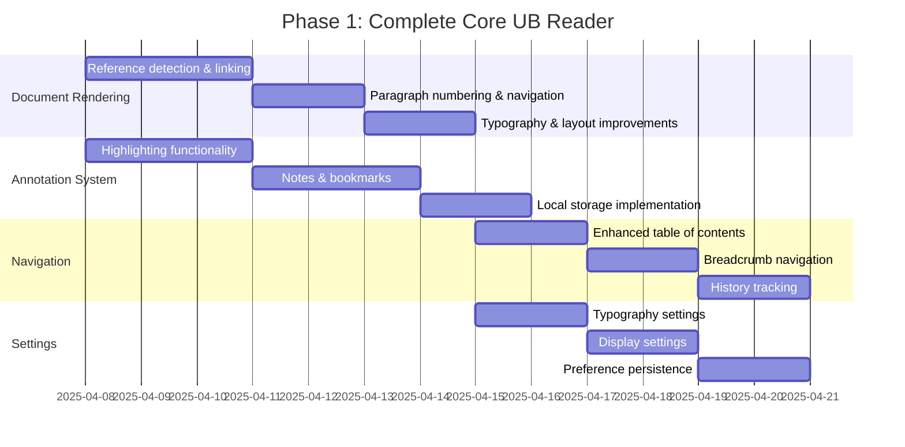
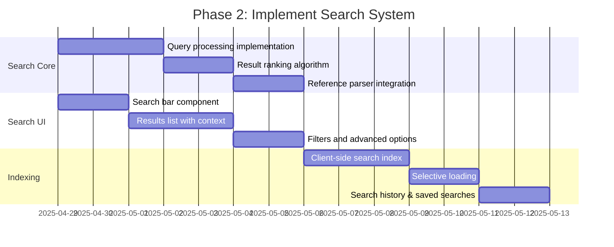
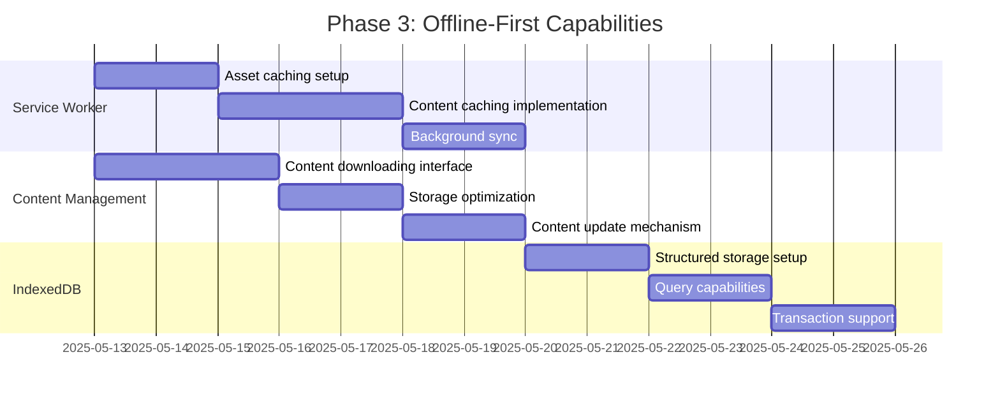
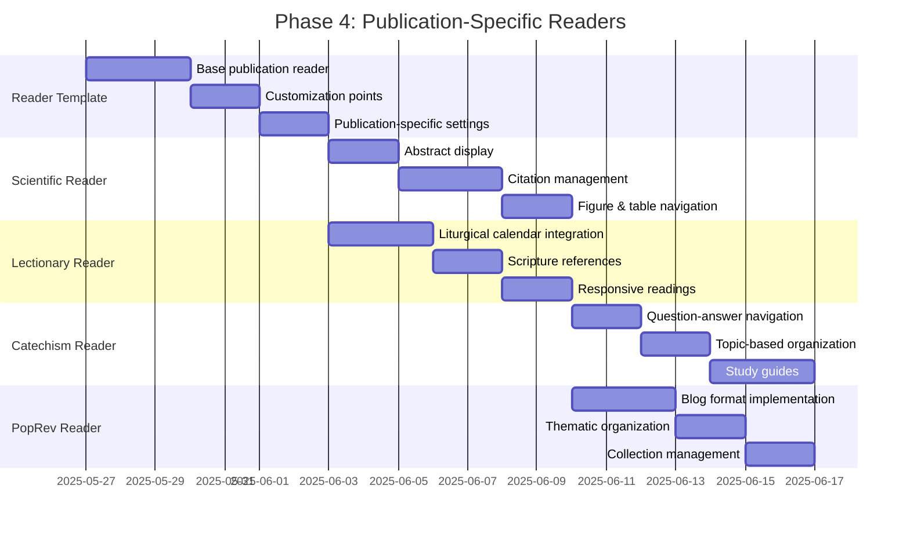
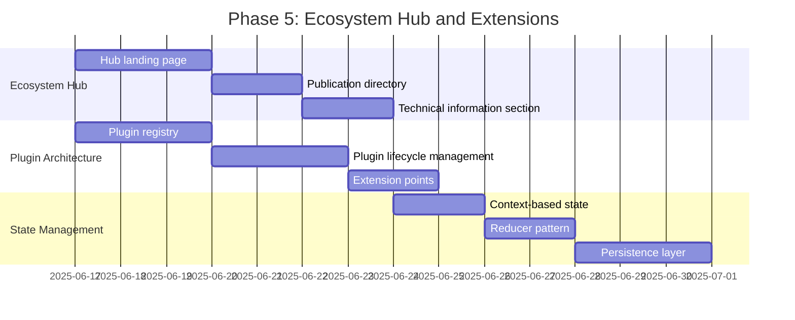
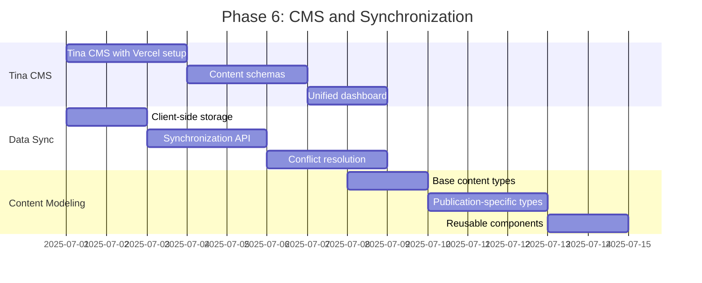
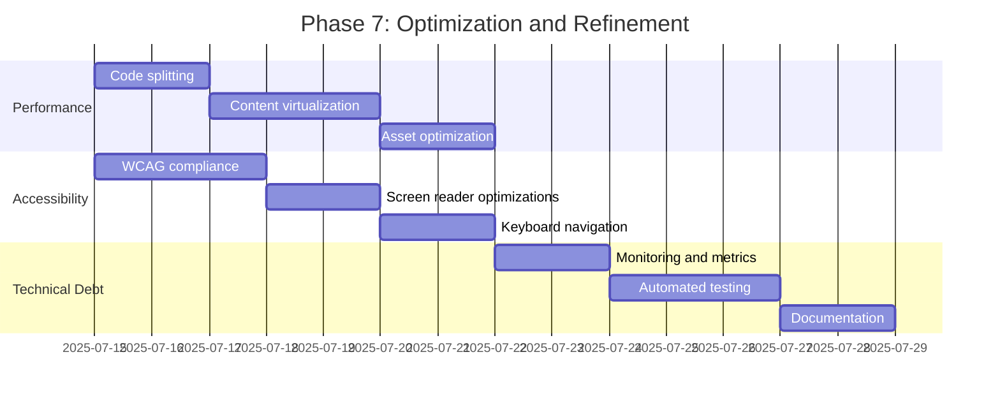

# UB Ecosystem Implementation Plan

## Current State Assessment

The UB Ecosystem is currently in the early stages of implementation, with:

1. **Core Packages (Partially Implemented)**:

   - `content-transformer`: Transforms content from various formats (markdown, docx, perplexity)
   - `reference-parser`: Handles UB references and linking
   - `audio-services`: Provides TTS capabilities with Urantia terminology pronunciation
   - `data-models`: Defines document, config, and extension models
   - `ui`: Contains shared UI components like DocumentReader

2. **UB Reader Application (Basic Implementation)**:

   - Next.js application structure
   - Reader component that emulates improved-demo.html (note: the enhanced reader was a test that is now deprecated)
   - Basic navigation and settings
   - Audio playback integration
   - Content rendering from JSON files

3. **Missing Components**:
   - Search system
   - State management
   - Performance optimization
   - Publication-specific readers
   - Ecosystem Hub
   - Plugin architecture
   - Data synchronization
   - CMS integration

## Publication Clarifications

The ecosystem includes the following publication types:

1. **Scientific Reader**: For scientific publications with academic content
2. **UB Lectionary**: For liturgical content with worship and study features
3. **UB Catechism**: For question-and-answer content related to the Urantia Book
4. **PopRev (UBgems)**: Popular Revelation Blog in a blog format
5. **Almanac-new**: A special publication for development after all else is in place

## Implementation Roadmap

### Phase 1: Complete Core UB Reader (2-3 weeks)

1. **Enhance Document Rendering**:

   - Implement reference detection and linking within content
   - Add paragraph numbering and section navigation
   - Improve typography and layout options

2. **Implement Annotation System**:

   - Create highlighting functionality
   - Add notes and bookmarks
   - Develop local storage for annotations

3. **Improve Navigation**:

   - Enhance table of contents with collapsible sections
   - Add breadcrumb navigation
   - Implement history tracking (back/forward)

4. **Complete Settings and Preferences**:
   - Finalize typography settings (font, size, spacing)
   - Add display settings (theme, layout, colors)
   - Implement preference persistence

### Phase 2: Implement Search System (1-2 weeks)

1. **Search Core Development**:

   - Implement query processing
   - Create result ranking algorithm
   - Integrate with reference parser

2. **Search UI Components**:

   - Develop search bar component
   - Create results list with context
   - Add filters and advanced options

3. **Indexing Service**:
   - Build client-side search index
   - Implement selective loading for performance
   - Add search history and saved searches

### Phase 3: Offline-First Capabilities (1-2 weeks)

1. **Service Worker Implementation**:

   - Set up asset caching
   - Implement content caching
   - Add background sync

2. **Offline Content Management**:

   - Create content downloading interface
   - Implement storage optimization
   - Add content update mechanism

3. **IndexedDB Integration**:
   - Set up structured storage
   - Implement query capabilities
   - Add transaction support

### Phase 4: Publication-Specific Readers (2-3 weeks)

1. **Publication Reader Template**:

   - Create base publication reader
   - Implement customization points
   - Add publication-specific settings

2. **Scientific Reader**:

   - Implement abstract display
   - Add citation management
   - Create figure and table navigation

3. **UB Lectionary Reader**:

   - Add liturgical calendar integration
   - Implement scripture references
   - Create responsive readings

4. **UB Catechism Reader**:

   - Implement question-answer navigation
   - Add topic-based organization
   - Create study guides

5. **PopRev (UBgems) Reader**:
   - Implement blog format
   - Add thematic organization
   - Create collection management

### Phase 5: Ecosystem Hub and Extensions (2 weeks)

1. **Ecosystem Hub Development**:

   - Create hub landing page
   - Implement publication directory
   - Add technical information section

2. **Plugin Architecture**:

   - Implement plugin registry
   - Create plugin lifecycle management
   - Add extension points

3. **State Management Package**:
   - Implement context-based state
   - Add reducer pattern for complex state
   - Create persistence layer

### Phase 6: CMS and Synchronization (2 weeks)

1. **Tina CMS Integration**:

   - Set up Tina CMS with Vercel
   - Create content schemas
   - Implement unified dashboard

2. **Data Synchronization**:

   - Implement client-side storage
   - Create synchronization API
   - Add conflict resolution

3. **Content Modeling**:
   - Define base content types
   - Create publication-specific types
   - Implement reusable components

### Phase 7: Optimization and Refinement (2 weeks)

1. **Performance Optimization**:

   - Implement code splitting
   - Add content virtualization
   - Optimize assets

2. **Accessibility Enhancements**:

   - Ensure WCAG compliance
   - Add screen reader optimizations
   - Implement keyboard navigation

3. **Technical Debt Management**:
   - Set up monitoring and metrics
   - Implement automated testing
   - Create documentation

### Phase 8: Almanac-New Development (After Core Completion)

As specified, the Almanac-New is a special publication for development after all else is in place. This will be addressed after the completion of the previous phases.

## Implementation Approach

### Development Workflow

1. **Component-First Development**:

   - Define interfaces and types first
   - Implement core functionality
   - Write comprehensive tests
   - Document APIs and usage examples

2. **Feature Development Process**:

   - Identify common requirements across publications
   - Develop in shared packages when possible
   - Create extension points for customization
   - Test across multiple publications

3. **Code Organization**:
   - Keep related functionality together
   - Use consistent naming conventions
   - Follow the principle of least surprise
   - Document architectural decisions

### Technical Considerations

1. **State Management**:

   - Use React Context for UI state
   - Implement reducers for complex state
   - Use middleware for side effects
   - Persist state in localStorage/IndexedDB

2. **Performance**:

   - Implement virtualization for large documents
   - Use code splitting for large features
   - Optimize bundle size
   - Implement caching strategies

3. **Testing Strategy**:
   - Unit tests for core functionality
   - Integration tests for components
   - End-to-end tests for critical flows
   - Accessibility testing

## Next Steps

To begin implementation, we recommend:

1. Start with completing the core UB Reader functionality
2. Focus on the annotation system and improved navigation
3. Implement the search system as a high-priority feature
4. Add offline capabilities to enhance the user experience

This implementation plan aligns with the comprehensive architecture document and takes into account the current state of the codebase. It provides a structured approach to building out the UB Ecosystem in a phased manner, ensuring that each component builds upon the previous ones.
