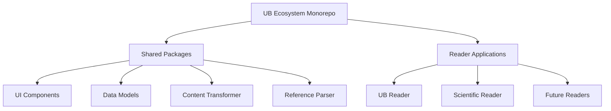
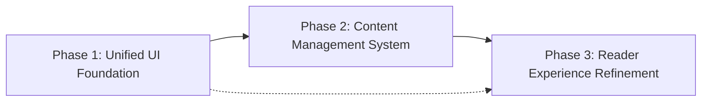
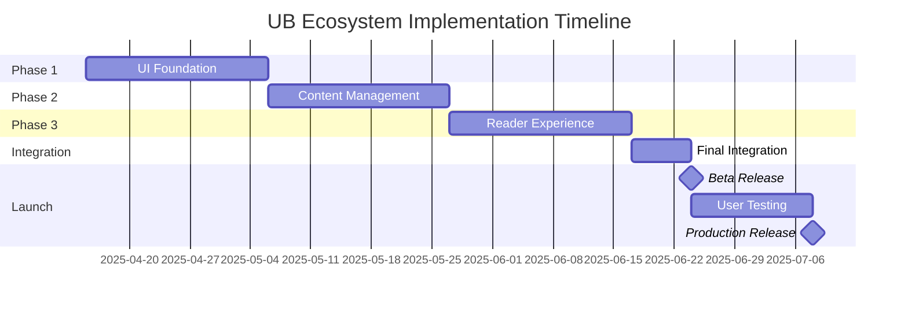

# UB Ecosystem: Master Implementation Plan

This document serves as the master implementation plan for the UB Ecosystem, providing a comprehensive overview of the entire project and how the three implementation phases fit together to create a unified, high-performance reading experience across all publication types.

## Table of Contents

1. [Project Overview](#project-overview)
2. [Implementation Strategy](#implementation-strategy)
3. [Phase Integration](#phase-integration)
4. [Critical Path and Dependencies](#critical-path-and-dependencies)
5. [Resource Allocation](#resource-allocation)
6. [Risk Management](#risk-management)
7. [Quality Assurance](#quality-assurance)
8. [Project Timeline](#project-timeline)
9. [Success Metrics](#success-metrics)

## Project Overview

### Vision

Create a unified, high-performance ecosystem for reading and studying publications that provides an intuitive user experience with both Traditional and Modern formatting options while ensuring content integrity and accessibility across all device types.

### Core Principles

1. **Content Integrity**: Maintain absolute fidelity to the original text while providing enhanced formatting options
2. **Unified Experience**: Create a consistent user interface that works across all publication types
3. **Performance First**: Ensure optimal performance even with large documents and on resource-constrained devices
4. **Offline Capability**: Provide full functionality without requiring constant internet connectivity
5. **Extensibility**: Build a foundation that can easily accommodate new publications and features

### Implementation Phases

1. **Phase 1: Unified UI Foundation** - Create the core UI components and layout system
2. **Phase 2: Content Management System** - Implement content storage, retrieval, and search capabilities
3. **Phase 3: Reader Experience Refinement** - Enhance the reading experience with advanced features and optimizations

## Implementation Strategy

### Architectural Approach

The UB Ecosystem will be implemented as a monorepo with shared packages for core functionality and separate applications for different reader experiences. This approach ensures code reuse while allowing for specialized implementations where needed.

### Development Methodology

The project will follow an iterative development approach with the following characteristics:

1. **Component-First Development**: Build and test individual components before integration
2. **Continuous Integration**: Implement automated testing and deployment
3. **Feature Flagging**: Use feature flags for gradual rollout of new functionality
4. **User Feedback Loops**: Incorporate user testing and feedback throughout development

### Technical Stack

- **Frontend Framework**: React with Next.js
- **State Management**: React Context API and Zustand
- **Styling**: CSS Modules or Styled Components
- **Storage**: IndexedDB with localStorage fallback
- **Build System**: Turborepo for monorepo management
- **Testing**: Jest, React Testing Library, and Cypress

## Phase Integration

### Phase Relationships

The three implementation phases are designed to build upon each other, with each phase providing essential functionality for subsequent phases:

### Integration Points

1. **UI Components → Content Management**

   - Content renderer components consume data from content management system
   - Navigation components use publication structure from content models
   - Settings components interact with user preferences storage

2. **Content Management → Reader Experience**

   - Search functionality builds on content indexing
   - Cross-publication features rely on unified content models
   - Performance optimizations leverage content chunking and caching

3. **UI Foundation → Reader Experience**
   - Theme implementation extends base UI components
   - Typography enhancements build on core text rendering
   - Navigation refinements extend base navigation components

## Critical Path and Dependencies

### Critical Path

The following elements represent the critical path for the project:

1. **Core UI Components** (Phase 1)

   - Reader layout
   - Content renderer
   - Navigation components

2. **Content Data Models** (Phase 2)

   - Document model
   - Publication model
   - User preferences model

3. **Content Storage** (Phase 2)

   - IndexedDB implementation
   - Repository pattern
   - Offline capabilities

4. **Performance Optimizations** (Phase 3)
   - Virtualization
   - Document chunking
   - Memory management

### External Dependencies

- **Content Availability**: Publication content in structured format
- **Design Assets**: Icons, typography, and color schemes
- **API Services**: If implementing cloud synchronization
- **Browser Capabilities**: IndexedDB, Service Workers, and other modern APIs

## Resource Allocation

### Development Resources

- **Frontend Development**: UI components, layout, and interactions
- **Data Engineering**: Content models, storage, and retrieval
- **Performance Engineering**: Optimization and memory management
- **UX Design**: User interface design and usability testing
- **QA Testing**: Functional, performance, and compatibility testing

### Time Allocation

| Phase   | Duration | Resource Focus                                 |
| ------- | -------- | ---------------------------------------------- |
| Phase 1 | 3 weeks  | Frontend Development, UX Design                |
| Phase 2 | 3 weeks  | Data Engineering, Frontend Development         |
| Phase 3 | 3 weeks  | Performance Engineering, UX Design, QA Testing |

### Skill Requirements

- **React/Next.js**: Advanced proficiency
- **TypeScript**: Advanced proficiency
- **IndexedDB/Browser Storage**: Intermediate proficiency
- **Performance Optimization**: Intermediate proficiency
- **Accessibility**: Intermediate proficiency

## Risk Management

### Identified Risks

1. **Performance with Large Documents**

   - **Mitigation**: Implement virtualization and document chunking early
   - **Contingency**: Fallback to simplified rendering for very large documents

2. **Browser Compatibility Issues**

   - **Mitigation**: Use feature detection and polyfills
   - **Contingency**: Provide graceful degradation for unsupported features

3. **Content Formatting Complexity**

   - **Mitigation**: Create comprehensive test suite with various content types
   - **Contingency**: Implement fallback rendering for complex content

4. **Offline Synchronization Conflicts**

   - **Mitigation**: Implement robust conflict resolution strategies
   - **Contingency**: Provide manual conflict resolution UI

5. **Scope Creep**
   - **Mitigation**: Clearly define MVP features and use feature flagging
   - **Contingency**: Prioritize features and defer non-essential items

### Risk Monitoring

- Regular performance testing with large documents
- Cross-browser compatibility testing
- User testing with different content types
- Synchronization testing with various network conditions

## Quality Assurance

### Testing Strategy

1. **Unit Testing**

   - Test individual components and functions
   - Verify proper rendering of different content types
   - Test state management and data flow

2. **Integration Testing**

   - Test component interactions
   - Verify data flow between systems
   - Test navigation and user flows

3. **Performance Testing**

   - Benchmark rendering performance
   - Test memory usage patterns
   - Verify smooth scrolling and interactions

4. **Compatibility Testing**
   - Test on different browsers and devices
   - Verify functionality with different network conditions
   - Test with various content types and sizes

### Acceptance Criteria

- **Functionality**: All features work as specified
- **Performance**: Smooth scrolling and interactions, even with large documents
- **Compatibility**: Works on all target browsers and devices
- **Accessibility**: Meets WCAG 2.1 AA standards
- **Offline Support**: Full functionality without internet connection

## Project Timeline

### Overall Timeline

### Detailed Timeline

| Week  | Phase       | Focus Areas                        | Deliverables                 |
| ----- | ----------- | ---------------------------------- | ---------------------------- |
| 1-3   | Phase 1     | UI Components, Layout, Navigation  | Unified UI Foundation        |
| 4-6   | Phase 2     | Data Models, Storage, Search       | Content Management System    |
| 7-9   | Phase 3     | Theme Implementation, Optimization | Reader Experience Refinement |
| 10    | Integration | Final Integration, Bug Fixes       | Complete System              |
| 11-12 | Testing     | User Testing, Refinement           | Production-Ready System      |

### Milestones

1. **UI Foundation Complete** - End of Week 3
2. **Content Management Complete** - End of Week 6
3. **Reader Experience Complete** - End of Week 9
4. **Beta Release** - End of Week 10
5. **Production Release** - End of Week 12

## Success Metrics

### User Experience Metrics

- **Readability**: User satisfaction with text rendering and formatting
- **Navigation**: Ease of finding and accessing content
- **Performance**: Perceived speed and responsiveness
- **Offline Usage**: Satisfaction with offline capabilities
- **Cross-Publication**: Ease of navigating between publications

### Technical Metrics

- **Rendering Performance**: Time to render initial view and scrolling performance
- **Memory Usage**: Peak memory consumption with large documents
- **Load Time**: Time to interactive for initial load
- **Offline Capability**: Percentage of features available offline
- **Code Reuse**: Percentage of code shared between reader applications

### Business Metrics

- **User Adoption**: Number of active users
- **User Retention**: Percentage of returning users
- **Feature Usage**: Utilization of different features
- **Publication Coverage**: Number of publications supported
- **Platform Support**: Number of supported devices and browsers

---

This master implementation plan provides a comprehensive roadmap for developing the UB Ecosystem. By following this plan and executing the detailed implementation plans for each phase, we will create a unified, high-performance reading experience that supports both Traditional and Modern formatting while ensuring content integrity and accessibility across all publication types.
