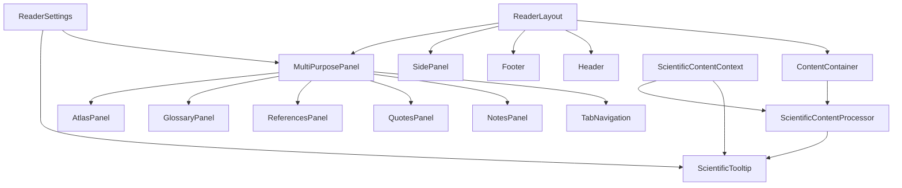

# Implementation Plan for UB Reader Enhancements

Based on analysis of the current codebase and the requirements outlined in the reader-enhancement-summary.md, code-mode-guidelines.md, and reader-features-implementation-plan.md documents, this document provides a detailed implementation plan for the UB Reader enhancements.

## Current State Analysis

Key components that will need to be modified or extended:

1. **ContentContainer**: Already has width settings ('narrow', 'medium', 'wide') with max-width values (650px, 800px, 1000px).
2. **ReaderLayout**: Provides the overall structure with header, footer, sidebar, and main content areas.
3. **SidePanel**: A sliding panel component that can be positioned on the left or right side of the screen.

## Implementation Plan

### Phase 1: Core Structure Updates

#### 1.1 Width Limitation Implementation

The current ContentContainer already has a 'medium' width setting of 800px, which aligns with the requirement. We need to ensure it's properly used in the reader layout.

**Tasks:**

1. **Update ContentContainer.css**:

   - Refine the media queries to ensure proper padding on larger screens
   - Add additional CSS for very large screens (>1440px) as specified in the implementation plan

2. **Update ReaderLayout.tsx**:
   - Ensure the content area properly uses the ContentContainer with appropriate width settings
   - Add a prop to specify the content width, defaulting to 'medium'

#### 1.2 Basic Structure for MultiPurposePanel

We'll create a new component based on the existing SidePanel but positioned at the bottom of the screen.

**Tasks:**

1. **Create MultiPurposePanel.tsx**:

   - Adapt from SidePanel.tsx but position at the bottom
   - Add height adjustment capability with a drag handle
   - Implement basic tab navigation structure

2. **Create MultiPurposePanel.css**:

   - Style for bottom positioning
   - Add styles for the drag handle
   - Add styles for the tab navigation

3. **Update ReaderLayout.tsx**:
   - Add support for the bottom panel
   - Add a prop to control the visibility of the bottom panel

#### 1.3 Tooltip Data Schema

**Tasks:**

1. **Create types/TooltipData.ts**:
   - Define the schema for tooltip content as outlined in the implementation plan
   - Create example data structure

### Phase 2: Pull-Up Panel Development

#### 2.1 Height Adjustment Implementation

**Tasks:**

1. **Enhance MultiPurposePanel.tsx**:

   - Implement the resize functionality with mouse and touch events
   - Add min/max height constraints
   - Implement event handlers for resize start, move, and end

2. **Update MultiPurposePanel.css**:
   - Add styles for the resize handle
   - Add transition effects for smooth resizing

#### 2.2 Tab Navigation System

**Tasks:**

1. **Create TabNavigation.tsx**:

   - Implement a reusable tab navigation component
   - Support for icons and labels
   - Support for active tab indication

2. **Create TabNavigation.css**:
   - Style the tab navigation
   - Add responsive styles for different screen sizes

#### 2.3 Panel Content Components

**Tasks:**

1. **Create specialized content components**:

   - NotesPanel.tsx
   - QuotesPanel.tsx
   - ReferencesPanel.tsx
   - GlossaryPanel.tsx
   - AtlasPanel.tsx

2. **Create corresponding CSS files**:
   - Style each panel component
   - Ensure consistent styling across all panels

### Phase 3: Scientific Content Enhancement

#### 3.1 Tooltip System Implementation

**Tasks:**

1. **Create ScientificTooltip.tsx**:

   - Implement the tooltip component as outlined in the implementation plan
   - Support different types of content (abbreviation, equation, term)
   - Add positioning logic to ensure tooltips are visible

2. **Create ScientificTooltip.css**:
   - Style the tooltip
   - Add animations for showing/hiding
   - Ensure readability of tooltip content

#### 3.2 Content Processor for Scientific Terms

**Tasks:**

1. **Create ScientificContentProcessor.ts**:
   - Implement the content processor to automatically wrap terms
   - Add support for different types of scientific content
   - Ensure proper escaping of HTML

#### 3.3 Mobile-Friendly Interaction

**Tasks:**

1. **Update ScientificTooltip.tsx**:

   - Add touch event handlers
   - Implement mobile-specific tooltip behavior
   - Ensure tooltips don't interfere with reading on small screens

2. **Update ScientificTooltip.css**:
   - Add mobile-specific styles
   - Ensure tooltips are properly sized on small screens

### Phase 4: State Management and Persistence

#### 4.1 LocalStorage for Panel Preferences

**Tasks:**

1. **Update MultiPurposePanel.tsx**:
   - Implement localStorage for panel height
   - Implement localStorage for active tab
   - Add loading/saving logic

#### 4.2 Context Providers for Tooltip Data

**Tasks:**

1. **Create ScientificContentContext.tsx**:
   - Implement a context provider for tooltip data
   - Add methods for registering and retrieving tooltip data
   - Support dynamic loading of tooltip data

#### 4.3 User Customization Settings

**Tasks:**

1. **Create ReaderSettings.tsx**:
   - Implement settings for panel behavior
   - Implement settings for tooltip behavior
   - Add persistence for user settings

### Phase 5: Testing and Refinement

#### 5.1 Cross-Browser Testing

**Tasks:**

1. Test in major browsers (Chrome, Firefox, Safari, Edge)
2. Identify and fix any browser-specific issues

#### 5.2 Accessibility Review

**Tasks:**

1. Ensure all interactive elements have proper ARIA attributes
2. Test with screen readers
3. Ensure keyboard navigation works properly

#### 5.3 Performance Optimization

**Tasks:**

1. Implement virtualized lists for large datasets
2. Optimize tooltip rendering
3. Measure and improve performance metrics

## Component Relationships



## File Structure

```
packages/ui/src/
├── layout/
│   ├── ContentContainer.tsx
│   ├── ContentContainer.css
│   ├── ReaderLayout.tsx
│   ├── ReaderLayout.css
│   ├── MultiPurposePanel.tsx
│   ├── MultiPurposePanel.css
│   ├── Header.tsx
│   ├── Header.css
│   ├── Footer.tsx
│   ├── Footer.css
│   └── SidePanel.tsx
├── navigation/
│   ├── TabNavigation.tsx
│   ├── TabNavigation.css
│   ├── TableOfContents.tsx
│   └── Breadcrumbs.tsx
├── panels/
│   ├── NotesPanel.tsx
│   ├── QuotesPanel.tsx
│   ├── ReferencesPanel.tsx
│   ├── GlossaryPanel.tsx
│   └── AtlasPanel.tsx
├── scientific/
│   ├── ScientificTooltip.tsx
│   ├── ScientificTooltip.css
│   ├── ScientificContentProcessor.ts
│   └── ScientificContentContext.tsx
├── settings/
│   └── ReaderSettings.tsx
└── types/
    └── TooltipData.ts
```

## Implementation Timeline

1. **Phase 1 (Core Structure Updates)**: 1-2 days
2. **Phase 2 (Pull-Up Panel Development)**: 2-3 days
3. **Phase 3 (Scientific Content Enhancement)**: 2-3 days
4. **Phase 4 (State Management and Persistence)**: 1-2 days
5. **Phase 5 (Testing and Refinement)**: 2-3 days

Total estimated time: 8-13 days

## Technical Considerations

1. **Performance**:

   - Use virtualized lists for large datasets (glossary, references)
   - Lazy-load panel content when switching tabs
   - Optimize tooltip rendering to prevent layout shifts

2. **Accessibility**:

   - Ensure all interactive elements have proper ARIA attributes
   - Support keyboard navigation for tooltips
   - Provide high-contrast mode support

3. **Mobile Considerations**:
   - Use touch-friendly interaction patterns
   - Ensure panels don't consume too much screen space on small devices
   - Implement swipe gestures for panel height adjustment
