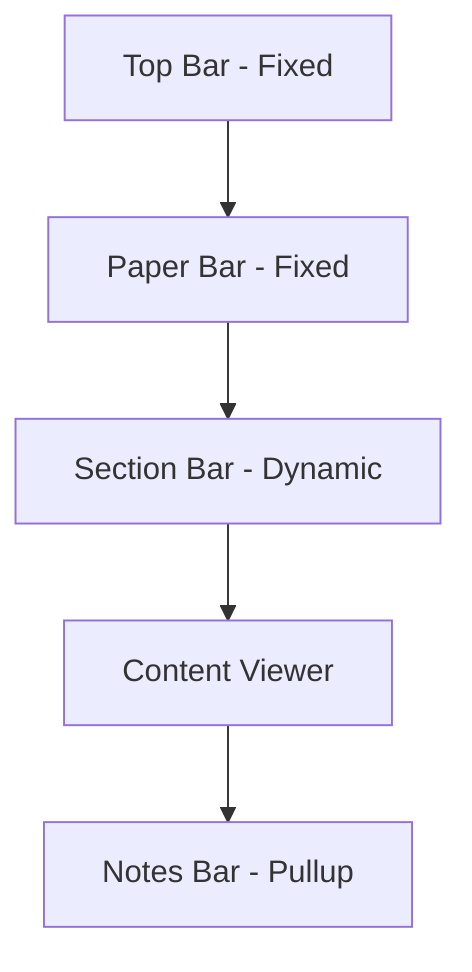

# UB Reader Implementation Plan

This document outlines the detailed implementation plan for enhancing the UB Reader demo with Paper 1 content and proper navigation features.

## Layout Structure

## Component Details

### 1. Top Bar (Fixed Position)

- **Left**: Two navigation hamburger menus side-by-side
  - Book navigation (Papers list) - larger icon
  - Section navigation (Sections within current Paper) - smaller icon
- **Center**: "Urantia Book" title
- **Center**: "Urantia Book" title
- **Right**: Reserved space for future link/feature
- **Behavior**: Always visible, fixed at top of viewport

### 2. Paper Bar (Fixed Position)

- **Left**: Paper Title (e.g., "PAPER 1: THE UNIVERSAL FATHER")
- **Center/Right**: Currently empty (reserved for future features)
- **Behavior**: Always visible, positioned below Top Bar

### 3. Section Bar (Dynamic)

- **Left**: Current Section Title
- **Center/Right**: Currently empty (reserved for future features)
- **Behavior**:
  - Initially empty when viewing introduction
  - Section title appears when corresponding section scrolls to this position
  - Updates dynamically based on scroll position
  - Smooth transitions between different section titles

### 4. Content Viewer

- **Structure**:
  - Paper introduction (unlabeled)
  - Section 1 with title and paragraphs (title positioned left, not center)
  - Section 2 with title and paragraphs (title positioned left, not center)
  - Section 3 with title and paragraphs (title positioned left, not center)
  - Top matter not shown (to avoid redundancy with title bars)
- **Features**:
  - Optional paragraph numbering (toggleable in settings)
  - Maintains content integrity (section titles flow with content)
  - Proper spacing and typography

### 5. Notes Bar (Pullup Panel)

- **Tabs**:
  - Notes
  - Quotes
  - Settings
- **Features**:
  - Resizable panel with visual handle indicator
  - Persistent user data
  - Note indicators in main content
  - Text selection options (Note, Quote, Highlight)

## Interaction Design

### Sticky Headers Behavior

- **Content Integrity**: Section titles remain part of the document flow
- **Section Bar Updates**:
  - When a section title scrolls to the Section Bar position, its text appears in the Section Bar
  - Gentle transition effect when titles change
  - Empty when introduction is at the top of the viewport
- **Copy/Paste Behavior**: Ensures section titles are included when copying across sections

### Text Selection and Annotation

- **Selection Options**:
  - When text is selected, show options: Note, Quote, Highlight
  - User can select any combination
  - Confirm with checkmark or cancel with X
- **Note Indicators**:
  - Small colored dots next to paragraph numbers
  - Clickable to open associated note in pullup panel
  - Optional display (can be toggled in settings)

### Navigation Menus

- **Book Navigation** (left hamburger):
  - List of all papers organized by Parts
  - Current paper highlighted
  - "Sticky" Part headers at bottom (similar to improved-demo.html)
  - Closes when selection made or clicked outside
- **Section Navigation** (right hamburger):
  - List of sections in current paper
  - Current section highlighted
  - Closes when selection made or clicked outside

## Typography and Styling

### Font Choices

- **Title Bars**: Respect user's font preference (Serif/Sans)
  - Default to serif for web
  - Default to sans-serif for small devices
- **Notes Bar**: Always sans-serif
- **Content**: Respect user's font preference

### Responsive Design

- **Mobile Optimization**:
  - Compact header elements
  - Adjusted font sizes
  - Full-width pullup panel
- **Desktop Enhancement**:
  - Optimal reading width
  - Refined spacing
  - Partial-height pullup panel option

## Implementation Phases

### Phase 1: Basic Structure

- Implement fixed Top Bar and Paper Bar
- Add Paper 1 content with proper sections
- Set up basic scroll behavior

### Phase 2: Dynamic Section Bar

- Implement section title detection on scroll
- Add smooth transitions between titles
- Ensure proper empty state for introduction

### Phase 3: Notes and Interaction

- Enhance pullup panel with tabs
- Implement text selection options
- Add note indicators in content

### Phase 4: Navigation Menus

- Implement hamburger menu dropdowns
- Add proper highlighting of current items
- Ensure proper overlay and closing behavior

### Phase 5: Refinement

- Typography and spacing adjustments
- Performance optimization
- Cross-browser testing

## Technical Considerations

### Content Integrity

- Section titles must be part of the main content flow
- Section Bar displays a "reflection" of the current section title
- Copy/paste operations must include section titles when spanning sections

### Scroll Performance

- Use efficient scroll event handling (debouncing/throttling)
- Optimize DOM updates for smooth performance
- Consider IntersectionObserver for detecting section positions

### Accessibility

- Ensure proper keyboard navigation
- Maintain semantic HTML structure
- Provide appropriate ARIA attributes

This implementation plan aims to create an elegant, intuitive reading experience that maintains the integrity of the original text while providing modern navigation and annotation features.
