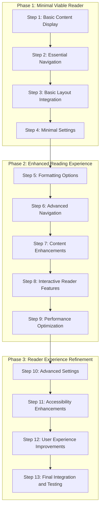

# UB Ecosystem: Incremental Implementation Plan for an Exemplary Reading Experience

This document outlines a strategy to create an exemplary reading experience by breaking down the implementation into smaller, more manageable chunks. This approach will help avoid overwhelming complexity while ensuring steady progress toward the ultimate goal.

## Implementation Strategy: Progressive Enhancement

This plan follows a progressive enhancement approach with these key principles:

1. **Core Functionality First**: Implement essential reading features before adding enhancements
2. **Vertical Slices**: Complete end-to-end functionality for specific user flows before moving to the next
3. **Continuous Integration**: Regularly integrate components to ensure they work together
4. **User-Centered Milestones**: Define milestones based on user experience improvements

## Phase 1: Minimal Viable Reader (MVR)

### Step 1: Basic Content Display (1-2 days)

- Complete the ContentRenderer component with basic paragraph rendering
- Implement minimal styling for readability
- Focus on content display without advanced formatting options
- Create a simple test document to verify rendering

### Step 2: Essential Navigation (1-2 days)

- Implement basic prev/next navigation
- Add simple table of contents with section linking
- Create minimal header and footer with navigation controls
- Ensure keyboard navigation works for accessibility

### Step 3: Basic Layout Integration (1 day)

- Integrate the layout components (ContentContainer, Header, Footer)
- Implement responsive behavior for different screen sizes
- Create a simple reader page that combines these components
- Test the basic reading flow

### Step 4: Minimal Settings (1 day)

- Add font size adjustment
- Implement a basic theme toggle (light/dark)
- Create a simple settings panel
- Ensure settings persist between sessions

## Phase 2: Enhanced Reading Experience

### Step 5: Formatting Options (2 days)

- Implement Traditional formatting
- Add Modern formatting
- Create the format toggle component
- Ensure smooth transitions between formats

### Step 6: Advanced Navigation (2 days)

- Enhance the TableOfContents with collapsible sections
- Implement dual hamburger menu system:
  - Larger hamburger for Book Navigation (same across papers)
  - Smaller hamburger for Section Navigation (paper-specific)
- Create book navigation panel based on improved-demo.html
- Add section navigator panel
- Implement breadcrumb navigation
- Create smooth scrolling to sections

### Step 7: Content Enhancements (2-3 days)

- Add paragraph numbering with indicators for notes
- Implement proper list rendering
- Add table rendering
- Enhance typography and spacing
- Implement three-row header system:
  - Top Row: Book title with dual hamburger navigation
  - Paper Row: Paper title
  - Section Row: Dynamic section title based on scroll position
- Process JSON content to remove redundant titles
- Ensure section titles are left-aligned in content
- Remove redundant titling from content (eliminate top matter)

### Step 8: Interactive Reader Features (2-3 days)

- Implement bottom pullup panel with tabs for Notes, Quotes, and Settings
- Create text selection system offering choices: Note, Quote, Highlight
- Implement Notes tab with text entry box and "Add Note" button
- Create Quotes tab for saving selected passages
- Add automatic referencing of notes and quotes (Paper:Section.Title format)
- Implement paragraph indicators for notes
- Add Settings tab for quick access to reader preferences
- Ensure smooth transitions and animations for pullups
- Make pullup system responsive (persistent on large screens, auto-hiding on small screens)

### Step 9: Performance Optimization (1-2 days)

- Implement virtualized scrolling for large documents
- Add lazy loading for content sections
- Optimize component rendering with memoization
- Test performance with large documents

## Phase 3: Reader Experience Refinement

### Step 10: Advanced Settings (1-2 days)

- Add line spacing controls
- Implement text width adjustment
- Create font family selection
- Add margin and padding controls

### Step 11: Accessibility Enhancements (1-2 days)

- Ensure proper ARIA attributes throughout
- Implement high contrast mode
- Add screen reader optimizations
- Test with accessibility tools

### Step 12: User Experience Improvements (1-2 days)

- Add smooth transitions and animations
- Implement progress indicators
- Create visual feedback for interactions
- Polish the overall look and feel

### Step 13: Final Integration and Testing (1-2 days)

- Integrate all components into a cohesive reader
- Perform comprehensive testing
- Fix any remaining issues
- Document the implementation

## Implementation Diagram

## Key Benefits of This Approach

1. **Early Functionality**: Creates a working reader quickly, allowing for early testing and feedback
2. **Manageable Complexity**: Each step has a clear, limited scope to prevent overwhelming complexity
3. **Visible Progress**: Provides tangible results at each step to maintain momentum
4. **Risk Mitigation**: Identifies integration issues early when they're easier to fix
5. **Flexibility**: Allows for adjustments based on feedback throughout the process

## Testing Strategy for Each Step

1. **Component Testing**: Test individual components in isolation
2. **Integration Testing**: Verify components work together properly
3. **User Flow Testing**: Test complete user flows for each feature
4. **Performance Testing**: Check rendering and interaction performance
5. **Accessibility Testing**: Verify accessibility at each step

## Component Dependencies and Integration Points

### Content Display Dependencies

- ContentRenderer depends on:
  - ParagraphRenderer
  - SectionRenderer
  - ListRenderer
  - TableRenderer

### Navigation Dependencies

- TableOfContents depends on:
  - Document structure model
  - Current position tracking
- NavigationControls depends on:
  - Current position tracking
  - Document structure model

### Layout Dependencies

- ReaderLayout integrates:
  - Header
  - Footer
  - SidePanel
  - ContentContainer

### Settings Dependencies

- Settings panel integrates:
  - ThemeToggle
  - FormatToggle
  - FontSizeControl
  - LineSpacingControl
  - PullupPanel
  - TextSelectionControls

### Pullup Dependencies

- PullupPanel integrates:
  - NotesPullup (with text entry and note list)
  - QuotesPullup (with saved passages list)
  - SettingsPullup (with quick access controls)
  - TextSelectionControls (Note, Quote, Highlight options)

### Header System Dependencies

- HeaderSystem integrates:
  - TopRowHeader (with dual hamburger navigation)
  - PaperRowHeader (with paper title)
  - SectionRowHeader (dynamically updated based on scroll)
  - ScrollPositionTracker for updating section title

## Implementation Priorities for Each Component Category

### Layout Components (Priority: High)

1. ContentContainer
2. Header
3. Footer
4. SidePanel
5. ReaderLayout

### Content Components (Priority: High)

1. ParagraphRenderer
2. ContentRenderer
3. SectionRenderer
4. ListRenderer
5. TableRenderer

### Navigation Components (Priority: Medium)

1. NavigationControls
2. TableOfContents
3. Breadcrumbs
4. SectionNavigator

### Settings Components (Priority: Medium)

1. ThemeToggle
2. FormatToggle
3. FontSizeControl
4. LineSpacingControl

### Pullup Components (Priority: Medium-High)

1. PullupPanel
2. NotesPullup
3. QuotesPullup
4. SettingsPullup
5. TextSelectionControls

### Header Components (Priority: High)

1. HeaderSystem
2. TopRowHeader (with hamburger menus)
3. PaperRowHeader
4. SectionRowHeader
5. ScrollPositionTracker

## Next Immediate Actions

To begin implementation, the recommended next steps are:

1. Complete any partially implemented components in the current codebase
2. Create a simple reader page that integrates the existing components
3. Implement the basic content renderer with paragraph support
4. Add essential navigation controls

This approach will quickly establish a foundation that demonstrates the core reading experience while setting the stage for progressive enhancements.

## Implementation Discipline

To maintain the benefits of this incremental approach:

1. **Phase Adherence**: Focus on completing the current phase before moving to components in later phases
2. **Reminder System**: If requested to implement something from a future phase, a reminder will be provided about which phase that component or feature is scheduled for
3. **Override Option**: While phase adherence is recommended for optimal development flow, the schedule can be overridden when necessary
4. **Documentation Updates**: As implementation progresses, this document should be updated to reflect completed components and any changes to the plan

This discipline helps maintain focus, prevents scope creep, and ensures that fundamental components are solid before building more complex features on top of them.
