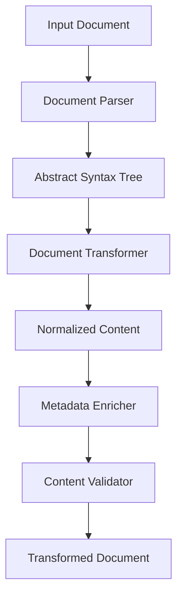
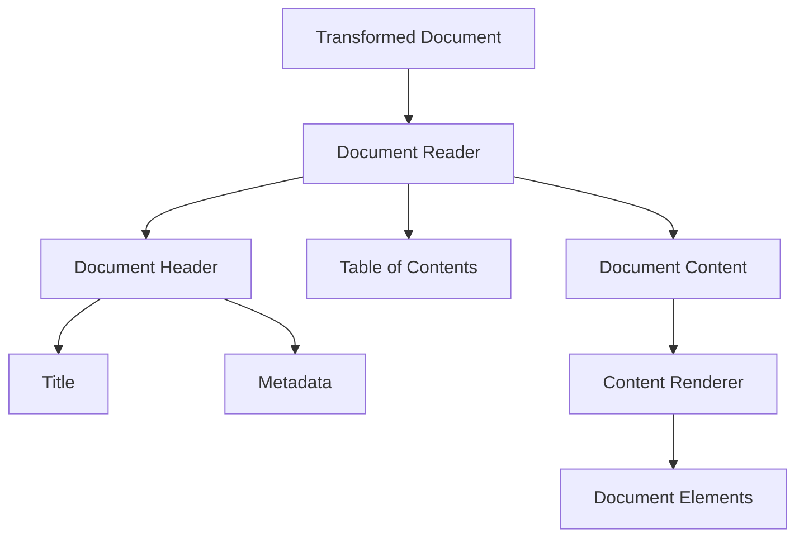
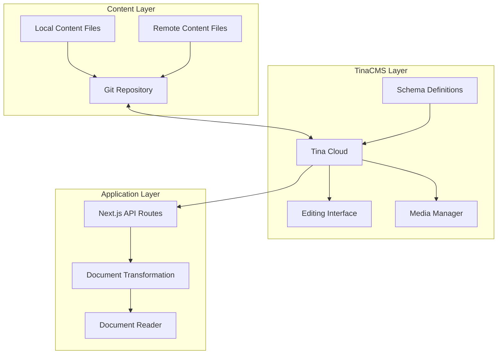

# PopRev2 Architecture Documentation

This directory contains documentation related to the architecture of the PopRev2 platform.

## Documents

- [Architecture Plan](architecture-plan.md) - The original architecture plan for the PopRev2 platform
- [Updated Architecture Plan](architecture-plan-updated.md) - The updated architecture plan with TinaCMS integration and purpose-specific adaptations
- [Lectionary CMS Plan](lectionary-cms-plan.md) - The plan for integrating the Lectionary content management system

## Architecture Overview

The PopRev2 platform is designed as a monorepo with multiple applications and shared packages:

```
poprev2/
├── apps/                  # Application implementations
│   ├── reader/            # UB Reader application
│   ├── publications/      # Publications application
│   └── almanac/           # Almanac application
├── packages/              # Shared libraries and components
│   ├── ui/                # Shared UI components
│   ├── content-transformer/ # Document transformation utilities
│   ├── data-models/       # Shared data models
│   ├── reference-parser/  # Reference parsing utilities
│   ├── audio-services/    # Audio playback services
│   └── table-transformer/ # Table transformation utilities
```

### Key Components

#### Content Transformation System

The content transformation system converts content from various formats (Markdown, DOCX, Perplexity) into a standardized internal representation. This system is implemented in the `packages/content-transformer` package.



#### Document Reader Component

The document reader component displays transformed documents with proper formatting and navigation. This component is implemented in the `packages/ui` package.



#### TinaCMS Integration

The TinaCMS integration provides a content management system for the PopRev2 platform. This integration is described in the [Updated Architecture Plan](architecture-plan-updated.md).



## Design Principles

The PopRev2 platform is designed with the following principles in mind:

1. **Modularity**: The platform is composed of modular components that can be developed, tested, and deployed independently.
2. **Reusability**: Common functionality is extracted into shared packages that can be reused across applications.
3. **Extensibility**: The platform is designed to be easily extended with new features and functionality.
4. **Maintainability**: The codebase is organized in a way that makes it easy to understand, maintain, and evolve.
5. **Performance**: The platform is optimized for performance, with a focus on fast page loads and smooth user interactions.

## Technology Stack

The PopRev2 platform is built with the following technologies:

- **Next.js**: A React framework for building server-rendered applications
- **TypeScript**: A typed superset of JavaScript that compiles to plain JavaScript
- **TinaCMS**: A headless content management system
- **Tailwind CSS**: A utility-first CSS framework
- **Vercel**: A platform for deploying Next.js applications
