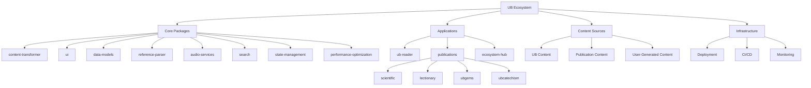
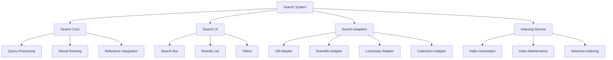

# UB Ecosystem Architecture: Foundational Design Document

## Overview

This document outlines the architecture and design philosophy of the UB Ecosystem - a collection of applications, packages, and services centered around the UB Reader. The ecosystem is structured as a monorepo, allowing for separate deployment of applications while sharing core components, features, and design patterns.

## Core Principles

### 1. Centralized Reader, Distributed Publications

The UB Reader serves as the central application in our ecosystem. It is designed to be:

- **Standalone**: Fully functional as an independent application
- **Extensible**: Capable of being branded and customized for different publications
- **Foundational**: Changes to the core reader propagate to all publication-specific readers

### 2. Shared Components with Publication-Specific Customization

The ecosystem follows a "develop once, deploy many" philosophy:

- **Core Components**: Developed in shared packages
- **Publication Customization**: Applied through configuration and theming
- **Feature Parity**: All publications benefit from core feature development

### 3. Exemplary Reading Experience

The reading experience is the most crucial shared function across all publications:

- **Typography Excellence**: Optimal readability across devices
- **Intuitive Navigation**: Consistent navigation patterns adapted to content structure
- **Annotation System**: Highlighting, notes, and references available across all publications
- **Accessibility**: WCAG compliance and inclusive design principles

### 4. Modular Architecture

The ecosystem is built on a modular architecture that enables:

- **Independent Development**: Teams can work on different packages simultaneously
- **Selective Feature Adoption**: Publications can adopt features selectively
- **Incremental Upgrades**: Components can be upgraded independently

## Ecosystem Structure



## Core Packages

### 1. content-transformer

The content-transformer package is responsible for converting content from various formats (markdown, docx, perplexity) into a standardized internal format with enhanced metadata.

**Key Features:**

- Format-specific transformers (markdown, docx, perplexity)
- Content normalization
- Metadata enrichment
- Content validation

**Interfaces:**

- `transformContent(content, documentType, options)`: Main entry point for content transformation
- Format-specific transformers: `transformMarkdown()`, `transformDocx()`, `transformPerplexity()`
- Utility functions: `normalizeContent()`, `enrichMetadata()`, `validateContent()`

### 2. ui

The UI package contains reusable UI components that are shared across all applications in the ecosystem.

**Key Components:**

- Document reader
- Navigation components
- Annotation system
- Settings panels
- Search interfaces

**Design System:**

- Typography system
- Color system
- Spacing system
- Component library

### 3. data-models

The data-models package defines the data structures and interfaces used throughout the ecosystem.

**Key Models:**

- Document models
- User models
- Annotation models
- Settings models
- Search models

### 4. reference-parser

The reference-parser package provides utilities for parsing and handling references within the Urantia Book and other publications.

**Key Features:**

- Reference detection
- Reference normalization
- Reference linking
- Cross-reference management

### 5. audio-services

The audio-services package provides audio playback capabilities for the reader applications.

**Key Features:**

- Audio playback controls
- Text-to-speech integration
- Synchronized text highlighting
- Audio bookmarks

### 6. search

The search package provides a modular search system that can be used across all applications in the ecosystem.

**Package Structure:**

```
packages/
  search/
    core/ - fundamental search capabilities
    ui/ - reusable search UI components
    adapters/ - publication-specific search adapters
    indexing/ - utilities for building search indices
```

**Key Components:**

- **Search Core**: Handles query processing, result ranking, and reference parsing integration
- **Search UI**: Modular components like search bar, results list, and filters
- **Search Adapters**: Publication-specific adapters for different content structures
- **Indexing Service**: Tools for building and maintaining search indices

**Implementation Approach:**

- Hybrid approach combining client-side and server-side capabilities
- Client-side search for smaller datasets and offline use
- Server-side search for larger datasets and advanced features
- Provider pattern for easy integration with applications

**Search Result Ordering:**

- Results are presented in the order they appear in the Urantia Papers
- This natural ordering preserves the logical flow of the content
- Relevance and date-based sorting are not applicable for this content type

### 7. state-management

The state-management package provides consistent patterns for managing application state across the ecosystem.

**Key Features:**

- Consistent state management patterns
- Complex state interactions between components
- Synchronization between client-side and server-side state
- Offline state management and reconciliation

**Implementation Approach:**

- Context-based state management for UI components
- Reducer pattern for complex state logic
- Middleware for side effects and asynchronous operations
- Persistence layer for offline state storage

### 8. performance-optimization

The performance-optimization package provides utilities and strategies for optimizing the performance of reader applications.

**Key Features:**

- Code splitting strategies for content-heavy applications
- Content virtualization for handling large documents
- Asset optimization for different publication types
- Performance monitoring and reporting tools

**Implementation Approach:**

- Dynamic imports for code splitting
- Virtualized lists and content rendering
- Image and asset optimization
- Performance metrics collection and analysis

## Applications

### 1. ub-reader

The UB Reader is the flagship application of the ecosystem, providing a comprehensive reading experience for the Urantia Book.

**Key Features:**

- Full Urantia Book content
- Advanced navigation
- Annotation system
- Search functionality
- Settings and preferences
- Audio integration

### 2. publications

The publications directory contains reader applications for specific publication types, each branded and customized for its content while sharing the core reader functionality.

#### 2.1 scientific

The Scientific Reader is designed for scientific publications with features tailored to academic content.

**Unique Features:**

- Abstract display
- Citation management
- Figure and table navigation
- Reference list

#### 2.2 lectionary

The Lectionary Reader is designed for liturgical content with features tailored to worship and study.

**Unique Features:**

- Liturgical calendar integration
- Scripture references
- Responsive readings
- Worship planning tools

#### 2.3 ubgems

The UB Gems Reader is designed for curated collections of notable passages from the Urantia Book.

**Unique Features:**

- Thematic organization
- Quick navigation to source context
- Sharing capabilities
- Collection management

#### 2.4 ubcatechism

The UB Catechism Reader is designed for question-and-answer content related to the Urantia Book.

**Unique Features:**

- Question-answer navigation
- Topic-based organization
- Study guides
- Quiz mode

### 3. ecosystem-hub

The Ecosystem Hub is a dedicated application that serves as an informational gateway to the UB Ecosystem.

**Key Features:**

- Comprehensive overview of the entire UB Ecosystem
- Clear description of each component's purpose and unique features
- Launch point for users to discover related applications
- Consistent branding that visually ties all publications together

**Implementation Components:**

- **Main Hub Structure**: Clean layout with distinct sections for each ecosystem component
- **UB Reader Section**: Description of the core UB Reader application and its features
- **Publications Directory**: Individual sections for each publication reader
- **Almanac-New Spotlight**: Featured section highlighting the almanac-new as a special publication
- **Technical Information**: Optional expandable sections with technical details for developers

## Content Sources

### 1. UB Content

The core Urantia Book content, structured and formatted for optimal reading experience.

**Content Structure:**

- Papers
- Sections
- Paragraphs
- References

### 2. Publication Content

Content specific to each publication type, following standardized formats for consistency.

**Content Types:**

- Scientific papers
- Lectionary readings
- UB Gems collections
- UB Catechism questions and answers

### 3. User-Generated Content

Content created by users, such as annotations, bookmarks, and notes.

**Storage Strategy:**

- Local storage for offline use
- Cloud synchronization for multi-device access
- Privacy controls for user data

## Infrastructure

### 1. Deployment

Infrastructure for deploying the applications to production environments.

**Deployment Strategy:**

- Independent deployment of applications
- Shared deployment of packages
- Environment-specific configuration

### 2. CI/CD

Continuous integration and deployment pipelines for automated testing and deployment.

**CI/CD Pipeline:**

- Automated testing
- Build process
- Deployment to staging and production
- Rollback capabilities

### 3. Monitoring

Systems for monitoring application performance and user experience.

**Monitoring Strategy:**

- Performance metrics
- Error tracking
- Usage analytics
- User feedback collection

## Development Workflow

### 1. Package Development

The development of shared packages follows a component-first approach:

1. Define clear interfaces and types
2. Implement core functionality
3. Write comprehensive tests
4. Document APIs and usage examples
5. Publish to the internal package registry

### 2. Application Development

Application development builds on the shared packages:

1. Configure and customize shared components
2. Implement application-specific features
3. Integrate with content sources
4. Test in isolation and in the ecosystem context
5. Deploy independently

### 3. Feature Development

New features are developed with ecosystem-wide adoption in mind:

1. Identify common requirements across publications
2. Develop in shared packages when possible
3. Create extension points for publication-specific customization
4. Test across multiple publications
5. Deploy incrementally

## Reader Experience

The reader experience is the cornerstone of the UB Ecosystem, with several key aspects:

### 1. Typography and Layout

- **Responsive Design**: Adapts to different screen sizes and orientations
- **Typography System**: Optimized for readability with appropriate font sizes, line heights, and spacing
- **Layout Options**: Multiple layout options (single column, two columns, etc.)
- **Theme Support**: Light and dark themes with customizable colors

### 2. Navigation

- **Hierarchical Navigation**: Paper, section, and paragraph navigation
- **Table of Contents**: Interactive table of contents with collapsible sections
- **Breadcrumbs**: Context-aware breadcrumb navigation
- **Search**: Full-text search with highlighted results
- **History**: Back and forward navigation through reading history

### 3. Annotation System

- **Highlighting**: Text highlighting with multiple colors
- **Notes**: Attach notes to highlighted text
- **Bookmarks**: Mark pages or sections for quick access
- **Tags**: Categorize annotations with tags
- **Collections**: Group related annotations into collections

### 4. Settings and Preferences

- **Font Settings**: Font family, size, and weight
- **Display Settings**: Line spacing, margins, and justification
- **Color Settings**: Theme colors and highlight colors
- **Behavior Settings**: Scroll behavior, navigation options, and annotation behavior

## Search System

The search system is a critical component of the UB Ecosystem, providing consistent search functionality across all reader applications while allowing for publication-specific customization.

### 1. Search Architecture

The search system follows a modular architecture that aligns with the "develop once, deploy many" philosophy:



### 2. Technical Implementation

The search system uses a hybrid approach combining client-side and server-side capabilities:

#### Client-Side Implementation

- **Search Index Generation**: Generate search indices during build time for each publication
- **Fuzzy Search Library**: Implement using Fuse.js or similar for client-side searching
- **Component-Based UI**: Create a composable search bar component that's consistent across all apps
- **Selective Loading**: Only load search indices for the content the user is currently accessing

#### Server-Side Implementation

- **Microservice Architecture**: Create a dedicated search service that each publication can query
- **Consolidated Index**: Maintain a central index that contains metadata from all publications
- **User Context Awareness**: Filter search results based on user permissions and preferences
- **Result Aggregation**: Combine results from different content types with appropriate ranking

### 3. Search UI Components

The search UI components provide a consistent user experience across all reader applications:

- **Search Bar**: A composable search bar component with autocomplete and suggestions
- **Results List**: A customizable results list that can be adapted for different content types
- **Filters**: Content-specific filters for refining search results
- **Keyboard Shortcuts**: System-wide shortcuts (like cmd/ctrl+shift+k) for quick access to search

### 4. Publication-Specific Adapters

Each publication has a dedicated search adapter that understands its unique content structure:

- **UB Adapter**: Understands paper/section/paragraph references and presents results in the order they appear in the Urantia Papers
- **Scientific Adapter**: Handles academic content structure with abstracts, citations, and references
- **Lectionary Adapter**: Recognizes liturgical organization and scripture references
- **Catechism Adapter**: Understands question-and-answer format and topic-based organization

### 5. Search Result Presentation

Search results are presented in a way that respects the content structure and user needs:

- **Natural Ordering**: Results are presented in the order they appear in the Urantia Papers, preserving the logical flow of the content
- **Context Display**: Results include surrounding context to help users understand the relevance
- **Reference Highlighting**: References within search results are highlighted and linked
- **Direct Navigation**: Users can navigate directly to the source content from search results

### 6. Implementation Phases

The search system will be implemented in phases:

1. **Phase 1**: Basic client-side search with shared UI components
2. **Phase 2**: Publication-specific adapters and improved result presentation
3. **Phase 3**: Server-side search for larger content sets
4. **Phase 4**: Advanced features like saved searches, search history, and personalized results

## Offline-First Approach

The UB Ecosystem follows an offline-first approach to ensure that users can access content and functionality even without an internet connection.

### 1. Service Worker Strategy

- **Asset Caching**: Cache static assets for offline use
- **Content Caching**: Cache content for offline reading
- **API Caching**: Cache API responses for offline functionality
- **Background Sync**: Queue actions performed offline for synchronization when online

### 2. Offline Content Access

- **Content Downloading**: Allow users to download content for offline reading
- **Content Management**: Provide tools for managing downloaded content
- **Storage Optimization**: Optimize storage usage for efficient offline content access
- **Content Updates**: Update downloaded content when online

### 3. Offline Annotations

- **Local Storage**: Store annotations locally for offline use
- **Synchronization Protocol**: Synchronize annotations when online
- **Conflict Resolution**: Resolve conflicts between local and remote annotations
- **Visual Indicators**: Provide visual indicators for synchronized and unsynchronized annotations

### 4. IndexedDB Storage

- **Structured Storage**: Use IndexedDB for robust offline content storage
- **Query Capabilities**: Provide query capabilities for offline content
- **Transaction Support**: Ensure data integrity with transaction support
- **Storage Limits**: Handle storage limits gracefully

### 5. Offline/Online Status

- **Status Detection**: Detect and monitor network status
- **Visual Indicators**: Provide visual indicators for offline/online status
- **Graceful Degradation**: Degrade functionality gracefully when offline
- **Feature Availability**: Clearly communicate which features are available offline

## Accessibility Implementation

The UB Ecosystem is designed to be accessible to all users, including those with disabilities.

### 1. Accessibility Standards

- **WCAG Compliance**: Ensure compliance with WCAG 2.1 guidelines
- **Aria Attributes**: Use appropriate ARIA attributes for complex components
- **Keyboard Navigation**: Ensure all functionality is accessible via keyboard
- **Focus Management**: Implement proper focus management for modal interactions

### 2. Screen Reader Optimizations

- **Semantic HTML**: Use semantic HTML elements for better screen reader support
- **Text Alternatives**: Provide text alternatives for non-text content
- **Reading Order**: Ensure logical reading order for screen readers
- **Announcements**: Implement appropriate announcements for dynamic content changes

### 3. Visual Accessibility

- **Color Contrast**: Ensure sufficient color contrast for all text and UI elements
- **Text Resizing**: Allow text to be resized without loss of functionality
- **High Contrast Themes**: Provide high contrast themes beyond light/dark mode
- **Focus Indicators**: Implement clear focus indicators for keyboard navigation

### 4. Accessibility Testing

- **Automated Testing**: Implement automated accessibility testing in CI/CD pipeline
- **Manual Testing**: Conduct manual accessibility testing with assistive technologies
- **User Testing**: Involve users with disabilities in testing
- **Continuous Improvement**: Continuously improve accessibility based on feedback and testing

## Plugin Architecture

The UB Ecosystem includes a plugin architecture that allows for extensibility and customization.

### 1. Plugin System

- **Plugin Registry**: Central registry for discovering and managing plugins
- **Plugin API**: Well-defined API for plugin development
- **Plugin Lifecycle**: Manage plugin installation, activation, and deactivation
- **Plugin Dependencies**: Handle plugin dependencies and conflicts

### 2. Extension Points

- **Reader Extensions**: Extend the reader functionality
- **UI Extensions**: Add new UI components or modify existing ones
- **Content Extensions**: Add new content types or modify content presentation
- **Tool Extensions**: Add new tools for content interaction

### 3. Plugin Development

- **Development Kit**: Provide tools and documentation for plugin development
- **Testing Framework**: Enable testing of plugins in isolation and in the ecosystem
- **Versioning**: Manage plugin compatibility with ecosystem versions
- **Distribution**: Facilitate plugin distribution and updates

### 4. Plugin Marketplace

- **Discovery**: Allow users to discover available plugins
- **Installation**: Simplify plugin installation process
- **Ratings and Reviews**: Enable users to rate and review plugins
- **Categories**: Organize plugins into categories for easier discovery

## Metadata and SEO Strategy

The UB Ecosystem includes a comprehensive approach to metadata and SEO optimization.

### 1. Structured Content Metadata

- **Publication Metadata**: Define metadata for different publication types
- **Content Metadata**: Enrich content with appropriate metadata
- **User-Generated Metadata**: Allow users to add metadata to annotations and bookmarks
- **Metadata Standards**: Follow established metadata standards for interoperability

### 2. SEO Optimization

- **Page Metadata**: Optimize page metadata for search engines
- **Content Structure**: Structure content for better indexing
- **Canonical URLs**: Implement canonical URLs for content
- **Sitemaps**: Generate sitemaps for search engine crawling

### 3. Social Sharing

- **Open Graph Tags**: Implement Open Graph tags for rich social media previews
- **Twitter Cards**: Implement Twitter Cards for rich Twitter previews
- **Sharing Functionality**: Enable easy sharing of content to social media
- **Preview Generation**: Generate appropriate previews for shared content

### 4. Citation Generation

- **Citation Formats**: Support multiple citation formats (APA, MLA, Chicago, etc.)
- **Citation Export**: Allow export of citations to reference management tools
- **In-Text Citations**: Generate in-text citations for academic use
- **Bibliography Generation**: Generate bibliographies from collections of citations

## Implementation Strategy

The implementation of the UB Ecosystem follows a phased approach:

### Phase 1: Core Infrastructure

1. Set up the monorepo structure
2. Implement the content-transformer package
3. Develop the base UI components
4. Create the data models
5. Establish the development workflow

### Phase 2: UB Reader Development

1. Implement the core reader functionality
2. Develop the annotation system
3. Create the navigation components
4. Implement basic search functionality
5. Develop settings and preferences

### Phase 3: Publication Readers

1. Create the publication reader template
2. Implement the Scientific Reader
3. Develop the Lectionary Reader
4. Create the UB Gems Reader
5. Implement the UB Catechism Reader

### Phase 4: Advanced Features

1. Implement audio integration
2. Develop offline support
3. Enhance search with publication-specific adapters
4. Implement advanced study tools
5. Develop cross-publication features

### Phase 5: Ecosystem Hub and Extensions

1. Create the Ecosystem Hub application
2. Implement the plugin architecture
3. Develop the state management package
4. Implement the performance optimization package
5. Enhance accessibility features

### Phase 6: Search System Enhancement

1. Implement server-side search for larger content sets
2. Develop advanced search features (saved searches, history)
3. Optimize search performance and relevance
4. Implement keyboard shortcuts and improved UX
5. Add search analytics and refinement

## Conclusion

The UB Ecosystem represents a comprehensive approach to creating a family of reader applications centered around the UB Reader. By sharing core components and features while allowing for publication-specific customization, the ecosystem enables efficient development and consistent user experiences across all publications.

This foundational design document serves as the architectural blueprint for the ecosystem, superseding previous documents and providing a clear vision for future development. As the ecosystem evolves, this document will be updated to reflect new insights, requirements, and architectural decisions.
