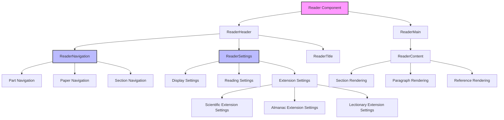
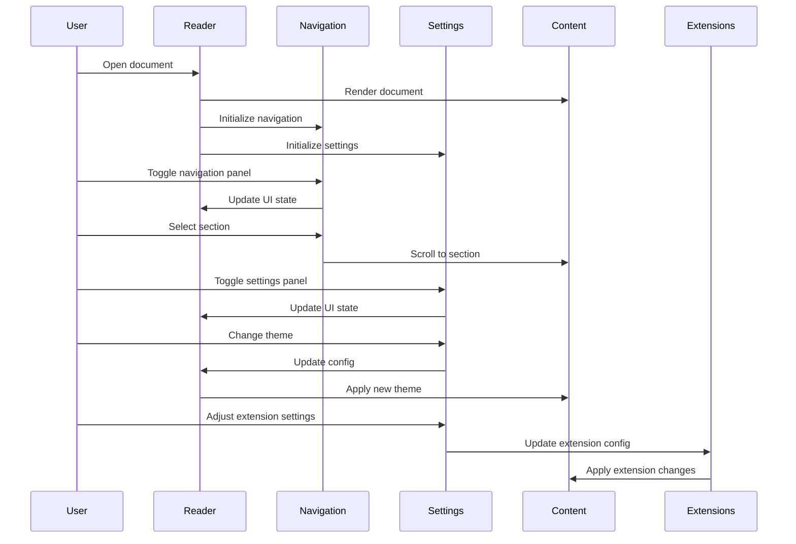
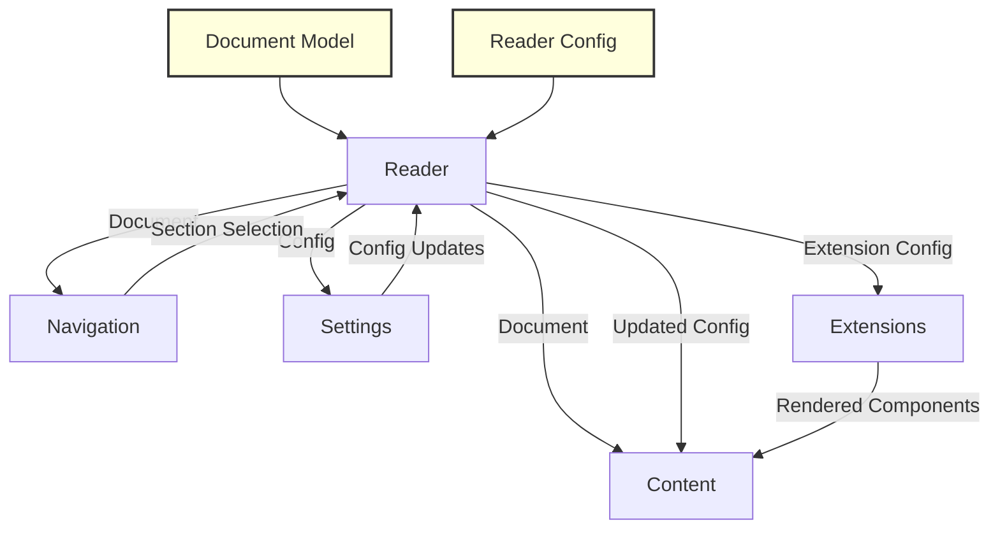
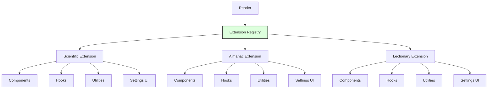
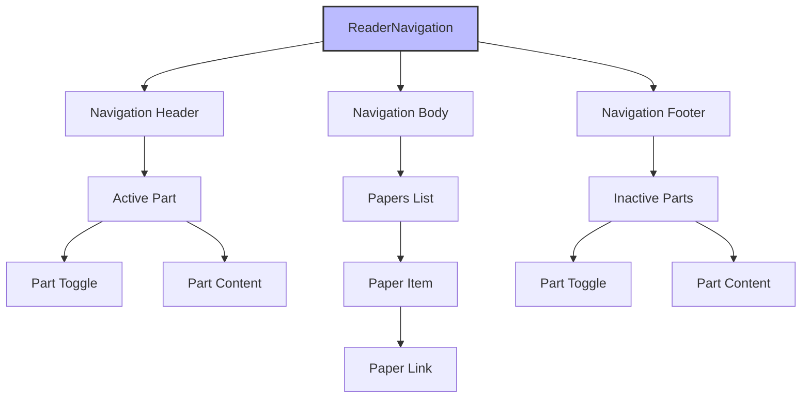
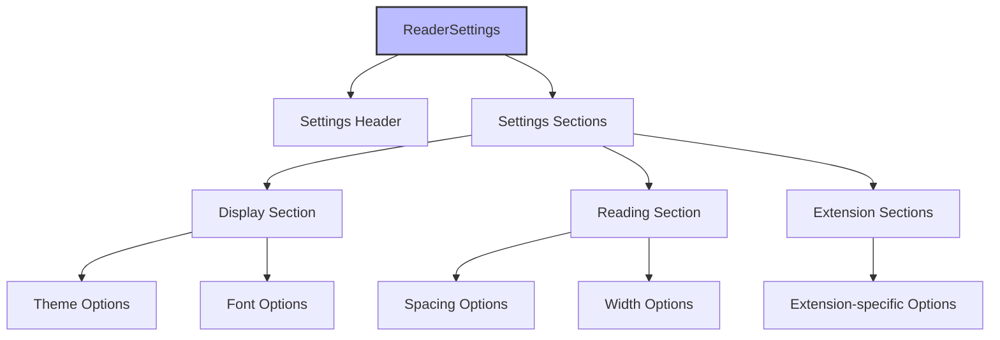

# UB Reader Component Architecture

This document provides a visual representation of the UB Reader component architecture, including the integration of the navigation and settings components.

## Component Hierarchy

## Component Interactions

## Data Flow

## Extension System

## Navigation Component Structure

## Settings Component Structure

This visual representation helps illustrate how the navigation and settings components integrate with the existing Reader component architecture, showing the hierarchical structure, interactions between components, and data flow throughout the system.
