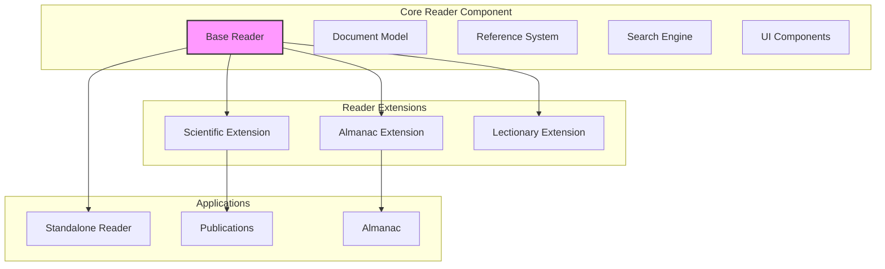

# UB Ecosystem: Component-Based Architecture Implementation Plan

## Executive Summary

This document outlines the implementation plan for the UB Ecosystem, focusing on a component-based architecture with a configurable UB Reader at its core. The plan includes specialized extensions for different contexts (Scientific, Almanac, Lectionary) while maintaining a consistent user experience across all applications.

## Core Architecture



## Implementation Phases

### Phase 1: Core Reader Component (6 weeks)

- **Base Reader Architecture (2 weeks)**

  - Implement a configurable, extensible reader component
  - Create a plugin system for context-specific extensions
  - Develop a theming system for branding customization

- **Document Model and Reference System (2 weeks)**

  - Design a hierarchical document model supporting main documents and satellites
  - Implement unique identifiers for sections and paragraphs
  - Create a consistent cross-document reference system
  - Build a reference verification system

- **UI and Navigation (2 weeks)**
  - Develop a clean, distraction-free reading interface
  - Implement adjustable text size, contrast, and reading preferences
  - Create a collapsible table of contents
  - Add breadcrumb navigation for document hierarchy

### Phase 2: Scientific Reader Extension (4 weeks)

- **Advanced Navigation (1 week)**

  - Implement hierarchical navigation for main paper and satellites
  - Create visual relationship maps between documents
  - Develop breadcrumb navigation specific to scientific papers

- **Comparison and Citation Features (2 weeks)**

  - Build split-view functionality for comparing related sections
  - Implement citation view showing context of referenced passages
  - Create hover previews for referenced content
  - Add visual indicators for different citation types

- **Search and Discovery (1 week)**
  - Develop a comprehensive search index for scientific content
  - Implement filters for different types of scientific content
  - Create saved searches and search history

### Phase 3: Application Integration (4 weeks)

- **Standalone Reader Application (1 week)**

  - Set up the standalone Reader application with its own URL
  - Configure default branding and features
  - Implement SEO optimizations

- **Publications Integration (2 weeks)**

  - Integrate the Reader component into the Publications application
  - Configure publication-specific branding and linkbacks
  - Implement seamless navigation between publication content and the Reader

- **Almanac Integration (1 week)**
  - Integrate the Reader component into the Almanac application
  - Configure Almanac-specific branding and linkbacks
  - Implement contextual references between Almanac content and the Reader

### Phase 4: TinaCMS Integration (6 weeks)

- **Basic Setup (2 weeks)**

  - Install and configure TinaCMS with Git backend
  - Implement base document schema
  - Create basic editing interface
  - Connect to existing transformation system

- **Scientific Schema Implementation (2 weeks)**

  - Implement scientific document schema with support for:
    - Main paper and satellite relationships
    - Cross-document references
    - Citation metadata
    - Figure and table management

- **Workflow Optimization (2 weeks)**
  - Implement role-based access control
  - Add publishing workflow
  - Create preview environments with Reader integration

### Phase 5: Advanced Features (4 weeks)

- **Document Sharing and Export (1 week)**

  - Implement export options (PDF, Markdown, DOCX, HTML)
  - Create sharing mechanisms with reference preservation
  - Develop access control options

- **Citation Management (1 week)**

  - Implement citation parser and validator
  - Create bibliography generator
  - Develop citation export in multiple formats

- **Data Visualization (2 weeks)**
  - Implement scientific chart components
  - Create interactive diagrams
  - Develop 3D model viewer for scientific models

## Technical Implementation Details

### Document Structure and Reference System

```typescript
// Hierarchical document model
interface Document {
  id: string;
  title: string;
  type: 'main' | 'satellite';
  sections: Section[];
  relationships: Relationship[];
  metadata: DocumentMetadata;
}

interface Section {
  id: string;
  title: string;
  paragraphs: Paragraph[];
  subsections?: Section[];
}

interface Paragraph {
  id: string;
  content: string;
  references: Reference[];
}

interface Reference {
  id: string;
  type: 'direct' | 'conceptual' | 'supporting';
  targetDocumentId: string;
  targetParagraphId: string;
  context?: string;
}

interface Relationship {
  type: 'supports' | 'extends' | 'critiques';
  targetDocumentId: string;
  description: string;
}
```

### Reader Component Configuration

```typescript
// Reader component configuration
interface ReaderConfig {
  // Branding
  branding: {
    primaryColor: string;
    secondaryColor: string;
    logo?: string;
    favicon?: string;
  };

  // Features
  features: {
    splitView: boolean;
    citationView: boolean;
    hoverPreviews: boolean;
    referenceVerification: boolean;
    advancedSearch: boolean;
  };

  // Navigation
  navigation: {
    showBreadcrumbs: boolean;
    showTableOfContents: boolean;
    showRelationshipMap: boolean;
    linkbackUrl?: string;
    linkbackText?: string;
  };

  // Extensions
  extensions: string[]; // e.g., ['scientific', 'almanac']
}
```

## Key Technical Components

1. **Extension System**

   - Plugin architecture for context-specific features
   - Standardized API for extensions
   - Configuration-driven feature enabling/disabling

2. **Document Model**

   - Hierarchical structure supporting main documents and satellites
   - Unique identifiers for precise linking
   - Cross-document reference system

3. **UI Framework**

   - Themeable components for consistent but customizable styling
   - Responsive design for all device sizes
   - Accessibility-first approach

4. **Reference System**
   - Verification of cross-document references
   - Hover previews for referenced content
   - Visual indicators for citation types

## Next Steps

1. **Immediate Actions**

   - Create detailed technical specifications for the core Reader component
   - Set up the development environment and project structure
   - Develop a prototype of the extension system

2. **Team Organization**

   - Form specialized teams for each phase
   - Establish regular review and integration points
   - Create a communication plan for cross-team collaboration

3. **Development Approach**
   - Use test-driven development for core components
   - Implement continuous integration for early issue detection
   - Create a component storybook for documentation and testing
