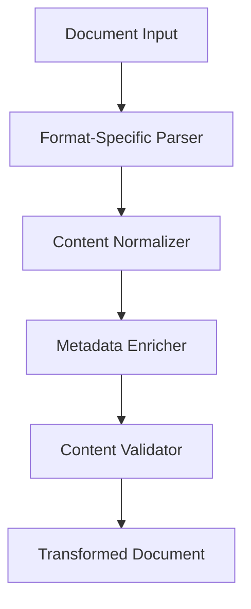
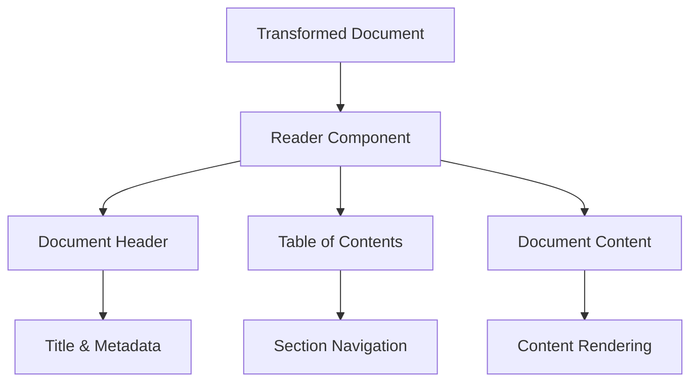

# Document Transformer and Reader System Implementation Plan

After reviewing the codebase, I've gained a comprehensive understanding of the document transformer system and reader components. This document outlines what I've found and proposes a plan for moving forward.

## Current System Overview

### Document Transformer System

The document transformer is a well-structured system that converts various document formats into a standardized internal representation:



Key components:

- **Format-specific parsers**: Currently supports Markdown (using unified.js/remark) and DOCX (using mammoth.js)
- **Content normalizer**: Ensures consistent structure across document types
- **Metadata enricher**: Extracts and enhances document metadata
- **Content validator**: Validates and sanitizes content for security

### Reader Component

The reader component renders transformed documents with a clean, navigable interface:



### Enhanced Reader Architecture

The enhanced reader extends functionality with:

- Theme management (light/dark modes)
- Panel controls for navigation and settings
- System theme detection
- Configuration management

## Future Architecture Plans

The architecture plans outline several key initiatives:

1. **TinaCMS Integration**: Git-backed content management with purpose-specific schemas
2. **Purpose-Specific Adaptations**: Configurations and components for different document types
3. **Advanced Features**: Document sharing, citation management, data visualization

## Gaps and Opportunities

Based on my analysis, I've identified several areas for improvement:

1. **Perplexity Parser Implementation**: Currently marked as TODO in the transformer system
2. **Enhanced Configuration System**: For purpose-specific document rendering
3. **Extension System Integration**: For specialized document features
4. **TinaCMS Implementation**: Currently planned but not implemented
5. **Mobile Responsiveness**: Ensuring reader works well on all devices
6. **Directory Structure Issues**: Resolving the nested src directory confusion

## Implementation Plan

### Phase 1: Directory Restructuring and Core Functionality (2 weeks)

#### Week 1: Directory Restructuring

1. Remove or properly relocate the nested `src/src` directory
2. Ensure all imports and references are updated to reflect the new structure
3. Update build configurations to work with the restructured directories
4. Verify that all components still function correctly after restructuring

#### Week 2: Perplexity Parser Implementation

1. Create `perplexity-transformer.ts` module
2. Implement parsing logic for Perplexity response format
3. Add metadata extraction specific to Perplexity responses
4. Update tests to cover Perplexity transformation

### Phase 2: Configuration System Enhancement (1 week)

#### Week 3: Configuration System

1. Create a configuration registry for purpose-specific settings
2. Implement configuration selector based on document type
3. Add configuration UI components to the reader settings
4. Update reader component to apply purpose-specific configurations

### Phase 3: Extension System (2 weeks)

#### Week 4: Extension Framework

1. Create extension registry system
2. Implement extension loading and initialization
3. Define extension API for components, hooks, and utilities
4. Create documentation for extension development

#### Week 5: Initial Extensions

1. Implement Scientific extension with citation and figure components
2. Implement Almanac extension with reference linking
3. Implement Lectionary extension with scripture components
4. Create extension settings UI components

### Phase 4: TinaCMS Integration (3 weeks)

#### Week 6: Basic TinaCMS Setup

1. Install and configure TinaCMS with Git backend
2. Implement base document schema
3. Create basic editing interface
4. Connect to existing transformation system

#### Week 7: Advanced Schema Implementation

1. Implement purpose-specific schemas
2. Add media management
3. Create custom field components for specialized content

#### Week 8: Workflow Optimization

1. Implement role-based access control
2. Add publishing workflow
3. Create preview environments

### Phase 5: Advanced Features (3 weeks)

#### Week 9: Document Sharing and Download

1. Implement PDF export functionality
2. Add Markdown and DOCX export options
3. Create sharing mechanisms (direct link, email, social)
4. Implement access control options

#### Week 10: Citation Management

1. Create citation parser and normalizer
2. Implement citation rendering components
3. Add bibliography generation
4. Create citation export functionality

#### Week 11: Data Visualization

1. Implement chart components for scientific documents
2. Add diagram support with Mermaid.js integration
3. Create interactive map components
4. Implement 3D model viewer for scientific content

## Technical Specifications

### Perplexity Parser Implementation

The Perplexity parser will need to handle the unique structure of Perplexity AI responses:

```typescript
// perplexity-transformer.ts
export async function transformPerplexity(content: string): Promise<any> {
  // Parse the Perplexity response format
  const parsedContent = parsePerplexityFormat(content);

  // Extract metadata (question, sources, etc.)
  const metadata = extractPerplexityMetadata(parsedContent);

  // Convert to our internal document format
  const transformedContent = convertToInternalFormat(parsedContent);

  // Generate HTML for preview
  const html = generateHtml(transformedContent);

  return {
    content: transformedContent,
    metadata,
    html,
    text: content,
  };
}
```

### Configuration System

The configuration system will allow for purpose-specific rendering:

```typescript
// Configuration registry
const configRegistry = {
  base: {
    typography: {
      /* base typography settings */
    },
    colors: {
      /* base color settings */
    },
    components: {
      /* base component mappings */
    },
  },
  scientific: {
    typography: {
      /* scientific typography settings */
    },
    colors: {
      /* scientific color settings */
    },
    components: {
      /* scientific component mappings */
    },
  },
  perplexity: {
    typography: {
      /* perplexity typography settings */
    },
    colors: {
      /* perplexity color settings */
    },
    components: {
      /* perplexity component mappings */
    },
  },
  lectionary: {
    typography: {
      /* lectionary typography settings */
    },
    colors: {
      /* lectionary color settings */
    },
    components: {
      /* lectionary component mappings */
    },
  },
};

// Configuration selector
function selectConfiguration(documentType: string, userPreferences: any) {
  const baseConfig = configRegistry.base;
  const typeConfig = configRegistry[documentType] || {};

  // Merge configurations with user preferences taking highest priority
  return {
    ...baseConfig,
    ...typeConfig,
    ...userPreferences,
  };
}
```

### Extension System

The extension system will allow for pluggable functionality:

```typescript
// Extension registry
const extensionRegistry = new Map();

// Register an extension
function registerExtension(name: string, extension: any) {
  extensionRegistry.set(name, extension);
}

// Get an extension
function getExtension(name: string) {
  return extensionRegistry.get(name);
}

// Extension interface
interface Extension {
  name: string;
  version: string;
  components: Record<string, React.ComponentType<any>>;
  hooks: Record<string, Function>;
  utilities: Record<string, Function>;
  settings: React.ComponentType<any>;
  initialize: () => void;
}
```

## Risk Assessment

### Directory Restructuring

The current project has a nested `src/src` directory which can cause confusion. We'll need to address this:

```
// Current structure (problematic)
src/
└── src/  <-- Nested src directory causing confusion
    └── ...

// Proposed structure
src/        <-- Main source directory
└── ...
content/    <-- Content directory (already created)
└── ...
```

This restructuring will involve:

1. Identifying all files in the nested `src/src` directory
2. Determining their proper location (either in `src` or `content`)
3. Moving files to their correct locations
4. Updating all import paths throughout the codebase
5. Testing to ensure everything still works correctly

| Risk                                    | Impact | Likelihood | Mitigation                                                                     |
| --------------------------------------- | ------ | ---------- | ------------------------------------------------------------------------------ |
| Directory restructuring breaks imports  | High   | Medium     | Create a detailed map of file movements, use automated tools to update imports |
| Perplexity format changes               | High   | Medium     | Design parser to be adaptable, add format version detection                    |
| Performance issues with large documents | High   | Medium     | Implement virtualization, lazy loading of content                              |
| Mobile compatibility issues             | Medium | Low        | Use responsive design patterns, test on multiple devices                       |
| TinaCMS integration complexity          | Medium | Medium     | Start with simple schemas, incrementally add features                          |
| Extension conflicts                     | Medium | Low        | Implement strict isolation between extensions, clear API                       |
| Extension conflicts                     | Medium | Low        | Implement strict isolation between extensions, clear API                       |

## Success Metrics

- **Performance**: Document loading time < 500ms for typical documents
- **Compatibility**: Support for all major browsers and devices
- **Extensibility**: Ability to add new document types without core changes
- **User Experience**: Intuitive navigation and reading experience

## Next Steps

To proceed with this plan, we should:

1. Address the directory structure issues to provide a clean foundation
2. Prioritize the Perplexity parser implementation to complete the core transformation system
3. Develop a detailed technical specification for the configuration system
4. Create a prototype of the extension system to validate the approach
5. Set up TinaCMS in a development environment to begin integration testing
