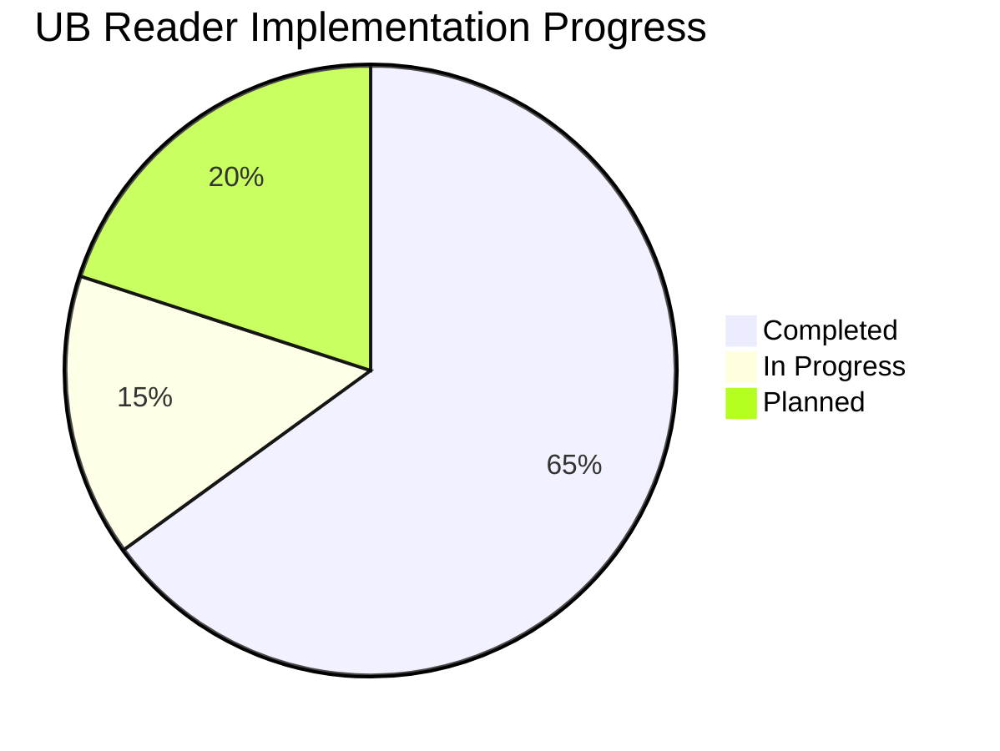

# Project Progress Tracker

This document tracks the implementation progress of the UB Reader application, with a focus on current development priorities.

## Overall Progress

## Current Sprint: UI Improvements & Page Structure Refinement

### ✅ Completed Tasks

- [x] Create standardized TypeScript interfaces in types.ts
- [x] Refactor Pullup component to use TypeScript interfaces
- [x] Implement proper component hierarchy with EnhancedPullupContainer
- [x] Modularize CSS approach for better maintainability
- [x] Enhance state management with React Context API
- [x] Implement ThemeContext for centralized theme management
- [x] Create HighlightProvider for highlight functionality
- [x] Document code quality improvements in memory bank
- [x] Fix `.roomodes` file JSON syntax
- [x] Add VS Code setting for file save conflict resolution
- [x] Improve TypeScript and ESLint configuration to ensure code quality without workarounds
- [x] Fix unused variables and parameters in components
- [x] Update React imports to avoid unused imports
- [x] Ensure all code paths in useEffect hooks return a value
- [x] Enable ESLint and TypeScript checking during builds in next.config.js
- [x] Create CODE_QUALITY_IMPROVEMENTS.md to document changes and provide guidance
- [x] Create plan for page structure redesign
- [x] Create HTML/CSS prototype for new page structure (paper-1-alpha.html)
- [x] Implement optimal reading width constraints (650-700px)
- [x] Develop text-only pullup component with adjustable height
- [x] Refine paragraph numbering (positioning, styling, alignment)
  - [x] Ensured paragraphs display only their own number
  - [x] Maintained paragraph numbers in their own column
  - [x] Enhanced extraction of paragraph numbers from complex formats
- [x] Improve pullup drag behavior (responsiveness, visual feedback)
  - [x] Reduced default minHeight from 100px to 40px
  - [x] Modified transform logic to keep handle visible when collapsed
  - [x] Implemented proper return-to-original-state behavior when toggling tabs
- [x] Enhance reading area layout (typography, spacing)
  - [x] Added text alignment options (left, right, justified)
  - [x] Set left alignment as default
  - [x] Implemented CSS classes for different text alignments
- [x] Create basic settings UI for text formatting
  - [x] Added text alignment options to Settings tab
  - [x] Created toggle for notes indicators visibility
- [x] Implement UI improvements for better user experience
  - [x] Changed section titles from uppercase to natural case
  - [x] Made tab labels adjacent with minimal spacing
  - [x] Separated notes indicators into their own column

### 🔄 In Progress (Transition to React Phase)

- [ ] Test improvements across environments (localhost and Vercel)
- [ ] Finalize any remaining UI adjustments
- [ ] Create core React component structure for UI improvements
- [ ] Prepare documentation for React implementation phase
- [ ] Implement performance optimizations for enhanced components

### 📅 Upcoming Tasks (React Phase)

- [ ] Convert essential layout elements to React components
- [ ] Implement advanced features directly in React:
  - [ ] Settings functionality (theme persistence, font customization)
  - [ ] Content management (dynamic loading, pagination)
  - [ ] Pullup advanced features (state persistence, notes integration)
- [ ] Implement state management for interactive elements
- [ ] Integrate with existing content system
- [ ] Test with full paper content
- [ ] Optimize for deployment

### Dependencies and Blockers

- **Dependencies**:

  - ✅ HTML refinements completed before React implementation
  - ✅ Paragraph numbering and pullup behavior validated in HTML
  - Clean component hierarchy needed for React conversion
  - Component performance optimization before scaling

- **Resolved Issues**:

  - ✅ Positioning inconsistencies addressed with standardized layout
  - ✅ Pullup behavior improved with consistent state management
  - ✅ Paragraph numbering refined with separate notes column

- **Current Blockers**:
  - Complex component interactions in the React implementation
  - Performance considerations with full paper content
  - Cross-device testing needed for enhanced UI

## Next Sprint: Component Performance Optimization

### Planned Tasks

- [ ] Implement React.memo for performance-critical components
- [ ] Optimize context providers to prevent unnecessary re-renders
- [ ] Implement code splitting for better load times
- [ ] Add performance benchmarks and monitoring

## Future Roadmap

1. Component library standardization
2. Advanced state management patterns
3. Enhanced accessibility compliance
4. Performance optimization
5. Comprehensive testing strategy
6. Mobile-optimized reading experience
7. Side-docked Notes for desktop (future enhancement)
