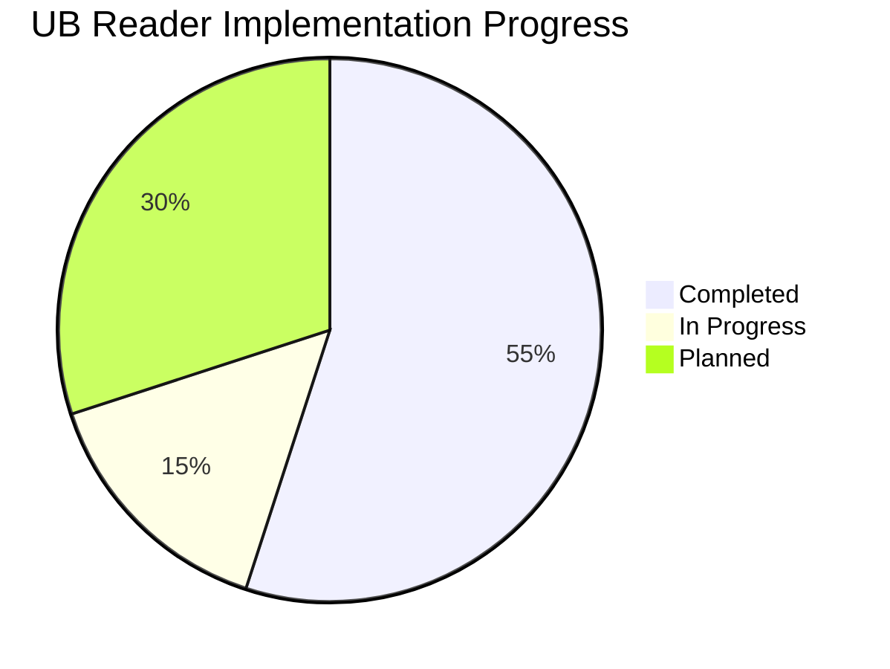

# Project Progress Tracker

This document tracks the implementation progress of the UB Reader application, with a focus on current development priorities.

## Overall Progress

## Current Sprint: Page Structure Redesign

### ✅ Completed Tasks

- [x] Create standardized TypeScript interfaces in types.ts
- [x] Refactor Pullup component to use TypeScript interfaces
- [x] Implement proper component hierarchy with EnhancedPullupContainer
- [x] Modularize CSS approach for better maintainability
- [x] Enhance state management with React Context API
- [x] Implement ThemeContext for centralized theme management
- [x] Create HighlightProvider for highlight functionality
- [x] Document code quality improvements in memory bank
- [x] Fix `.roomodes` file JSON syntax
- [x] Add VS Code setting for file save conflict resolution
- [x] Create plan for page structure redesign

### 🔄 In Progress

- [ ] Create HTML/CSS prototype for new page structure
- [ ] Implement optimal reading width constraints (650-700px)
- [ ] Develop text-only pullup component with adjustable height
- [ ] Test prototype across environments (localhost and Vercel)
- [ ] Address positioning inconsistencies between environments

### 📅 Upcoming Tasks

- [ ] Convert HTML/CSS prototype to React components
- [ ] Implement state management for interactive elements
- [ ] Integrate with existing content system
- [ ] Test with full paper content
- [ ] Optimize for deployment
- [ ] Implement comprehensive error handling
- [ ] Add detailed component documentation

### Dependencies and Blockers

- **Dependencies**:

  - Clean HTML/CSS prototype needed before React implementation
  - Consistent positioning approach needed for cross-environment compatibility
  - Proper width constraints needed for optimal reading experience

- **Potential Blockers**:
  - Positioning inconsistencies between localhost and Vercel
  - Complex div nesting causing layout bugs
  - Responsive design challenges across devices

## Next Sprint: Component Performance Optimization

### Planned Tasks

- [ ] Implement React.memo for performance-critical components
- [ ] Optimize context providers to prevent unnecessary re-renders
- [ ] Implement code splitting for better load times
- [ ] Add performance benchmarks and monitoring

## Future Roadmap

1. Component library standardization
2. Advanced state management patterns
3. Enhanced accessibility compliance
4. Performance optimization
5. Comprehensive testing strategy
6. Mobile-optimized reading experience
7. Side-docked Notes for desktop (future enhancement)
