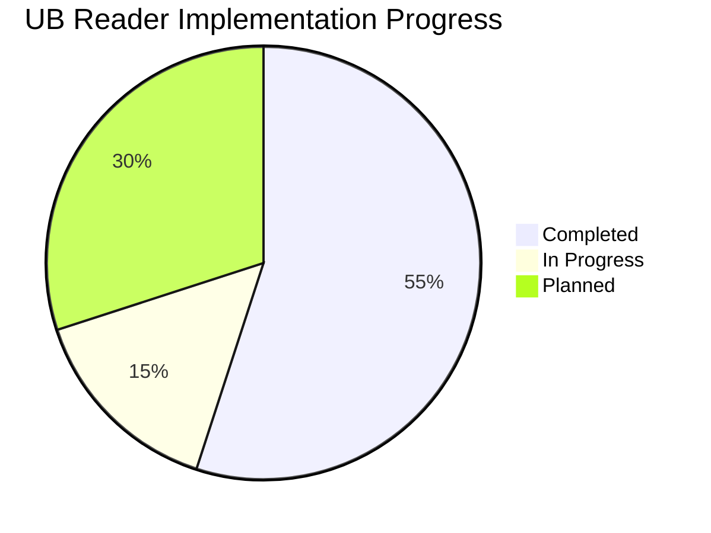

# Project Progress Tracker

This document tracks the implementation progress of the UB Reader application, with a focus on current development priorities.

## Overall Progress

## Current Sprint: Page Structure Redesign

### ✅ Completed Tasks

- [x] Create standardized TypeScript interfaces in types.ts
- [x] Refactor Pullup component to use TypeScript interfaces
- [x] Implement proper component hierarchy with EnhancedPullupContainer
- [x] Modularize CSS approach for better maintainability
- [x] Enhance state management with React Context API
- [x] Implement ThemeContext for centralized theme management
- [x] Create HighlightProvider for highlight functionality
- [x] Document code quality improvements in memory bank
- [x] Fix `.roomodes` file JSON syntax
- [x] Add VS Code setting for file save conflict resolution
- [x] Create plan for page structure redesign

### 🔄 In Progress (HTML Phase)

- [x] Create HTML/CSS prototype for new page structure (paper-1-alpha.html)
- [x] Implement optimal reading width constraints (650-700px)
- [x] Develop text-only pullup component with adjustable height
- [ ] Refine paragraph numbering (positioning, styling, alignment)
- [ ] Improve pullup drag behavior (responsiveness, visual feedback)
- [ ] Enhance reading area layout (typography, spacing)
- [ ] Create basic settings UI mockups (theme toggles, font controls)
- [ ] Test prototype across environments (localhost and Vercel)

### 📅 Upcoming Tasks (React Phase)

- [ ] Create core React component structure
- [ ] Convert essential layout elements to React components
- [ ] Implement advanced features directly in React:
  - [ ] Settings functionality (theme persistence, font customization)
  - [ ] Content management (dynamic loading, pagination)
  - [ ] Pullup advanced features (state persistence, notes integration)
- [ ] Implement state management for interactive elements
- [ ] Integrate with existing content system
- [ ] Test with full paper content
- [ ] Optimize for deployment

### Dependencies and Blockers

- **Dependencies**:

  - HTML refinements needed before React implementation
  - Paragraph numbering and pullup behavior must be validated in HTML first
  - Clean component hierarchy needed for React conversion
  - Consistent positioning approach needed for cross-environment compatibility

- **Potential Blockers**:
  - Positioning inconsistencies between localhost and Vercel
  - Complex interactions in pullup behavior across devices
  - Responsive design challenges with paragraph numbering
  - Performance considerations with full paper content

## Next Sprint: Component Performance Optimization

### Planned Tasks

- [ ] Implement React.memo for performance-critical components
- [ ] Optimize context providers to prevent unnecessary re-renders
- [ ] Implement code splitting for better load times
- [ ] Add performance benchmarks and monitoring

## Future Roadmap

1. Component library standardization
2. Advanced state management patterns
3. Enhanced accessibility compliance
4. Performance optimization
5. Comprehensive testing strategy
6. Mobile-optimized reading experience
7. Side-docked Notes for desktop (future enhancement)
