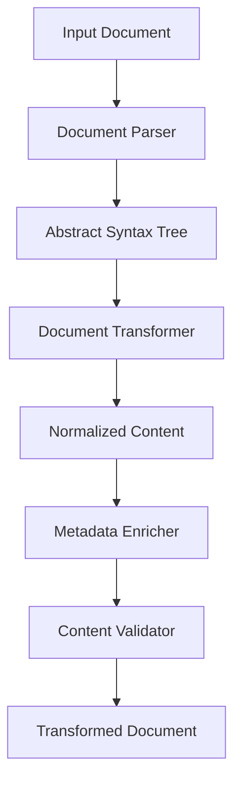

# Content Transformer Package

A package for transforming content from various formats (Markdown, DOCX, Perplexity) into a standardized internal representation.

## Overview

The Content Transformer package provides utilities for transforming content from different formats into a standardized internal representation that can be used by the PopRev2 platform. This standardized representation makes it easier to display, search, and manipulate content regardless of its original format.

## Features

- Transform Markdown content into a standardized internal representation
- Transform DOCX content into a standardized internal representation
- Support for Perplexity content (coming soon)
- Extract and enrich metadata from content
- Normalize content structure
- Validate and sanitize content

## Installation

```bash
# From the repository root
npm install
```

## Usage

```typescript
import { transformContent } from "@ub-ecosystem/content-transformer";

// Transform a markdown document
const markdownContent = `---
title: Sample Document
author: John Doe
---

# Introduction

This is a sample document.
`;

const result = await transformContent(markdownContent, "markdown");

// Access the transformed content
console.log(result.metadata.title); // "Sample Document"
console.log(result.content); // The standardized internal representation
console.log(result.html); // The HTML representation
```

## API Reference

### `transformContent(content, documentType, options?)`

Transforms content from a source format into the standardized format.

#### Parameters

- `content` (string | Buffer): The content to transform
- `documentType` (DocumentType): The type of document ('markdown', 'docx', 'perplexity')
- `options` (TransformOptions, optional): Transformation options

#### Returns

- Promise<TransformedDocument>: A promise that resolves to the transformed document

### `transformMarkdown(content)`

Transforms markdown content into the standardized internal representation.

#### Parameters

- `content` (string): The markdown content to transform

#### Returns

- Promise<TransformedDocument>: A promise that resolves to the transformed document

### `transformDocx(content)`

Transforms DOCX content into the standardized internal representation.

#### Parameters

- `content` (Buffer): The DOCX content as a Buffer

#### Returns

- Promise<TransformedDocument>: A promise that resolves to the transformed document

### `normalizeContent(content)`

Normalizes the content structure.

#### Parameters

- `content` (any): The content to normalize

#### Returns

- Promise<any>: A promise that resolves to the normalized content

### `enrichMetadata(content, options?)`

Enriches the document with metadata.

#### Parameters

- `content` (any): The content to enrich
- `options` (any, optional): Enrichment options

#### Returns

- Promise<any>: A promise that resolves to the enriched content

### `validateContent(content)`

Validates and sanitizes the transformed content.

#### Parameters

- `content` (any): The content to validate

#### Returns

- Promise<TransformedDocument>: A promise that resolves to the validated content

## Types

### `DocumentType`

```typescript
type DocumentType = "markdown" | "docx" | "perplexity";
```

### `PublicationType`

```typescript
type PublicationType = "scientific" | "lectionary" | "ubgems" | "ubcatechism";
```

### `TransformedDocument`

```typescript
interface TransformedDocument {
  content: RootNode;
  metadata: DocumentMetadata;
  publicationType?: PublicationType;
  html?: string;
  text?: string;
}
```

### `TransformOptions`

```typescript
interface TransformOptions {
  extractMetadata?: boolean;
  sanitize?: boolean;
  publicationType?: PublicationType;
  [key: string]: any;
}
```

## Architecture

The Content Transformer package is composed of several modules:

- **Markdown Transformer**: Transforms markdown content into the standardized internal representation
- **DOCX Transformer**: Transforms DOCX content into the standardized internal representation
- **Content Normalizer**: Normalizes the content structure
- **Metadata Enricher**: Extracts and enriches metadata from content
- **Content Validator**: Validates and sanitizes content



## Contributing

Contributions are welcome! Please follow these steps:

1. Fork the repository
2. Create a new branch for your feature or bugfix
3. Make your changes
4. Run tests to ensure your changes don't break existing functionality
5. Submit a pull request

## License

This package is part of the PopRev2 platform and is licensed under the same terms.
