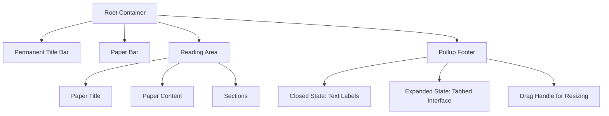
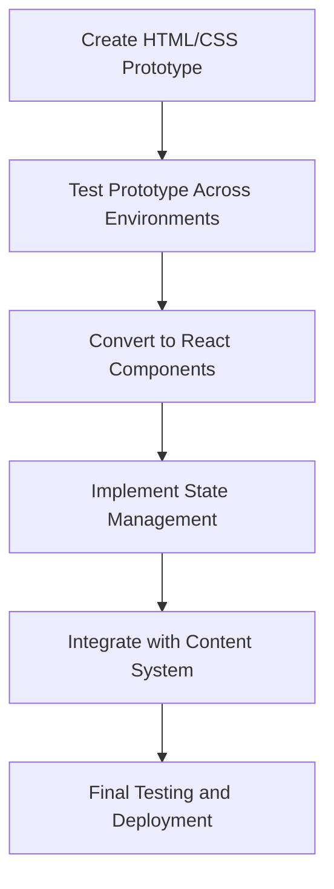

# Page Structure Redesign Plan

This document outlines the plan for redesigning the UB Reader page structure to create a more consistent and optimized reading experience.

## Overview

The UB Reader page structure will be redesigned to address positioning inconsistencies between localhost and Vercel deployment, while creating a cleaner and more maintainable component hierarchy. The redesign will focus on a mobile-first approach that also works well on desktop.

## Component Hierarchy



## Implementation Approach



### Phase 1: HTML/CSS Prototype

1. **Create basic HTML structure**

   - Root container with proper viewport settings
   - Fixed position headers (Title Bar, Paper Bar)
   - Reading area with width constraints
   - Pullup footer with initial and expanded states

2. **Implement CSS**

   - Use CSS variables for consistent measurements
   - Implement responsive design with mobile-first approach
   - Create clean positioning system that works across environments
   - Implement optimal reading width (650-700px) for desktop

3. **Add basic JavaScript functionality**
   - Toggle pullup state (closed/expanded)
   - Adjust pullup height via drag handle
   - Basic content navigation

### Phase 2: Testing and Validation

1. **Test across environments**

   - Test on localhost
   - Deploy to Vercel for comparison
   - Identify and fix positioning inconsistencies
   - Validate on different devices and screen sizes

2. **Refine prototype**
   - Address any layout issues
   - Optimize responsive behavior
   - Ensure consistent positioning
   - Validate pullup behavior

### Phase 3: React Implementation

1. **Convert to React components**

   - Create component structure matching the validated prototype
   - Implement proper props and interfaces
   - Ensure consistent styling approach
   - Maintain the validated positioning system

2. **Implement state management**

   - Use React Context for shared state
   - Implement hooks for component-specific behavior
   - Ensure proper state transitions for pullup
   - Maintain type safety with TypeScript

3. **Integrate with content system**
   - Load full paper content
   - Implement proper content rendering
   - Ensure optimal typography and spacing
   - Test with real-world content volume

### Phase 4: Final Testing and Deployment

1. **Comprehensive testing**

   - Test across all supported browsers
   - Validate on various devices
   - Ensure consistent behavior between environments
   - Verify performance with full content

2. **Deployment**
   - Deploy to Vercel
   - Verify production behavior
   - Monitor for any issues
   - Document implementation details

## Component Specifications

### Permanent Title Bar

- **Position**: Fixed at top of viewport
- **Height**: ~60px (configurable via CSS variable)
- **Content**: App title, navigation controls
- **Behavior**: Always visible, consistent across all views

### Paper Bar

- **Position**: Fixed below Title Bar
- **Height**: ~40px (configurable via CSS variable)
- **Content**: Current paper title/number
- **Behavior**: Always visible, updates based on current paper

### Reading Area

- **Position**: Below fixed headers with appropriate padding
- **Width**: 100% on mobile, max-width of 650-700px on desktop
- **Content**: Paper title, content, sections
- **Behavior**: Scrollable, centered in viewport on desktop

### Pullup Footer

- **Initial State**:

  - Fixed at bottom of viewport
  - Shows only text labels: "Notes Quotes Settings"
  - Height: ~40px (configurable via CSS variable)

- **Expanded State**:

  - Expands to half-height interface
  - Shows tabbed interface with content
  - User can adjust height via drag handle

- **Behavior**:
  - Clicking text labels expands to half-height
  - Drag handle allows height adjustment
  - Close button returns to initial state

## CSS Structure

```css
/* Example CSS structure */
:root {
  /* Global variables */
  --title-bar-height: 60px;
  --paper-bar-height: 40px;
  --pullup-closed-height: 40px;
  --reading-max-width: 700px;
  /* Colors and other variables */
}

.ub-reader-container {
  position: relative;
  min-height: 100vh;
  width: 100%;
}

.title-bar {
  position: fixed;
  top: 0;
  left: 0;
  right: 0;
  height: var(--title-bar-height);
  z-index: 100;
}

.paper-bar {
  position: fixed;
  top: var(--title-bar-height);
  left: 0;
  right: 0;
  height: var(--paper-bar-height);
  z-index: 99;
}

.reading-area {
  padding-top: calc(var(--title-bar-height) + var(--paper-bar-height));
  padding-bottom: var(--pullup-closed-height);
  width: 100%;
  max-width: var(--reading-max-width);
  margin: 0 auto;
}

.pullup-footer {
  position: fixed;
  bottom: 0;
  left: 0;
  right: 0;
  height: var(--pullup-closed-height);
  z-index: 100;
  transition: height 0.3s ease;
}

.pullup-footer.expanded {
  height: 50vh;
}

/* Media queries for responsive design */
@media (min-width: 768px) {
  /* Desktop-specific styles */
}
```

## Implementation Timeline

1. **Week 1**: HTML/CSS Prototype

   - Day 1-2: Create basic HTML structure
   - Day 3-4: Implement CSS styling
   - Day 5: Add JavaScript functionality

2. **Week 1-2**: Testing and Validation

   - Day 1-2: Test across environments
   - Day 3-4: Refine prototype
   - Day 5: Final validation

3. **Week 2-3**: React Implementation

   - Day 1-3: Convert to React components
   - Day 4-5: Implement state management
   - Day 6-7: Integrate with content system

4. **Week 3**: Final Testing and Deployment
   - Day 1-2: Comprehensive testing
   - Day 3: Deployment
   - Day 4-5: Documentation and knowledge transfer

## Success Criteria

1. Consistent positioning between localhost and Vercel deployment
2. Clean, minimal div structure with clear component hierarchy
3. Optimal reading experience with proper width constraints
4. Functional pullup component with text-only initial state
5. Responsive design that works well on both mobile and desktop
6. Successful loading and display of full paper content
7. Smooth transitions and interactions

## Future Enhancements (Deferred)

1. Section Bar implementation
2. Note expansion via text selection
3. Side-docked Notes for desktop
4. Advanced theme switching
5. Enhanced typography controls
