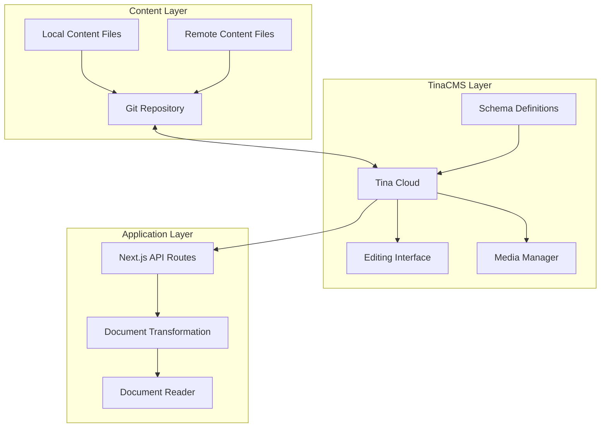
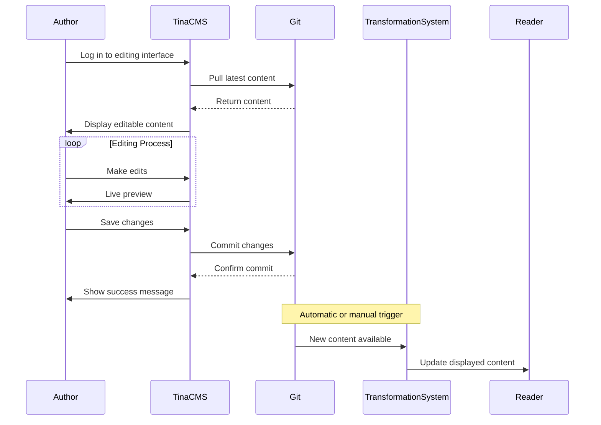
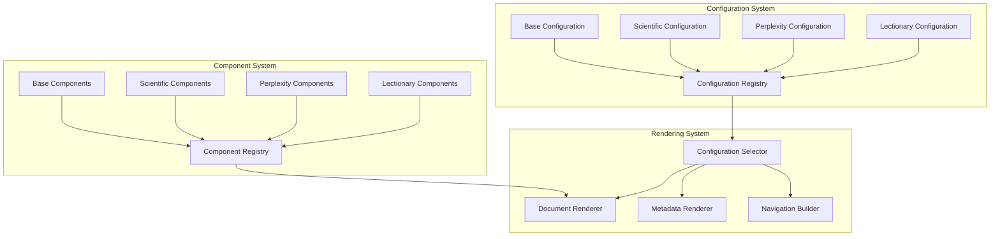
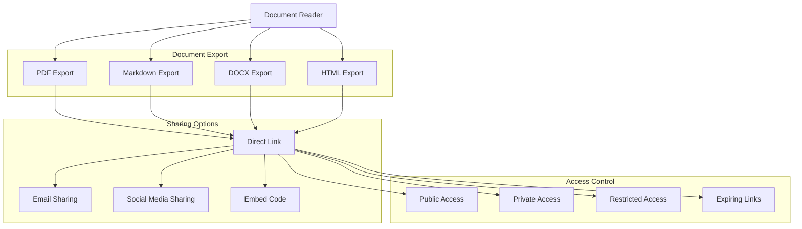
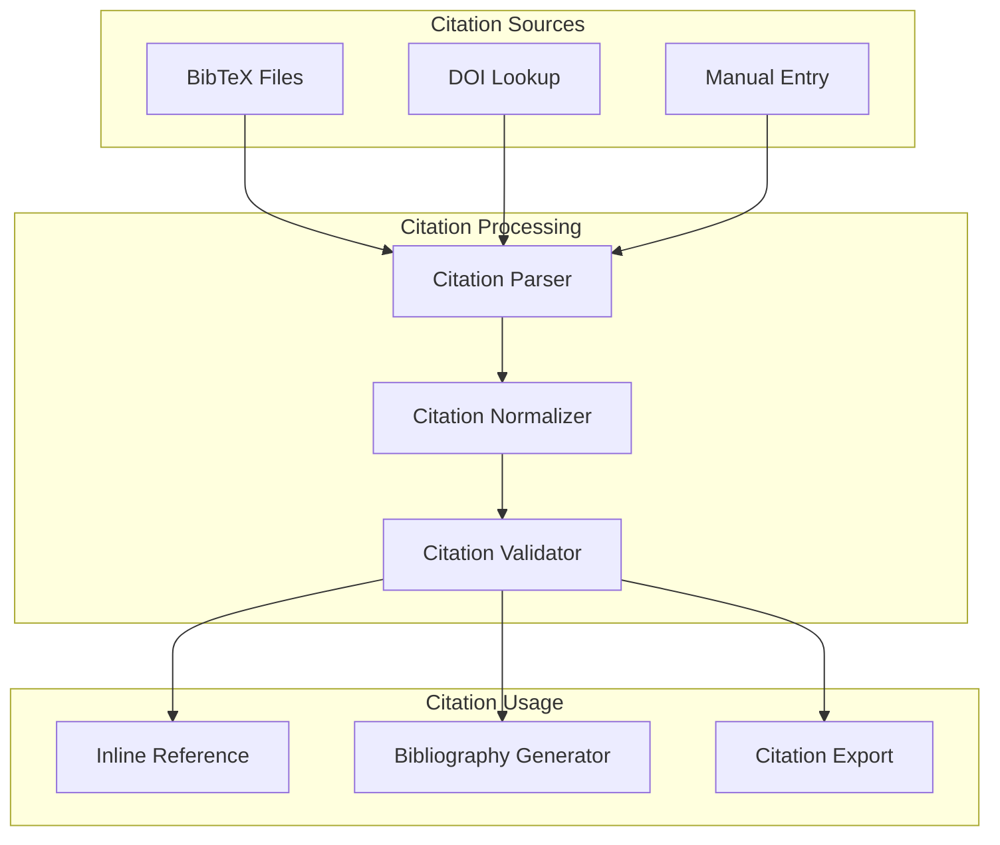
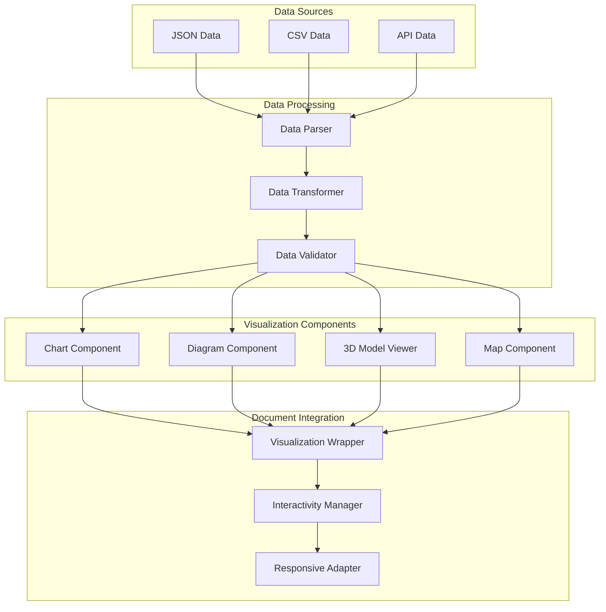

# PopRev2: Next Phase Architecture Plan

This document outlines the architectural plan for the next phase of the PopRev2 project, focusing on TinaCMS integration, purpose-specific adaptations, and advanced features.

## 1. TinaCMS Integration Architecture

TinaCMS is an excellent choice for content management with its Git-backed approach. Here's how we should structure the integration:

### 1.1 Architecture Overview



### 1.2 Content Models and Schemas

Define these schema types in TinaCMS:

1. **Base Document Schema**

   ```typescript
   // Base schema that all document types inherit from
   const baseDocumentSchema = {
     title: {
       type: "string",
       label: "Title",
       required: true,
     },
     author: {
       type: "string",
       label: "Author",
     },
     date: {
       type: "datetime",
       label: "Publication Date",
     },
     categories: {
       type: "string",
       label: "Categories",
       list: true,
     },
     tags: {
       type: "string",
       label: "Tags",
       list: true,
     },
   };
   ```

2. **Scientific Document Schema**

   ```typescript
   // Extends base schema with scientific-specific fields
   const scientificDocumentSchema = {
     ...baseDocumentSchema,
     abstract: {
       type: "rich-text",
       label: "Abstract",
     },
     citations: {
       type: "object",
       label: "Citations",
       list: true,
       fields: [
         {
           name: "citationKey",
           label: "Citation Key",
           type: "string",
         },
         {
           name: "authors",
           label: "Authors",
           type: "string",
         },
         {
           name: "title",
           label: "Title",
           type: "string",
         },
         {
           name: "journal",
           label: "Journal/Source",
           type: "string",
         },
         {
           name: "year",
           label: "Year",
           type: "number",
         },
         {
           name: "doi",
           label: "DOI",
           type: "string",
         },
       ],
     },
     figures: {
       type: "object",
       label: "Figures",
       list: true,
       fields: [
         {
           name: "caption",
           label: "Caption",
           type: "string",
         },
         {
           name: "image",
           label: "Image",
           type: "image",
         },
         {
           name: "altText",
           label: "Alt Text",
           type: "string",
         },
       ],
     },
   };
   ```

3. **Perplexity Document Schema**

   ```typescript
   // Extends base schema with perplexity-specific fields
   const perplexityDocumentSchema = {
     ...baseDocumentSchema,
     question: {
       type: "string",
       label: "Original Question",
       required: true,
     },
     responses: {
       type: "object",
       label: "Responses",
       list: true,
       fields: [
         {
           name: "responseText",
           label: "Response Text",
           type: "rich-text",
         },
         {
           name: "sources",
           label: "Sources",
           type: "string",
           list: true,
         },
       ],
     },
   };
   ```

4. **Lectionary Document Schema**
   ```typescript
   // Extends base schema with lectionary-specific fields
   const lectionaryDocumentSchema = {
     ...baseDocumentSchema,
     scriptureReferences: {
       type: "object",
       label: "Scripture References",
       list: true,
       fields: [
         {
           name: "book",
           label: "Book",
           type: "string",
         },
         {
           name: "chapter",
           label: "Chapter",
           type: "number",
         },
         {
           name: "verses",
           label: "Verses",
           type: "string",
         },
       ],
     },
     liturgicalSeason: {
       type: "string",
       label: "Liturgical Season",
       options: [
         "Advent",
         "Christmas",
         "Epiphany",
         "Lent",
         "Easter",
         "Pentecost",
         "Ordinary Time",
       ],
     },
   };
   ```

### 1.3 Editing Workflow



### 1.4 Implementation Strategy

1. **Phase 1: Basic TinaCMS Setup**

   - Install and configure TinaCMS with Git backend
   - Implement base document schema
   - Create basic editing interface
   - Connect to existing transformation system

2. **Phase 2: Advanced Schema Implementation**

   - Implement purpose-specific schemas
   - Add media management
   - Create custom field components for specialized content

3. **Phase 3: Workflow Optimization**
   - Implement role-based access control
   - Add publishing workflow
   - Create preview environments

## 2. Purpose-Specific Adaptations

### 2.1 Architecture for Purpose-Specific Configurations



### 2.2 Configuration System Design

Create a configuration registry that allows for purpose-specific overrides:

```typescript
// Base configuration
const baseConfig = {
  typography: {
    headingFont: "system-ui, sans-serif",
    bodyFont: "system-ui, sans-serif",
    baseSize: "16px",
    scale: 1.2,
  },
  colors: {
    primary: "#0070f3",
    secondary: "#6c757d",
    background: "#ffffff",
    text: "#333333",
  },
  components: {
    // Default component mappings
  },
  navigation: {
    // Default navigation settings
  },
  metadata: {
    // Default metadata display settings
  },
};

// Scientific configuration (extends and overrides base)
const scientificConfig = {
  ...baseConfig,
  typography: {
    ...baseConfig.typography,
    headingFont: "Georgia, serif",
  },
  components: {
    // Scientific-specific component mappings
    citation: "ScientificCitation",
    figure: "ScientificFigure",
    equation: "MathEquation",
  },
  navigation: {
    // Scientific-specific navigation
    showFiguresList: true,
    showCitationsList: true,
  },
  metadata: {
    // Scientific-specific metadata display
    showAbstract: true,
    citationStyle: "APA",
  },
};

// Similar configurations for Perplexity and Lectionary
```

### 2.3 Component Registry

Create a component registry that maps node types to React components based on the selected configuration:

```typescript
// Component registry
const componentRegistry = {
  // Base components
  heading: HeadingComponent,
  paragraph: ParagraphComponent,
  list: ListComponent,
  link: LinkComponent,
  image: ImageComponent,

  // Scientific components
  ScientificCitation: ScientificCitationComponent,
  ScientificFigure: ScientificFigureComponent,
  MathEquation: MathEquationComponent,

  // Perplexity components
  PerplexityQuestion: PerplexityQuestionComponent,
  PerplexityResponse: PerplexityResponseComponent,

  // Lectionary components
  ScriptureReference: ScriptureReferenceComponent,
  LiturgicalSeason: LiturgicalSeasonComponent,
};
```

## 3. Advanced Features

### 3.1 Document Sharing and Download System



#### Implementation Details

1. **Document Export Options**

   - PDF Export: High-quality PDF generation with proper formatting
   - Markdown Export: Clean markdown export for technical users
   - DOCX Export: Compatible with Microsoft Word
   - HTML Export: Self-contained HTML for web sharing

2. **Sharing Mechanisms**

   - Direct Link: Unique URL for document access
   - Email Sharing: Send document links via email
   - Social Media Sharing: Share on platforms like Twitter, LinkedIn
   - Embed Code: Embed documents in other websites

3. **Access Control**

   - Public Access: Anyone with the link can view
   - Private Access: Requires authentication
   - Restricted Access: Limited to specific users
   - Expiring Links: Links that expire after a set time

4. **User Interface**
   - Download button in document reader
   - Share button with multiple options
   - Access control settings for document owners

### 3.2 Citation Management System



### 3.3 Data Visualization Components

For scientific documents, implement these visualization components:

1. **Chart Component**

   - Support for various chart types (bar, line, scatter, etc.)
   - Data input via JSON or CSV
   - Interactive features (zoom, tooltips, etc.)

2. **Diagram Component**

   - Support for flowcharts, sequence diagrams, etc.
   - Integration with Mermaid.js
   - Export to image formats

3. **3D Model Viewer**

   - Support for common 3D formats
   - Interactive rotation and zoom
   - Cross-section views

4. **Interactive Maps**
   - Geographic data visualization
   - Custom overlays
   - Time-series data support

### 3.4 Integration Architecture



## Implementation Roadmap

### Phase 1: TinaCMS Integration (4 weeks)

1. **Week 1-2**: Basic TinaCMS setup and schema definition
2. **Week 3-4**: Editing interface and Git integration

### Phase 2: Purpose-Specific Adaptations (4 weeks)

1. **Week 1-2**: Configuration system and component registry
2. **Week 3-4**: Scientific document adaptations

### Phase 3: Advanced Features (4 weeks)

1. **Week 1**: Document sharing and download system
2. **Week 2**: Citation management system
3. **Week 3-4**: Data visualization components

## Technical Considerations

1. **Performance**

   - Use incremental static regeneration for content updates
   - Implement code splitting for purpose-specific components
   - Optimize media assets with next/image

2. **Scalability**

   - Design schemas to be extensible for future purposes
   - Use component composition for reusability
   - Implement feature flags for gradual rollout

3. **Maintainability**
   - Document all schemas and configurations
   - Create a component storybook
   - Implement comprehensive testing

## Next Steps for Implementation

When returning to Code mode, begin with:

1. Setting up TinaCMS with a Git backend
2. Implementing the base document schema
3. Creating a basic editing interface
4. Connecting it to the existing transformation system

This architectural plan provides a solid foundation for implementing TinaCMS integration, purpose-specific adaptations, and advanced features in the PopRev2 project. The modular approach ensures that each component can be developed and tested independently, while the configuration system allows for flexible customization based on document purpose.
