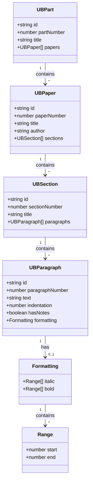
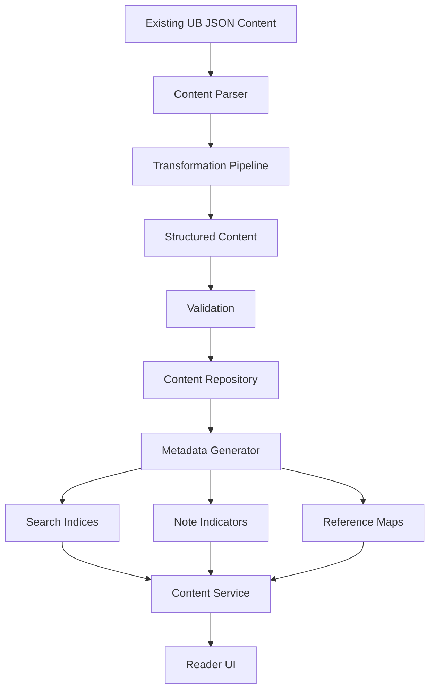
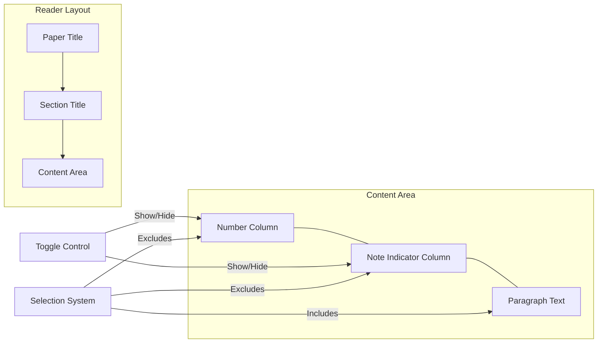
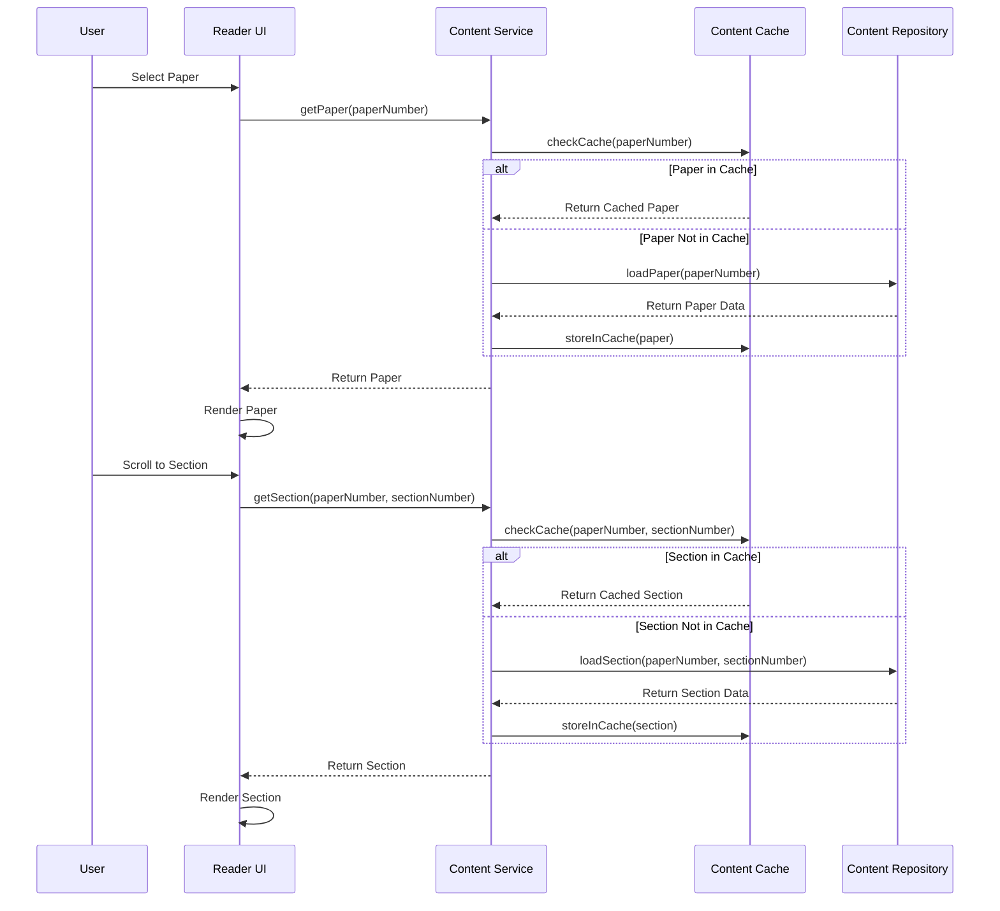
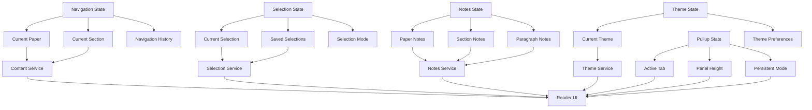
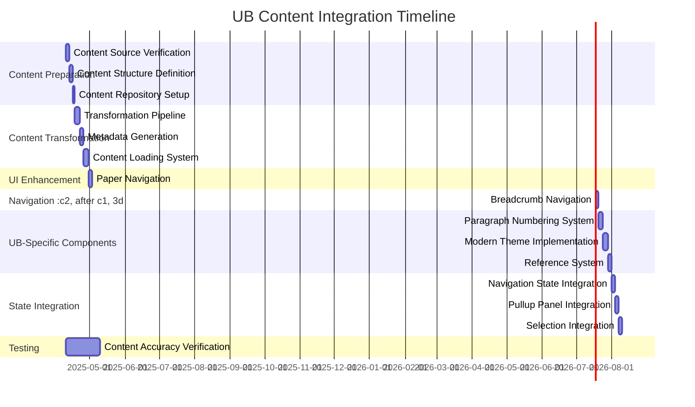

# Urantia Book Content Integration: Visual Diagram (Revised)

The following diagrams illustrate the key components and processes involved in integrating the Urantia Book content into our reader application.

## Content Structure



## Content Transformation Process



## Paragraph Numbering System



## Content Loading Strategy



## Theme Comparison

```mermaid
flowchart TB
    subgraph Traditional Theme
        A1[Regular Text] --- B1[Italic Text]
        C1[Regular List] --- D1[Indented List]
    end

    subgraph Modern Theme
        A2[Regular Text] --- B2[Bold Italic Text]
        C2[Enhanced List] --- D2[Styled Indentation]
    end

    E[Theme Toggle] --> Traditional Theme
    E --> Modern Theme
```

## State Management Integration



## Implementation Timeline



These diagrams provide a visual representation of our revised content integration plan, showing the data structure, transformation process, paragraph numbering system, loading strategy, theme comparison, state management integration, and implementation timeline.
