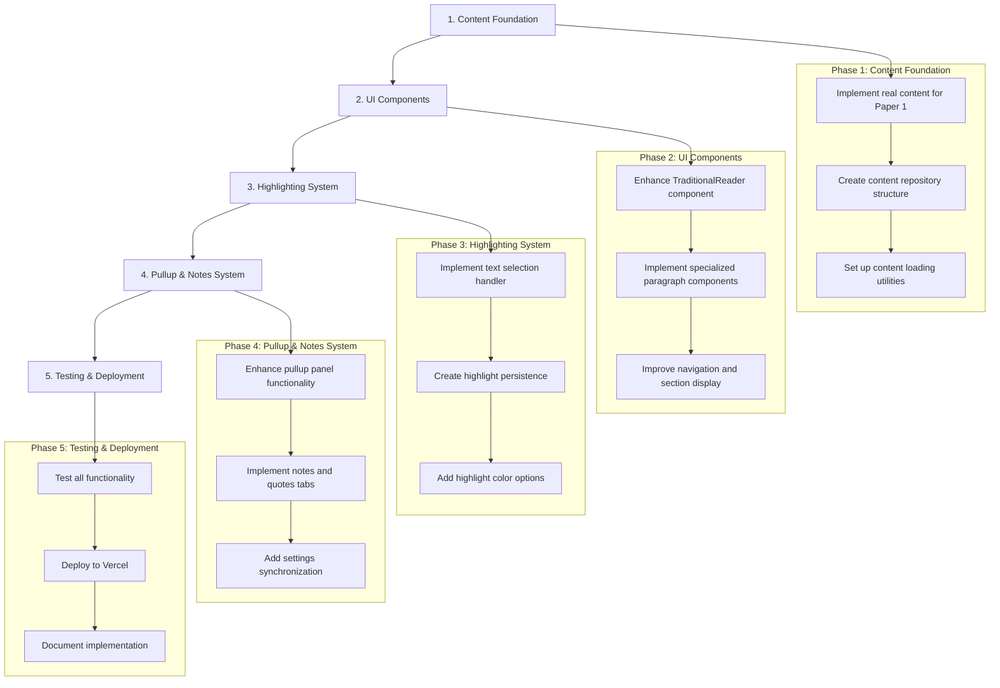

# UB Reader UI Implementation Plan

**Date:** April 14, 2025  
**Status:** Approved  
**Author:** Roo

## Overview

This document outlines the implementation plan for establishing a foundation for the UB Reader UI, focusing on implementing a fully functional Paper 1 with settings, notes, highlighting, and the pullup system. The plan follows a phased approach that prioritizes establishing a solid foundation first and then building up the interactive features.

## Current State Assessment

The UB Reader already has a basic structure in place:

- TraditionalReader component with navigation, settings panel, and content display
- PullupContainer integration
- Mock data service for paper content
- Theme switching functionality
- Basic text selection (copy functionality)

However, it lacks:

- Real content for Paper 1
- Full highlighting functionality
- Notes and quotes in the pullup system
- Proper integration with the core packages

## Implementation Approach

## Detailed Implementation Plan

### Phase 1: Content Foundation (Week 1)

#### 1.1 Implement Real Content for Paper 1 (2 days)

- **Task 1.1.1:** Create JSON structure for Paper 1 content
- **Task 1.1.2:** Add actual text content for all sections and paragraphs
- **Task 1.1.3:** Include proper metadata (author, title, section titles)
- **Task 1.1.4:** Update PaperDataService to use real content

#### 1.2 Create Content Repository Structure (1 day)

- **Task 1.2.1:** Organize content files in a structured directory
- **Task 1.2.2:** Create content index for efficient access
- **Task 1.2.3:** Implement content versioning strategy

#### 1.3 Set Up Content Loading Utilities (1 day)

- **Task 1.3.1:** Create efficient content loading mechanisms
- **Task 1.3.2:** Implement caching for better performance
- **Task 1.3.3:** Add error handling for content loading

### Phase 2: UI Components (Week 2)

#### 2.1 Enhance TraditionalReader Component (2 days)

- **Task 2.1.1:** Improve responsive design for different screen sizes
- **Task 2.1.2:** Enhance header and navigation components
- **Task 2.1.3:** Implement sticky headers for better reading experience
- **Task 2.1.4:** Add proper loading states and error handling

#### 2.2 Implement Specialized Paragraph Components (2 days)

- **Task 2.2.1:** Create UBParagraph component with proper styling
- **Task 2.2.2:** Implement UBNumberedList for list content
- **Task 2.2.3:** Create UBSectionDivider for section breaks
- **Task 2.2.4:** Ensure accessibility compliance for all components

#### 2.3 Improve Navigation and Section Display (1 day)

- **Task 2.3.1:** Enhance section navigation with smooth scrolling
- **Task 2.3.2:** Improve breadcrumb functionality
- **Task 2.3.3:** Add visual indicators for current section

### Phase 3: Highlighting System (Week 3)

#### 3.1 Implement Text Selection Handler (2 days)

- **Task 3.1.1:** Create selection menu with highlight options
- **Task 3.1.2:** Implement text selection tracking
- **Task 3.1.3:** Add reference extraction functionality
- **Task 3.1.4:** Handle selection across multiple paragraphs

#### 3.2 Create Highlight Persistence (2 days)

- **Task 3.2.1:** Store highlights in localStorage
- **Task 3.2.2:** Implement highlight retrieval on page load
- **Task 3.2.3:** Create highlight management functions
- **Task 3.2.4:** Add highlight rendering in the document

#### 3.3 Add Highlight Color Options (1 day)

- **Task 3.3.1:** Add multiple color options for highlights
- **Task 3.3.2:** Implement color selection UI
- **Task 3.3.3:** Apply proper styling to highlighted text

### Phase 4: Pullup & Notes System (Week 4)

#### 4.1 Enhance Pullup Panel Functionality (2 days)

- **Task 4.1.1:** Improve pullup panel UI and interactions
- **Task 4.1.2:** Implement smooth animations
- **Task 4.1.3:** Add proper tab navigation
- **Task 4.1.4:** Ensure responsive behavior on different devices

#### 4.2 Implement Notes and Quotes Tabs (2 days)

- **Task 4.2.1:** Create notes management functionality
- **Task 4.2.2:** Implement quotes collection
- **Task 4.2.3:** Add reference linking to original text
- **Task 4.2.4:** Implement sorting and filtering options

#### 4.3 Add Settings Synchronization (1 day)

- **Task 4.3.1:** Ensure settings are persisted
- **Task 4.3.2:** Implement theme switching in pullup panel
- **Task 4.3.3:** Add font size and style controls

### Phase 5: Testing & Deployment (Week 5)

#### 5.1 Test All Functionality (2 days)

- **Task 5.1.1:** Create comprehensive test plan
- **Task 5.1.2:** Test on different devices and browsers
- **Task 5.1.3:** Verify accessibility compliance
- **Task 5.1.4:** Perform performance testing

#### 5.2 Deploy to Vercel (1 day)

- **Task 5.2.1:** Configure Vercel deployment
- **Task 5.2.2:** Set up proper build process
- **Task 5.2.3:** Ensure optimal performance
- **Task 5.2.4:** Configure monitoring and analytics

#### 5.3 Document Implementation (2 days)

- **Task 5.3.1:** Create documentation for the implementation
- **Task 5.3.2:** Add usage examples
- **Task 5.3.3:** Document architecture decisions
- **Task 5.3.4:** Create user guide for the UB Reader

## Technical Considerations

### 1. Component Architecture

- Use React functional components with hooks
- Follow the presentation/container pattern
- Ensure proper component composition
- Maintain clear separation of concerns

### 2. State Management

- Use React Context for global state
- Implement localStorage persistence
- Create custom hooks for state access
- Ensure proper state synchronization

### 3. Styling Approach

- Use CSS modules for component styling
- Implement theme system with CSS variables
- Ensure responsive design for all screen sizes
- Follow accessibility guidelines

### 4. Performance Optimization

- Implement efficient rendering strategies
- Use React.memo for expensive components
- Optimize content loading and parsing
- Implement proper code splitting

### 5. Integration with Core Packages

- Leverage shared packages for common functionality
- Ensure proper typing with TypeScript
- Follow the extension system architecture
- Maintain compatibility with future enhancements

## Timeline

| Phase                    | Duration | Start Date     | End Date       |
| ------------------------ | -------- | -------------- | -------------- |
| 1. Content Foundation    | 1 week   | April 15, 2025 | April 21, 2025 |
| 2. UI Components         | 1 week   | April 22, 2025 | April 28, 2025 |
| 3. Highlighting System   | 1 week   | April 29, 2025 | May 5, 2025    |
| 4. Pullup & Notes System | 1 week   | May 6, 2025    | May 12, 2025   |
| 5. Testing & Deployment  | 1 week   | May 13, 2025   | May 19, 2025   |

## Success Criteria

The implementation will be considered successful when:

1. **Content Display**: Paper 1 content is properly displayed with correct formatting and structure
2. **UI Components**: All UI components are responsive, accessible, and properly styled
3. **Highlighting**: Text selection and highlighting work correctly with multiple color options
4. **Notes & Quotes**: The pullup system allows for creating, editing, and managing notes and quotes
5. **Settings**: User preferences are properly persisted and applied
6. **Performance**: The application loads quickly and performs well on all devices
7. **Accessibility**: The application meets WCAG 2.1 AA standards
8. **Deployment**: The application is successfully deployed to Vercel

## Next Steps

After approval of this implementation plan:

1. Set up the development environment
2. Begin implementation of Phase 1: Content Foundation
3. Schedule regular progress reviews
4. Prepare for deployment to Vercel
